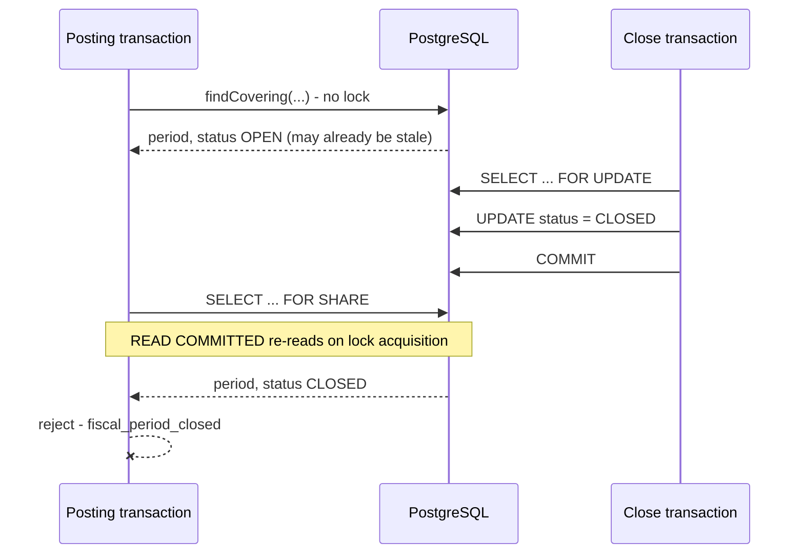

# Accounting dates and periods

> Only the posting date selects a fiscal period. Every other date is business or technical
> metadata. See [ADR 0022](../adr/0022-accounting-date-and-fiscal-period-concurrency.md).

This is the implementer's guide to accounting-date semantics and the posting-versus-close
concurrency protocol (GitHub issue #35). The fiscal-period tables arrive with issue #36; the
semantics are fixed here first so that issue implements a decided design rather than inventing one.

## The five values

| Value | Type | Source | Selects the period? |
| --- | --- | --- | --- |
| `recordedAt` | `Instant` | The `Clock` bean, UTC | No — technical only |
| `businessDate` | `LocalDate` | `business_date.current_business_date` via `AccountingBusinessDateLookup` | No — but bounds the others |
| `transactionDate` | `LocalDate` | The source module | No — descriptive |
| `valueDate` | `LocalDate` | The source module | No — interest and float effect |
| **`postingDate`** | `LocalDate` | Derived; defaults to the business date | **Yes, and only this** |

Two rules that catch people out:

- **The business date is never read from a clock.** `LocalDate.now()` in a posting path is a defect.
  A tenant's business date is a controlled value that an operator advances.
- **`businessDate != transactionDate` is normal.** A Friday-evening transaction may legitimately
  post on Monday's business date. Both are retained; neither is corrected to match the other.

## Posting rules

| Situation | Outcome | Error code |
| --- | --- | --- |
| Posting date after the business date | Rejected | `accounting.posting_date_in_future` |
| Transaction date after the business date | Rejected | `accounting.transaction_date_in_future` |
| Posting date equals the business date | `CURRENT`, no extra permission | — |
| Posting date before the business date | `BACKDATED`, requires `journal.post_prior_period` | — |
| Covering period is closed | Rejected **regardless of permission** | `accounting.fiscal_period_closed` |
| No covering period | Rejected | `accounting.fiscal_period_not_found` |
| Business date not open, current-dated posting | Rejected | `accounting.business_date_not_open` |
| Business date not open, backdated posting | **Allowed** | — |
| Organisation has no business date | Rejected | `accounting.business_date_unavailable` |

The last two rows are deliberate. Close-of-business must not deadlock corrections: a backdated
posting into a still-open prior period stays legal while the current day is closing.

And a closed period rejects a posting **even for an actor holding `journal.post_prior_period`**.
That permission opens a *prior open* period, not a closed one. Reopening is an explicit, audited
operation — never an implicit consequence of holding a code.

## Worked examples

**Ordinary same-day posting.** Business date 2026-08-31, open. No dates supplied. All four dates
resolve to 2026-08-31; classification `CURRENT`; no extra permission.

**Backdated correction.** Business date 2026-08-31; posting date 2026-08-28. Classification
`BACKDATED`, so `journal.post_prior_period` is required. If August is still open, it posts. If
August is closed, it is rejected whatever the actor holds.

**Future-dated interest.** Business date 2026-08-31; value date 2026-09-30. The value date is
allowed to be in the future because it carries the economic effect, not the period selection. The
posting date is still 2026-08-31.

**Close-of-business in progress.** Business date 2026-08-31, `postingAllowed` false. A current-dated
posting is rejected; a posting dated 2026-08-30 into the still-open period succeeds.

**Business date rolls mid-flight.** A posting captures 2026-08-31 and holds its period lock; an
operator advances the business date to 2026-09-01 and commits. The posting still commits against
2026-08-31, because August is open until it is closed. This is correct, not a race.

## The concurrency protocol

Three properties make this work, and all three are load-bearing:

1. **The decision uses the status read under the lock**, never the earlier lookup.
   `lockForPosting` returns a freshly read snapshot rather than a boolean, so the correct value is
   the one nearest to hand. `findCovering` still returns a status, so deciding from the stale read
   remains *possible* — it is a convention the resolver follows, not something the types forbid.
2. **`FOR SHARE` for postings, `FOR UPDATE` for closes.** Postings do not block each other; a close
   waits for them. `FOR KEY SHARE` would be wrong — it does not conflict with the
   `FOR NO KEY UPDATE` a plain `UPDATE` takes.
3. **READ COMMITTED.** The read issued after the lock takes a fresh snapshot and so sees a close
   that committed since this transaction's own lookup. Under a stricter isolation level that
   second read would return the transaction's original snapshot and the protocol is simply wrong.

## What the tests prove

`FiscalPeriodConcurrencyIntegrationTests` runs eight latch-driven scenarios against real
PostgreSQL, with relative ordering assertions and no wall-clock sleeps — a sleep-based race test
passes or fails on machine speed rather than on the property under test.

| Scenario | Proves |
| --- | --- |
| S1 | A close waits for an in-flight posting to commit |
| **S2** | The unlocked read sees OPEN, a close commits, and the **locking** read sees CLOSED |
| S3 | Two postings hold the shared lock concurrently |
| S4 | Concurrent closes serialise; the second observes the first |
| S5 | A bare `UPDATE` still blocks behind the posting's lock |
| S6 | A reopen after a rejected posting resurrects nothing |
| S7 | An unrelated write does not block behind a held period lock |
| S8 | Locking outside a transaction fails loudly |

S2 is the one that matters, and it earns that only because both of its reads happen inside **one**
posting transaction with a close committing between them. Written as three sequential transactions
— as an earlier revision was — it passes with both locks deleted and at any isolation level, since
a fresh transaction takes a fresh snapshot for trivial reasons.

The ordering scenarios (S1, S4, S5) have the same hazard in a different place: releasing the lock
holder immediately after starting the contending transaction lets the assertion hold on thread
scheduling rather than on the lock. Each waits for PostgreSQL to report a backend genuinely blocked
before releasing, so a missing lock times out instead of passing.

## Prior-period authority

A backdated posting requires `journal.post_prior_period`, and two things about that gate are
deliberate.

**Its exercise is audited where it is enforced, but only once the posting is admissible.** The
permission is checked at the gate; the record is written after the covering period has been found,
locked and validated. Writing it at the gate — as an earlier revision did — left a permanent
`SUCCESS` row for a backdated request into a closed or missing period, claiming a prior-period
posting that never happened.

Recorded through `recordIndependently`, so it survives a rollback of the posting that follows. That
is intentional, and the row says what it means: *authority was exercised on a posting the ledger
accepted as admissible*, not *a journal was committed*. The journal's own outcome is issue #41's to
audit, which is the only place a journal id exists. `AccountingSeparationOfDutiesPolicyTests` fails the
build if any file enforces a break-glass code without also calling the audit service, so the two
cannot drift apart again.

**System actors do not satisfy it.** The platform's ordinary permission check short-circuits to
allow for the system-actor sentinels (`AuthorizationService.hasPermission`), which is deliberate
for background provisioning and wrong for a ledger control: a batch job would exercise prior-period
authority that no principal holds, and a tenant administrator who revoked the permission could
neither observe nor prevent it. Accounting therefore calls
`AccountingPermissionGuard.requireBreakGlassPermission`, which never short-circuits.

That path also resolves through `EffectivePermissionResolver` rather than `RequestPermissionCache`.
The cache is `@RequestScope`, so dereferencing it outside a web request raises
`ScopeNotActiveException` — which would have failed a background caller with a scope error instead
of evaluating its grant, defeating the very alternative this section prescribes.

The consequence is intended: a background job that legitimately needs to post into a prior period
must be given a real service identity holding the code, which is auditable. Opening that path is a
deliberate act, not an inherited default.

## Advisory locks

Row locks cover an existing period. Materialising a period that does not exist yet has no row to
lock, so that needs an advisory lock — and new domains use the **two-`int4`** form via
`AdvisoryLockNamespace`.

The reason is concrete. Two single-key advisory call sites already exist — tenant settings and
idempotency — and both hash arbitrary text into the *same* `bigint` space, with nothing separating
them. PostgreSQL keeps the two-`int4` space structurally separate (`pg_locks.objsubid` 1 versus 2),
verified empirically rather than assumed, so a new domain cannot collide with either.

Within one class, a 32-bit `objid` collision causes false sharing: two unrelated keys serialise.
That costs throughput, never correctness.

## What issue #36 did, and what must not change now

Issue #36 discharged every obligation this section used to list as pending:

- `FiscalPeriodStandIn` is **deleted**, and every scenario runs against `accounting_fiscal_period`
  through the production `JooqFiscalPeriodStateStore`. Deleting the file is what forced the
  repointing: the compiler, not a checklist, is what stopped the proof quietly narrowing.
- The store, `PostingPeriodResolver` and `FiscalPeriodStateChangeGuard` became beans in **one**
  change, and a test now asserts all three exist — the inverse of the assertion that pinned their
  absence.
- `findCovering` executes its date predicate against a database for the first time. The stand-in
  ignored its `postingDate` parameter and returned hardcoded bounds, so the period-selection half
  of the protocol had never run. `JooqFiscalPeriodStateStoreIntegrationTests` covers it, including
  both inclusive boundary days, and deleting the predicate fails that test.

Issue #39 then made the period lifecycle real: an FSM over the four states with `open`, `close`,
`reopen` and `lock` transitions, each writing a `fiscal_period_transition_log` row through the
shared transition executor. `LOCKED` became reachable for the first time — until then it was a
state the enum carried, the guard refused transitions out of, and nothing could produce.

What still must not change:

- The posting date remains the only period selector.
- The decision must keep using the post-lock read.
- `FOR SHARE`/`FOR UPDATE` strengths stay as they are.
- The isolation assertion stays.
- The snapshot's organisation id is read from the **row**, never echoed back from the caller's key.
  Echoing it labels another tenant's period with the caller's organisation, which is how a
  cross-tenant write passes a downstream tenant check.

## Related documents

- [ADR 0022: Accounting date and fiscal-period concurrency][adr-0022]
- [Accounting foundation](accounting-foundation.md)
- [Accounting module boundary](accounting-module-boundary.md)
- [Business date operations](../operations/business-date.md)

[adr-0022]: ../adr/0022-accounting-date-and-fiscal-period-concurrency.md
