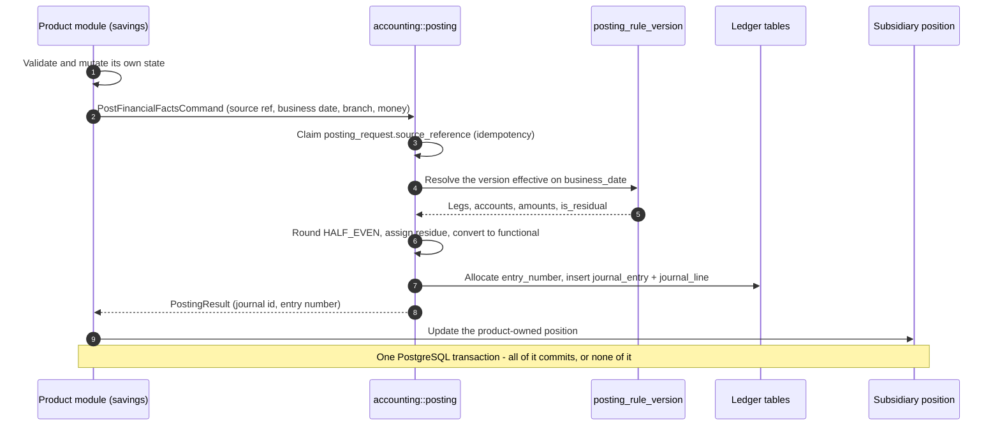

# Accounting foundation

> Accounting is decided once, before any table exists. This document is the canonical design
> record for the Finaxis ledger: money, dates, the ledger model, the invariants, the posting
> lifecycle and the query patterns. It creates no schema and no code. Later issues implement it
> rather than re-derive it.

Sources verified on: 2026-08-31.

## What This Document Freezes

- How money, currency and exchange rates are represented, rounded and allocated.
- Which date or timestamp answers which accounting question, and which one selects a period.
- What the general ledger is, what a subsidiary ledger is, and which module owns which rows.
- Sixteen numbered invariants, `INV-1` … `INV-16`, that later issues cite by number.
- The posting lifecycle, reversal, fiscal periods, concurrency and maker-checker.
- The seven query patterns, the indexes that serve them, the single projection, the pagination
  contract, and the measured thresholds at which any of it is revisited.

This is the architectural half of a pair. The physical half — tables, columns, constraints and
identifier conventions — is [the accounting schema](../database/accounting-erd.md). The two must
agree; where the schema is more specific about a column or a constraint, the schema is the
authority and this document defers to it.

| Record | Covers |
| --- | --- |
| [ADR 0018](../adr/0018-financial-transaction-atomicity-invariant.md) | One PostgreSQL transaction for every financial effect |
| [ADR 0019](../adr/0019-accounting-money-representation-and-rounding.md) | Money representation, rounding, direction, currency |
| [ADR 0020](../adr/0020-immutable-ledger-and-reversal-only-correction.md) | Immutable journals, reversal-only correction, ledger architecture |
| [ADR 0017](../adr/0017-bian-semantic-reference-architecture.md) | BIAN as semantic reference, not deployment blueprint |
| [Accounting schema](../database/accounting-erd.md) | Tables, columns, constraints, indexes |

## Scope And Non-Goals

### What This Document Decides

- The representation and arithmetic rules for every monetary amount in the platform.
- The date semantics: which column drives accounting and which columns are descriptive.
- The ledger architecture: authoritative rows, derived rows, and ownership boundaries.
- The invariants that make a posting correct, and how each is enforced.
- The performance envelope, the query patterns, the indexing strategy and the evidence
  thresholds that would justify changing any of it.

### What This Document Does Not Decide

- **It creates no schema.** No table, no column, no migration, no jOOQ, no Kotlin. Accounting
  migrations are written by #36, #40, #44, #46 and #47 against the schema document.
- It does not specify REST paths, DTO shapes or OpenAPI documents; those are #52's, governed by
  [API governance](api-governance.md) and [API versioning](api-versioning.md).
- It does not define product semantics. What a savings deposit *means* belongs to the savings
  module; this document defines only how its financial consequence reaches the ledger.
- It does not choose a chart of accounts. The account catalogue is tenant data, not design.
- It does not enumerate permission codes. Those are seeded by #34 following the existing
  `<entity>.<action>` convention.

## Benchmark Matrix

Four reference points are used throughout: **BIAN** v14.0.0 (a semantic reference architecture
with no physical model), **Martin Fowler's** accounting patterns, **Apache Fineract** (a
production core-banking schema for exactly this domain) and **Apache OFBiz** (a mature
general-ledger data model). Each row states what each reference does and what Finaxis decided.

Fineract cells are read from the published SchemaSpy documentation of `fineract_default`; OFBiz
cells from the `trunk` entity model. Both are cited under [Benchmark Sources](#benchmark-sources)
with the exact URLs and the claims that could not be verified.

| Design question | BIAN | Fowler | Fineract | OFBiz | Finaxis decision and rationale |
| --- | --- | --- | --- | --- | --- |
| Money representation | Silent on physical representation; semantic APIs only | Explicit `Money` value object, no binary floating point; scale not fixed | `acc_gl_journal_entry.amount DECIMAL(19,6)` | `currency-amount` → `NUMERIC(18,2)`, `currency-precise` → `NUMERIC(18,3)`, `fixed-point` → `NUMERIC(18,6)`, all `java.math.BigDecimal` | `NUMERIC(23, 6)` → `BigDecimal`; rates `NUMERIC(20, 10)` with `CHECK (exchange_rate > 0)`. Six fractional digits cover every ISO 4217 exponent (maximum 4) plus accrual headroom; 17 integer digits survive any SACCO aggregate. Float banned and enforced |
| Sign versus direction | Not addressed | Signed entries of opposite sign that must sum to zero | `type_enum SMALLINT` (debit or credit) with a positive `amount` | `debitCreditFlag` indicator with a positive `amount` | Direction, not sign: `direction TEXT CHECK (direction IN ('DEBIT','CREDIT'))` plus `CHECK (amount > 0)`. **Adopt Fineract and OFBiz over Fowler** — a signed amount makes "debit or credit" depend on the account's normal balance, a derived reading, and makes a zero-value line representable. A STORED generated `signed_functional_amount` serves ad-hoc SQL |
| Multi-currency | Not addressed | `Money` carries a currency; no functional-amount pattern | One `currency_code VARCHAR(3)` and one `amount`; no functional amount, no rate on the entry | `amount`/`currencyUomId` **plus** `origAmount`/`origCurrencyUomId` on `AcctgTransEntry`; no rate column on the line | **Adopt OFBiz's dual-amount shape**, add the rate: five columns always populated. Invariant enforced on `functional_amount` only |
| Transaction container | `FinancialBookingLog` control record with a `LedgerPosting` behaviour qualifier | `Accounting Transaction` links two or more entries; two-legged and multi-legged variants | **None** — headerless; the entry *is* the line, correlated by `transaction_id VARCHAR(50)` | `AcctgTrans` header plus `AcctgTransEntry` lines, composite key `(acctgTransId, acctgTransEntrySeqId)` | **Adopt header plus lines, reject Fineract's headerless model.** Without a header there is nowhere for balanced totals, the entry number, the reversal link or the period binding, and every "show me this journal" becomes a self-join on a correlation column |
| Immutability of posted entries | Not addressed | Entries are immutable; corrections are adjustments | `lastmodified_date` and `lastmodifiedby_id` on the entry; `reversed` flag set in place | `AcctgTrans` carries `lastModifiedDate` and `lastModifiedByUserLogin` alongside `isPosted` | **Adopt Fowler's strict immutability.** No `updated_at`, no `updated_by`, no `row_version` on `journal_entry` or `journal_line`; backed physically by `REVOKE UPDATE, DELETE` on a least-privilege role |
| Reversal mechanism | Not addressed | Three named adjustments: Replacement, **Reversal**, Difference | `reversed BIT` plus a `reversal_id` self-foreign-key, set by `UPDATE` on the original row | No reversal-link field on `AcctgTrans` in the entity model; reversal is service-level | **Adopt Fowler's Reversal Adjustment, reject Fineract's in-place UPDATE.** A contra-journal with `entry_type='REVERSAL'`, direction flipped, the **same positive amounts**, and `reverses_journal_entry_id` on the new row |
| Fiscal periods | Not addressed | Balances are computed over a time period; no period entity prescribed | `acc_gl_closure` — `office_id`, `closing_date DATE`, `is_deleted BIT`; no status, and journals carry no period reference | `CustomTimePeriod` in `org.apache.ofbiz.common.period` with `parentPeriodId`, `periodTypeId`, `fromDate`, `thruDate` and an `isClosed` indicator | **Reject both.** `accounting_fiscal_year` plus `accounting_fiscal_period` with an explicit FSM. Fineract's closure-date model cannot express `LOCKED` versus reopenable, nor bind a posted journal to a period; OFBiz's is over-general with no accounting FSM |
| Posting-rule indirection | Fact-in, instruction-out; no rule model | **Posting Rule** and **Secondary Posting Rule** patterns, plus "Handling a Rule Change" | Three overlapping mechanisms: `acc_accounting_rule`, `acc_product_mapping`, `acc_gl_financial_activity_account` | Default-account mappings such as `GlAccountTypeDefault` and `PartyGlAccount`, keyed by `glAccountTypeId` | **Adopt Fowler's Posting Rule, reject Fineract's dual mechanism** — a reviewer cannot tell which of the two governs a given posting. One path: `posting_rule` → effective `posting_rule_version` → `posting_rule_leg` → account. **Versioned and effective-dated is a Finaxis addition** neither benchmark has |
| Balance storage | Not addressed | Balance is derived as the sum of the account's entries | `office_running_balance` and `organization_running_balance` stored on **every** journal entry row, with `is_running_balance_calculated BIT` | `GlAccountHistory` stores `openingBalance`, `postedDebits`, `postedCredits`, `endingBalance` per `CustomTimePeriod`; the `AcctgTransEntrySums` view sums lines grouped by account and `debitCreditFlag` | **Adopt Fowler: balances are derived.** Reject a stored balance carried by the account — a per-account write hotspot on every posting and a silent divergence risk. Exactly one projection, `gl_account_daily_balance`, rebuildable and never authoritative. `AcctgTransEntrySums` exists to paper over a header join the denormalised Finaxis line does not have |
| Branch and office dimension | Not addressed | Descriptors on the entry | `office_id` on every journal entry row, foreign key to `m_office`; `acc_gl_account` has no office column | `organizationPartyId` on `AcctgTransEntry` and `GlAccountOrganization`; no branch concept | `branch_id` on both `journal_entry` and `journal_line`. `gl_account` is **tenant-scoped, never branch-scoped** — one chart per tenant, branch is a dimension on the posting |
| Trial balance | Not addressed | Sum entries per account over a period | Computed by application query; the only non-foreign-key index on the journal table is `transaction_date_index` | The `AcctgTransEntrySums` view, joined back to `AcctgTrans` for `isPosted` and `transactionDate` | Aggregate over `journal_line` on a purpose-built composite index (#49); at month and year scale, read `gl_account_daily_balance` (#47) instead of scanning lines |
| Subsidiary-ledger ownership | Position Keeping owns positions; "reconciled financial transactions are subsequently used for posting to the accounting systems" | Accounts are generic containers; no ownership split | Product tables are the subledger, and the GL entry holds hard foreign keys to `m_loan_transaction`, `m_savings_account_transaction`, `m_client_transaction`, `m_share_account_transactions` | `AcctgTrans` holds foreign keys to `Invoice`, `Payment`, `FinAccountTrans`, `Shipment`, `WorkEffort`; `AcctgTransEntry` carries `partyId` and `productId` descriptors | **Product modules own their positions; accounting owns the general ledger and holds no foreign key into a product table.** Reject BIAN's sequencing: the GL journal commits in the same transaction as the position, so there is no reconcile-then-post step |
| Control accounts | "Multiple levels of consolidation (sub-ledgers)" | An account collects entries and provides summarising behaviour | `acc_gl_account.account_usage` (header or detail) with `parent_id` and `hierarchy`; no control-account classification | `GlAccount.parentGlAccountId` and category or group membership; no control flag | A control account **is** a GL account with no independent lifecycle. Classification lives on `gl_account` as `is_control_account` and `control_subledger_kind`. Reconciliation *runs* are separate evidence rows (#46) |
| Idempotency and source lineage | Not addressed | `Event` with "Linking to Events" and "Maintaining the Event Trace" | `transaction_id VARCHAR(50)` correlation plus `entity_type_enum`/`entity_id`, with no uniqueness on the source key | `theirAcctgTransId` on `AcctgTrans` plus the per-source foreign keys above | **Exactly one domain mechanism**: `posting_request.source_reference`, unique per `(organisation_id, source_module, source_reference)`, reusing the proven `identity_dispatch_log.dispatch_key` pattern. `source_entity_type` and `source_entity_id` are descriptive, not keys and not foreign keys |
| Maker-checker on configuration | No maker-checker primitive (deviation `FX-DEV-007`) | Not addressed | `m_permission.can_maker_checker BIT DEFAULT b'1'` across 865 permissions, with `m_portfolio_command_source` carrying `maker_id`, `made_on_date`, `checker_id`, `checked_on_date` and `command_as_json` | No maker-checker construct in the accounting entity model | Privileged accounting operations require a persisted checker distinct from the maker, gated by permission codes, following the platform's existing `user.invite`/`user.approve` split and the `require_maker_checker_*` tenant settings |

### Benchmark Sources

| Source | Fetched | Provides |
| --- | --- | --- |
| `https://fineract.apache.org/docs/database/` | 200 HTML | Table index for the `fineract_default` schema |
| `https://fineract.apache.org/docs/database/tables/acc_gl_journal_entry.html` | 200 | Columns, types and indexes of the journal table |
| `https://fineract.apache.org/docs/database/tables/acc_gl_account.html` | 200 | Chart-of-accounts columns |
| `https://fineract.apache.org/docs/database/tables/acc_gl_closure.html` | 200 | The closure-date period model |
| `https://fineract.apache.org/docs/database/tables/acc_accounting_rule.html` | 200 | Rule table columns |
| `https://fineract.apache.org/docs/database/tables/acc_product_mapping.html` | 200 | Product-mapping columns |
| `https://fineract.apache.org/docs/database/tables/acc_gl_financial_activity_account.html` | 200 | The third mapping mechanism |
| `https://fineract.apache.org/docs/database/tables/m_permission.html` | 200 | `can_maker_checker` |
| `https://fineract.apache.org/docs/database/tables/m_portfolio_command_source.html` | 200 | Maker and checker columns |
| `https://raw.githubusercontent.com/apache/ofbiz-framework/trunk/applications/datamodel/entitydef/accounting-entitymodel.xml` | 200 | `AcctgTrans`, `AcctgTransEntry`, `GlAccount`, `GlAccountHistory`, `AcctgTransEntrySums` |
| `https://raw.githubusercontent.com/apache/ofbiz-framework/trunk/framework/common/entitydef/entitymodel.xml` | 200 | `CustomTimePeriod` |
| `https://raw.githubusercontent.com/apache/ofbiz-framework/trunk/framework/entity/fieldtype/fieldtypepostgres.xml` | 200 | PostgreSQL SQL types for `currency-amount` and friends |
| `https://martinfowler.com/eaaDev/AccountingNarrative.html` | 200 | The narrative and the three adjustment patterns |
| `https://martinfowler.com/eaaDev/AccountingTransaction.html` | 200 | Signed entries summing to zero |
| `https://martinfowler.com/eaaDev/Account.html` | 200 | Balance derived from entries |
| `https://martinfowler.com/apsupp/accounting.pdf` | 200 | Document outline naming Posting Rule and Secondary Posting Rule |
| BIAN v14.0.0 | See [BIAN service landscape](bian-service-landscape.md) | Financial Accounting and Position Keeping semantics |

Three claims are deliberately narrower than they could be, because the primary sources do not
support more:

1. **OFBiz stored balances.** What the `trunk` entity model shows today is `GlAccountHistory`
   with `openingBalance`, `postedDebits`, `postedCredits` and `endingBalance`, keyed by
   `(glAccountId, organizationPartyId, customTimePeriodId)`. A running balance field on the
   `GlAccount` row itself is not present in that file. The Finaxis position is unchanged and
   independent of the naming: **no stored balance is carried by the account**, in any form.
2. **OFBiz reversal.** The entity model carries no reversal-link field on `AcctgTrans`, so
   reversal must be service-level behaviour. The service implementation was not fetched, so no
   claim is made about how OFBiz reverses, only that the *schema* records no link.
3. **OFBiz posting-rule indirection.** `GlAccountTypeDefault` and `PartyGlAccount` were read
   directly; the wider set of OFBiz account-resolution services was not, so the row describes
   the mapping entities rather than the resolution algorithm.

Re-verify these sources when a benchmark publishes a major release, or twelve months from the
"Sources verified on" date above, whichever is first, and bump that date.

## Money And Currency

### Amount Representation

**Every monetary amount is `NUMERIC(23, 6)`, mapped to `java.math.BigDecimal`.** Six fractional
digits cover every ISO 4217 currency exponent — the maximum in use is 4, for CLF and UYW — and
leave two digits of headroom so per-line interest accrual and allocation residue do not accumulate
error at the storage boundary. Seventeen integer digits survive any aggregate a SACCO will
produce, including seven years of consolidated turnover in a minor-unit currency.

**Exchange rates are `NUMERIC(20, 10)` with `CHECK (exchange_rate > 0)`**, deliberately a different
type from an amount. A rate is a ratio, not a quantity of money; giving it the money type invites
it to be summed, averaged into a balance, or added to an amount without a compiler or a reviewer
noticing.

**Binary floating point is banned in accounting schema and code**, and both halves are enforced
rather than reviewed:

- `AccountingBoundaryRuleTests.accounting code never uses binary floating point` forbids `Double`
  and `Float` anywhere under `com.finaxis.platform.accounting..`;
- `FoundationSchemaNumericTypeTests` forbids any `double precision` or `real` column in any
  application table — wider than accounting on purpose, so it is meaningful before the
  accounting tables exist rather than passing vacuously until issue #36.

A rule that is only written down is a rule that is eventually broken by a hurried change. These
two tests are the reason this decision survives contact with the next twenty pull requests.

### Rounding And Allocation

**Rounding is `HALF_EVEN` at the currency's minor unit** for any amount that is presented,
settled or reported. Intermediate computation stays at scale 6 and is rounded once, at the
boundary, never repeatedly.

**`BigDecimal.divide` without an explicit scale and `RoundingMode` is banned.** Its default throws
`ArithmeticException` on a non-terminating decimal expansion, which converts a rounding-policy
question into a production incident on the first third-of-a-shilling split. The constraint feels
pedantic at each call site and is kept for exactly that reason: the failure it prevents is
invisible in tests written with round numbers.

**Allocation residue is assigned, not scattered.** When an amount is split across N legs, the
posting rule marks exactly one leg `is_residual`; that leg receives the difference between the
total and the sum of the other legs. **The total is never re-rounded.** A split is therefore
reproducible from the rule and the input, and the double-entry invariant holds exactly rather
than approximately.

### Currency Policy

Currency is `CHAR(3)` with `CHECK (currency_code ~ '^[A-Z]{3}$')` — the same regex the foundation
schema already applies to `organisation.base_currency_code`.

**There is deliberately no `currency` reference table.** Validation stays where it already lives:
`java.util.Currency`, reached through `MoneyPolicy` - `requireCurrency` where a code merely has to
be known, and `requireSettlementCurrency` where a code is being *chosen* as a unit for future
postings and must therefore also have a minor unit. Both supply points for a tenant's functional
currency use the latter: organisation provisioning (create and amend) and the `base_currency` tenant
setting through `TenantSettingCatalog`. A second source of truth for currency codes is a bug factory — it
has to be seeded, migrated, kept in step with a standard that already ships with the JDK, and
reconciled with the JDK's view every time the two disagree.

### Multi-Currency Extension Points

**Every money-bearing row carries five columns, always populated:**

| Column | Type | Meaning |
| --- | --- | --- |
| `currency_code` | `CHAR(3)` | The currency the transaction actually happened in |
| `amount` | `NUMERIC(23, 6)` | The amount in that currency, always positive |
| `functional_currency_code` | `CHAR(3)` | The tenant's reporting currency |
| `functional_amount` | `NUMERIC(23, 6)` | The amount in the reporting currency, always positive |
| `exchange_rate` | `NUMERIC(20, 10)` | Transaction to functional, strictly greater than zero |

A single-currency tenant sets the two currencies equal, the two amounts equal, and the rate to
`1`. This is OFBiz's `origAmount`/`origCurrencyUomId` shape, adopted from day one, with the rate
added so the conversion is self-describing rather than inferable.

**The double-entry balance invariant is enforced on `functional_amount` only.** Transaction
amounts in different currencies are not required to balance against each other; requiring it
would make a multi-currency journal inexpressible.

**Why this is not speculative generality.** It is the one place the design pays before the
requirement lands, and the arithmetic is decisive. `journal_line` is immutable and grows at
roughly 200 million rows a year. Adding a functional-currency column later means backfilling data
nobody has: the rate that applied at each historical posting instant is not recoverable after the
fact, because the rate was never recorded. Three columns now, or an unfixable gap in the ledger
later. No speculative behaviour accompanies them — there is no rate table, no revaluation engine,
and no multi-currency reporting until a requirement asks for one.

## Accounting Dates And Timestamps

Five temporal columns exist and each answers exactly one question. Confusing them is the most
common way a ledger silently posts into the wrong period.

| Column | Type | Question it answers | Drives accounting? |
| --- | --- | --- | --- |
| `created_at` | `TIMESTAMPTZ` | When did this row physically appear? | **Never** |
| `posted_at` | `TIMESTAMPTZ` | At which instant did the journal become immutable? | Audit and ordering only |
| `posting_date` | `DATE` | Which accounting day does this journal post into? | **Yes — it alone selects the fiscal period** |
| `transaction_date` | `DATE` | When did the source module's event occur? | Descriptive only |
| `value_date` | `DATE` | From when does this affect interest or float? | **Never selects a period** |

`posting_date` is *not* a synonym for the tenant's current business date. It defaults to it, and
for an ordinary same-day posting the two are equal — but a backdated correction posts into an
earlier open period, and there `posting_date < business_date`. Collapsing the two names, as an
earlier draft of this document did, makes backdating inexpressible and puts this document in
direct conflict with ADR 0022, which the posting code implements. The tenant's current day is read
from the `business_date` table; the journal column that selects the period is `posting_date`.

**The business date that `posting_date` defaults to is read from the `business_date` table, never
from a clock.** The platform
already owns a controlled business date per organisation with an FSM (`OPEN`, `CLOSING`,
`CLOSED`, `ADVANCING`) and an append-only `business_date_history`. Accounting consumes it through
an inverted port and has no other source. A posting path that calls `LocalDate.now()` is a defect.

**`posted_at` is a distinct column from `created_at` on purpose.** A `posting_request` may be
created and its journal posted at different instants — a request can be rejected, retried, or
resolved against a rule that must first be looked up — so collapsing the two loses the moment the
ledger actually became immutable.

**`business_date != transaction_date` is normal, not an anomaly.** A Friday-evening teller
transaction may post on Monday's business date after a weekend close. Both values are retained
and neither is derived from the other: `transaction_date` answers "when did this happen in the
world", `business_date` answers "which day's books does it land in". Reporting that mixes them
produces two different correct answers to two different questions.

**Timezone rule.** All `TIMESTAMPTZ` values are UTC. All `DATE` columns are tenant-local business
dates and are **never** timezone-converted — converting a business date is how a period-end
posting moves into the wrong month.

## Ledger Architecture

### General Ledger

The general ledger is the **immutable system of record**. It consists of `journal_entry` (a
balanced header) and `journal_line` (one debit or credit against one GL account), with
`posting_request` in front of them carrying durable source identity and lineage.

A journal is a header plus lines. The header carries what a line cannot: the balanced totals, the
gapless entry number, the reversal link, the branch, and the fiscal-period binding. Fineract's
headerless model is rejected precisely because those five things have nowhere to live, and every
"show me this journal" degrades into a self-join on a correlation column.

`journal_line` deliberately denormalises `branch_id`, `posting_date`, `fiscal_period_id` and the
currency codes from its header. This is safe **only because** the table is append-only under a
hard no-update rule: the copies cannot drift from their source. It removes a join from every
aggregate query in the section on performance below.

### Subsidiary Ledgers And Positions

A subsidiary ledger — a savings position, a loan position, a share position, a teller
drawer — is owned by the **product module that owns the product**, not by accounting. Accounting
creates no member or product ledger table and holds no foreign key into one.

Those positions nevertheless participate in the **same PostgreSQL transaction** as the GL posting.
That is the atomicity invariant of
[ADR 0018](../adr/0018-financial-transaction-atomicity-invariant.md): the source mutation, the
subsidiary-ledger effect and the general-ledger effect commit together or not at all. There is no
interval in which a position exists that the ledger does not know about, and no reconciliation
step that promotes positions into the ledger.

The link from the ledger back to a position is **soft**: `journal_line` carries `source_module`
and `subledger_reference` as descriptive columns with no foreign key, because the modules they
point at do not exist yet. A speculative foreign key would either constrain a design not yet
written or rot into a dangling reference.

### Control Accounts

A control account **is** a GL account. It has no independent lifecycle, no separate identity and
no separate permissions, so it is a **classification on `gl_account`** — `is_control_account` plus
`control_subledger_kind` — and not a table of its own.

The classification carries an obligation, which is the point of naming it at all: the balance of a
control account must equal the aggregate of the subsidiary ledger it controls, at every business
date, and that equality is *proven* rather than assumed (`INV-14`).

**One control account per class per tenant** (`uq_gl_account_control_kind`, `V11`). A
`SubledgerProofQuery` names the class rather than the account, because choosing general-ledger
accounts is accounting's job and not a product module's (`INV-11`); a second control account of the
same class would therefore be proven against an aggregate that is not its own. The port is widened
with a partition key when a product module genuinely splits one class across accounts — widening a
port later is available in a way narrowing one is not.

A mis-classification is recoverable while it is still cheap: a withdrawn control account that was
never posted to may release its class, and the replacement is then created and approved normally.
Once a line has posted to it the class stays put, because a released account's balance would sit
outside the class while the sub-ledger positions behind it stayed inside the aggregate — a
permanent false `BREAK` on every later proof. See the `uq_gl_account_control_kind` section of
[the accounting ERD](../database/accounting-erd.md).

### Derived Balances And Rollups

Every balance, every rollup, every reporting aggregate is a **projection over immutable journal
lines**. A projection is never a statutory source of truth, never the only place a number exists,
and always accompanied by the deterministic query that rebuilds it from `journal_line`.

When a projection and the journal disagree, **the journal wins** and the projection is rebuilt.
Any design that makes a rollup authoritative is a defect, not a variation.

### Reconciliation Proof Contracts

A reconciliation proof is a repeatable, parameterised query pair that produces two numbers and
asserts they are equal. Three are first-class:

| Proof | Left side | Right side | Owner |
| --- | --- | --- | --- |
| Header versus lines | `journal_entry` stored totals | `SUM` over its `journal_line` rows | #40 |
| Projection versus journal | `gl_account_daily_balance` | The documented rebuild query | #47 |
| Control account versus subledger | Control-account balance from the GL | The owning module's position aggregate | #46 |

Each ships twice: as an integration test that fails the build, and as an operational check that
can be run against a live tenant on demand. A proof that exists only in a test suite cannot answer
the question an auditor actually asks, which is about production data on a specific date.

The header-versus-lines proof is fixed here because every other accounting issue depends on it:

```sql
SELECT je.id,
       je.entry_number,
       je.total_debit_functional,
       je.total_credit_functional,
       je.line_count,
       agg.debit_total,
       agg.credit_total,
       agg.lines
FROM journal_entry je
JOIN LATERAL (
    SELECT
        COALESCE(SUM(jl.functional_amount)
                 FILTER (WHERE jl.direction = 'DEBIT'), 0)  AS debit_total,
        COALESCE(SUM(jl.functional_amount)
                 FILTER (WHERE jl.direction = 'CREDIT'), 0) AS credit_total,
        COUNT(*)                                            AS lines
    FROM journal_line jl
    WHERE jl.organisation_id = je.organisation_id
      AND jl.journal_entry_id = je.id
) AS agg ON TRUE
WHERE je.organisation_id = :organisation_id
  AND je.posting_date BETWEEN :from_date AND :to_date
  AND (je.total_debit_functional <> agg.debit_total
    OR je.total_credit_functional <> agg.credit_total
    OR je.line_count <> agg.lines
    OR agg.debit_total <> agg.credit_total);
```

**A sound ledger returns zero rows.** The query is bounded by tenant and by date range on purpose:
it must be runnable on a 1.4-billion-row table without being a full scan, so it is always executed
per period, never unbounded.

## Canonical Invariants

Sixteen invariants. Later issues cite them by number; a pull request that weakens one needs an ADR
that supersedes the ADR the invariant comes from, not a code review comment.

| ID | Invariant | Enforced by |
| --- | --- | --- |
| **INV-1** | Monetary amounts are `NUMERIC(23, 6)` mapped to `BigDecimal`; rates are `NUMERIC(20, 10)` and positive. No binary floating point appears in an accounting column or an accounting class | Column types, `CHECK (exchange_rate > 0)`, an ArchUnit rule banning `Double`/`Float` under `com.finaxis.platform.accounting..`, and a schema test banning `double precision`/`real` |
| **INV-2** | Rounding is `HALF_EVEN` at the currency's minor unit; intermediates stay at scale 6; `BigDecimal.divide` without an explicit scale and `RoundingMode` is banned; allocation residue goes to the single `is_residual` leg and the total is never re-rounded | Static analysis, posting-engine unit tests, posting-rule validation |
| **INV-3** | Direction carries the sign. Every line has `direction IN ('DEBIT','CREDIT')` and `amount > 0`; a zero-amount or negative-amount line cannot exist | Column `CHECK` constraints |
| **INV-4** | For every journal, the sum of `functional_amount` over debit lines equals the sum over credit lines, the total is greater than zero, and there are at least two lines | The posting service, inside the posting transaction, before the entry is visible (see below). Header `CHECK` constraints cover only the header's own columns; the proof query is a detector, not an enforcer |
| **INV-5** | A posted `journal_entry` and its `journal_line` rows are never updated and never deleted | No `updated_at`/`updated_by`/`row_version` columns to maintain, plus `REVOKE UPDATE, DELETE` on the application role (#54) |
| **INV-6** | The only correction is a reversal followed by a fresh posting. There is no edit path, no `CORRECTION` entry type, and no negative amount | `entry_type` check, `reverses_journal_entry_id`, a partial unique index giving at most one reversal per journal, `INV-5` |
| **INV-7** | Every journal is traceable to exactly one durable source identity, and re-submitting the same source identity produces no second journal | `posting_request.source_reference` with `UNIQUE (organisation_id, source_module, source_reference)` |
| **INV-8** | Every accounting row is organisation-scoped, every parent reference is a composite foreign key on `(organisation_id, parent_id)`, and every branch-attributable row carries `branch_id` | Composite foreign keys with `uq_<table>_organisation_id` targets, per [the accounting schema](../database/accounting-erd.md) |
| **INV-9** | A journal binds to exactly one fiscal period, selected by its `posting_date` and no other column, and a journal may only be created while that period is open | Period resolution inside the posting transaction; `fiscal_period_id` on entry and line; the fiscal-period FSM |
| **INV-10** | A privileged accounting operation requires a checker whose identity is persisted and who is not the maker | Permission codes (#34), the maker-resolution ports, the `require_maker_checker_*` tenant settings |
| **INV-11** | Product modules never write accounting persistence and never choose GL accounts. They express posting intent; accounting resolves it | Spring Modulith `allowedDependencies`, the `accounting::posting` named interface, ArchUnit hexagonal rules |
| **INV-12** | The source mutation, the subsidiary-ledger effect and the general-ledger effect commit in one PostgreSQL transaction. No `REQUIRES_NEW` and no async step between them, and no outbox **as the handoff between them**. Registering an outbox row for a downstream notification inside that same transaction is permitted and expected — it is transactional, and it carries no financial effect | [ADR 0018](../adr/0018-financial-transaction-atomicity-invariant.md), `FinancialTransactionAtomicityFixture` probes |
| **INV-13** | Every balance and rollup is a projection, rebuildable from `journal_line` by a documented deterministic query, and is never a statutory source of truth | The rebuild query shipped with `gl_account_daily_balance` (#47) and its reconciliation proof |
| **INV-14** | A control account's balance equals the aggregate of the subsidiary ledger it controls, at every business date, and the equality is proven by a reconciliation run | `control_account_reconciliation_run` evidence rows (#46) |
| **INV-15** | Every accounting query is tenant-filtered and bounded — a mandatory date range, a capped window, and a page size ceiling. No unbounded collection is ever returned | The pagination contract below, API governance, query-plan tests |
| **INV-16** | Accounting declares no foreign key into a module that does not exist. Cross-boundary references are soft and descriptive | Schema review; `source_module`/`subledger_reference` carry no foreign key |

## Posting Lifecycle

### Representative Financial Transaction

A member deposits 5,000 KES over the counter at a branch. This is the reference walkthrough; every
other financial transaction is a variation on it.



Step by step, with the decision each step embodies:

1. **The product module validates and mutates its own state.** It knows what a deposit means; it
   does not know which GL accounts move (`INV-11`).
2. **It calls the accounting public API** with posting intent: `source_module`,
   `source_reference`, the `posting_date` read from the `posting_date` table, `branch_id`,
   `transaction_date`, optional `value_date`, currency and amount, and the fact type. It does not
   pass GL accounts and it does not pass debits and credits.
3. **Accounting claims idempotency first.** The `posting_request` insert is an
   `INSERT … ON CONFLICT DO NOTHING` on `UNIQUE (organisation_id, source_module,
   source_reference)` — never a bare insert whose unique violation would abort the caller's whole
   transaction and the product module's own writes with it. When the claim inserts nothing, the
   existing row is locked `FOR UPDATE` and its `request_fingerprint` compared with the new
   request's:

   - same fingerprint and the existing request is **posted** — return its journal and write
     nothing (`INV-7`);
   - a **different fingerprint** — the same durable identity is being reused for a materially
     different request, which is a conflict (`accounting.posting_request_conflict`), never a
     second financial effect;
   - the existing request is **in flight** — the lock serialises the second caller, which then
     observes one of the two outcomes above once the first commits, or finds no row and proceeds
     if the first rolled back.

   The fingerprint compared here is computed from the caller's own inputs - the source triple, the
   event, the entry type, the branch, the correction and reversal lineage, the resolved dates, the
   functional currency, the product class selector and the caller's asserted financial facts (each
   amount settled to storage scale before hashing) - never from the legs steps 4-5 resolve. The
   product class and financial facts are what still give this fingerprint selector- and
   amount-level discrimination without depending on rule resolution: they are the inputs of step 2,
   known before any rule ever runs. That is what makes claiming idempotency come genuinely *first*:
   nothing about the claim,
   including telling a retry from a conflict, depends on resolving a rule or reading an account.
   Steps 4 through 7 below therefore run only when the claim is genuinely new; a request that
   replays an already-posted one returns
   from step 3 alone and never reaches them, which is what lets a retry succeed even when the
   fiscal period has since closed, an account has since been deactivated, or the posting rule has
   since changed (issue #89, ADR 0023).

   There is deliberately **no rejected branch**, and an earlier revision of this step had one. A
   rejected posting throws, and the throw rolls back the transaction that attempted it together
   with the `posting_request` row it had claimed — `INV-12` forbids the `REQUIRES_NEW` write that
   would be needed to keep the row. So nothing is left behind to be *rejected*; a retry after the
   cause is fixed finds no row and posts afresh, which is the outcome the earlier text wanted,
   reached without a second transaction. The status domain is therefore `PENDING` and `POSTED`,
   and no committed row is ever `PENDING`. See
   [the accounting schema](../database/accounting-erd.md#posting_request-has-no-persistable-rejected-state).
4. **Accounting resolves and locks the fiscal period** from the `posting_date` and refuses the
   posting if that period is not open (`INV-9`), taking the shared row lock issue #35 requires
   before anything below reads an account or a rule.
5. **Accounting resolves the posting rule version effective on the `posting_date`** — not on
   today's date. This is what makes a prior-period correction re-post under the rule that was in
   force when the transaction happened.
6. **Accounting computes the legs**: account per leg, amount per leg, `HALF_EVEN` at the minor
   unit, residue to the `is_residual` leg, conversion to the functional currency (`INV-2`).
7. **Accounting locks every distinct account the legs reference**, in ascending id order, before
   validating that each is `ACTIVE` and `POSTABLE` — the posting-time lock issue #90 adds (ADR
   0023), which closes the race between this check and a concurrent deactivation or chart edit.
8. **Accounting allocates the `entry_number`** from the tenant's `JOURNAL` reference sequence and
   writes `journal_entry` with its balanced totals and `line_count`, then the `journal_line` rows
   (`INV-4`).
9. **The product module updates its own position.** Accounting does not touch it, and holds no
   foreign key to it (`INV-16`).
10. **Everything above commits in one transaction** (`INV-12`). The outbox row for any downstream
    notification is registered inside that same transaction and published only after it commits;
    nothing in the critical path is asynchronous.

Journal numbering is worth stating explicitly. It reuses the existing `reference_sequence` table
and its `JOURNAL` code, seeded by `OrganisationBootstrapDefaults.SEQUENCE_CODES` in
`JooqOrganisationBranchProvisioningStore`
(`src/main/kotlin/com/finaxis/platform/lifecycle/adapter/outbound/persistence/`), which declares
`listOf("MEMBER", "TRANSACTION", "JOURNAL")`.

**It is not seeded for every organisation, and the first accounting migration must fix that.**
Those rows are created at organisation-approval time, in application code. `V2` and `V3` insert no
`reference_sequence` rows at all, so the seeded `PLATFORM` and `FINAXIS-LOCAL` organisations have
no `JOURNAL` row for a posting to lock or increment — the first journal for either would fail, or
worse, silently take a different path. The migration that creates the accounting tables owes a
forward backfill inserting the missing `SEQUENCE_CODES` rows for every existing organisation. This
is the same class of gap as the accounting permission bundles, which are also only granted to
tenants approved after the change. The result is `entry_number BIGINT` with
`UNIQUE (organisation_id, entry_number)`.

**It is deliberately not a PostgreSQL sequence.** Auditors require gapless numbering, and a
sequence loses gaplessness on every rollback. The honest cost of the alternative is that the
`UPDATE ... RETURNING next_value` holds a row lock until commit, so journal creation is
**serialised per tenant**. At the design envelope — roughly 50 postings per second at peak against
a ceiling of about 200 per second implied by ~5 ms transactions — that is not the bottleneck.

The threshold to revisit is measured, not argued: **posting p99 above 20 ms *and* time waiting on
the `reference_sequence` row lock above 10% of it.** Both, from production metrics, not one from a
benchmark.

### Reversal

A reversal is a **new journal**, never a mutation.

- A new `journal_entry` with `entry_type = 'REVERSAL'` and `reverses_journal_entry_id` pointing at
  the original.
- Its lines mirror the original's, with `direction` flipped and the **same positive amounts**.
- The original row is never touched. "Has this been reversed?" is derived by looking for a
  reversal, and a partial unique index on `(organisation_id, reverses_journal_entry_id)` both
  enforces at most one reversal per journal and serves that lookup.

**Never negative amounts.** Negative-amount storno makes turnover reporting wrong: a reversed
1,000 debit must appear as 1,000 of debit turnover *and* 1,000 of credit turnover, not as zero
turnover. Regulatory and management reporting both ask about gross movement, and storno destroys
the answer.

**Correction is reversal plus re-post.** There is no edit path and no `CORRECTION` entry type; a
correction is two ordinary journals. Correction lineage lives on the *mutable* `posting_request`,
in `corrects_posting_request_id`, which keeps the immutable journal minimal while keeping "what
was this fixing?" answerable without touching posted rows.

This is a deliberate deviation from Fineract, whose `acc_gl_journal_entry` records a reversal by
`UPDATE`-ing `reversed` and `reversal_id` on the original row — an update of posted financial
history, which `INV-5` forbids outright.

The consequence is accepted plainly: the ledger grows on every mistake and never shrinks. In
exchange, an auditor can reconstruct exactly what was believed at every point in time, which a
mutable ledger cannot offer at any price.

## Fiscal Periods And Concurrency

**Periods are explicit entities with a state machine**, not a closure date. `accounting_fiscal_year`
divides into `accounting_fiscal_period`, and each period moves through an FSM built on
`com.finaxis.platform.common.transitions` with its own append-only transition log — the same
machinery the organisation, branch, user and membership lifecycles already use.

The FSM is why the explicit model beats both benchmarks. Fineract's `acc_gl_closure` stores a
`closing_date` per office with an `is_deleted` flag: it cannot distinguish a period that is closed
but reopenable from one that is locked forever, and a posted journal carries no reference to it.
OFBiz's `CustomTimePeriod` is a generic calendar entity in a non-accounting package whose only
state is an `isClosed` indicator.

Rules that follow from the model:

### Enforcing the balance invariant

`INV-4` is the ledger's defining property and the hardest one to enforce, because it is a statement
about a *set of rows*. This deserves stating precisely, because an earlier revision of this document
credited it to "denormalised header totals with `CHECK` constraints" — and a row-level `CHECK` can
only see its own row. It cannot sum children. As written, a posting defect that wrote balanced
header totals but omitted a line, or wrote lines that did not match the header, would satisfy every
constraint; and because `INV-5` makes the journal immutable, the result would be a permanently
unbalanced ledger detectable only after the fact.

What actually enforces it, in order:

1. **The posting service computes the lines and the header totals from one in-memory balanced set**
   and writes both in the same transaction. There is no path that accepts a caller-supplied header.
2. **A verification read inside the posting transaction**, after the lines are written and before
   commit, re-sums `journal_line` for the entry and compares it with the header. A mismatch throws
   and the transaction rolls back, so the entry never becomes visible. This is the enforcement
   point; issue #41 owns it and must not treat it as optional.

   The same read also proves the four dimensions a line **denormalises** from its header - branch,
   fiscal period, posting date and both currency codes - agree with it, counted per dimension in
   the same aggregate so a failure names what diverged. Money is not the only thing a line copies:
   the reporting reads filter and group on those columns directly rather than joining the header
   back in, so a line that balanced to the cent but was filed against another period would satisfy
   every check above and be wrong in every report below. No schema constraint can catch it, because
   the foreign keys tie a line to a *valid* period and branch, never to *its header's*. The
   comparison is `IS DISTINCT FROM`, because `branch_id` is nullable; comparing every line against
   one header value also detects lines that disagree with *each other*.
3. **The header `CHECK` constraints** cover what a single row can: totals greater than zero, and
   debit total equal to credit total.
4. **The header-versus-lines proof query** is a *detector* for operational assurance and for tests —
   it runs after commit and therefore cannot prevent anything.

A deferred `CONSTRAINT TRIGGER` was considered and rejected for the reason `V1` established: this
repository has zero triggers, and invisible PL/pgSQL business logic is the opposite of its
declarative-`CHECK` culture. The cost of that choice is that step 2 is application-level, so it must
be covered by a test that fails when the verification read is removed.

- **`posting_date` alone selects the period** (`INV-9`). Not `business_date`, not
`transaction_date`, not `value_date`,
  not `posted_at`, not the wall clock.
- **Period ranges within a fiscal year neither overlap nor gap**, so resolution from a business
  date to a period is total and deterministic. The two halves are enforced differently, and an
  earlier revision of this line assigned both to #36's schema, which is not achievable.
  **Overlap** is declarative: #36 ships `ex_accounting_fiscal_period_no_overlap`, a tenant-scoped
  `EXCLUDE USING gist` constraint. **Gaplessness** is not expressible as a row constraint — it is
  a property of a whole calendar, and no table constraint can see the neighbouring rows it would
  need — so it is enforced by #39's `FiscalCalendarService`, the only path that creates a year or
  a period, which materialises a year as one contiguous set. A gap arising any other way is not
  silent corruption: a posting into it is rejected with `accounting.fiscal_period_not_found`.
- **A journal may only be created while its period is open.** The check happens inside the posting
  transaction, against the period row, not against a cached value.
- **A closed period may be reopened; a locked period may not.** Reopening is a privileged
  operation under maker-checker (`INV-10`), and it is a transition on the FSM with a log row, not
  a column update.

**Concurrency between posting and closing.** Period close must not race in-flight postings. The
posting transaction takes a shared lock on the period row when it validates the period; the close
transition takes an exclusive lock on the same row. A close therefore waits for in-flight postings
into that period to commit, and a posting that arrives after the close has committed fails the
open-period check. The two outcomes are the only two that exist: the posting is inside the period,
or it is rejected. There is no third state in which a journal lands in a period that has already
been reported.

**Concurrency between postings.** Two postings into the same tenant serialise on the
`reference_sequence` row for the `JOURNAL` code, as described above. Postings into *different*
tenants never contend, because the sequence row is organisation-scoped.

**Interaction with close-of-business.** The business date and the fiscal period are separate
controls with separate FSMs. Advancing the business date does not close a fiscal period, and
closing a fiscal period does not advance the business date. Conflating them would make a
month-end close block the next day's trading.

## Maker-Checker And Privileged Operations

Maker-checker is not new to this platform and accounting does not invent a mechanism for it. The
existing precedent is:

- paired permission codes — `user.invite` for the maker, `user.approve` for the checker;
- per-tenant switches in `TenantSettingCatalog`: `require_maker_checker_for_user_invites` and
  `require_maker_checker_for_branch_creation`;
- application-layer enforcement that the approver is not the inviter, in
  `UserProvisioningService.approveUser`;
- outbound ports that resolve the original maker of a membership or a branch;
- migration `V4`, which seeds a second bootstrap actor precisely because the bootstrapped
  administrator cannot approve their own invitation.

Accounting follows that pattern. These operations are privileged and require a checker whose
identity is persisted and who is **not** the maker (`INV-10`):

| Operation | Why it is privileged |
| --- | --- |
| Create, modify or deactivate a GL account | Changes the shape of every future report |
| Activate a posting-rule version | Silently changes where money lands for every subsequent posting |
| Lock or reopen a fiscal period | Makes a reporting period irreversible, or undoes one that was reported |
| Close a fiscal period | Determines what can still be posted — but see the note below |
| Post a manual journal entry | Bypasses posting-rule resolution by definition |
| Reverse a posted journal | Changes reported figures for a period that may already be closed |
| Change tenant accounting settings, excluding the functional currency | Reinterprets reporting behaviour |

**Two actors attach to the step that cannot be undone, not to every step in a reversible pair.**
`INV-10` asks for a checker whose identity is persisted and who is not the maker. For a fiscal
period that requirement is discharged on **lock** and **reopen**, and deliberately not on **close**,
which is why the two are separate rows above. Three things force it.

A transition log records an act *after* it has happened, so it cannot gate the act that creates it.
A different-actor rule between two operations therefore constrains the *second* one; there is no
second actor available for a first close unless the design adds a `fiscal_period.close_request`
permission and models close as submit-then-approve. The catalogue `V5` seeded has no such code and
is frozen.

It does not need one, because a close is **reversible**. A wrongly closed period is reopened — under
`fiscal_period.reopen`, a break-glass code checked with no system-actor exemption, a mandatory
reason, an audit record, and an actor who is not the closer. The step that makes a reporting state
*irreversible* is `LOCKED`, and that carries the same two-actor rule against the latest closer plus
the same no-exemption check. So no single principal can, alone, produce a state that cannot be
undone. That is the property `INV-10` is protecting, and it holds.

This also matches the platform's own precedent rather than departing from it. `user.invite` /
`user.approve` puts maker-checker on the step that *commits* the outcome, not on every step leading
to it, and migration `V4` seeds a second bootstrap actor precisely so the committing step has a
distinct checker.

The residual gap is stated rather than hidden: a single actor holding `fiscal_period.close` can stop
posting into a period without a second pair of eyes, and every close is audited at `CRITICAL` with
the actor's identity. A deployment wanting a checker on the close itself needs a
`fiscal_period.close_request` code and a forward migration; the same migration should add
`fiscal_period.lock`, which today reuses `fiscal_period.close` for the same catalogue-freeze reason.
Both are recommended follow-ups, and until they exist no role should hold `fiscal_period.close`
unless it is also trusted to lock.

**The functional currency is frozen once the tenant has posted.** It is deliberately absent from
the table above, because maker-checker is the wrong control for it: approval makes a change
*authorised*, not *correct*. Journal lines are immutable (`INV-5`), so changing the functional
currency leaves historical lines denominated in the old unit while later lines use the new one, and
every balance, header total and daily projection then sums incompatible units. No amount of
approval repairs that, and this design ships no revaluation engine.

So the rule is structural rather than procedural: once a tenant has a single posted journal, its
functional currency cannot change. The enforcement point is **issue #40**, where `journal_entry`
first exists — an earlier revision assigned it to issue #36, which creates the fiscal calendar and
the chart of accounts and therefore has no table the predicate *"has posted"* can be read from.
Within #40's stack the migration creates the table and the check itself ships with the posting
engine (#41): lifecycle asks accounting, through an accounting-declared `AccountingLedgerActivity`
query port, whether the tenant has posted, from the two places the functional currency can
change — the organisation update and the `base_currency` tenant setting — and refuses the change
when it has.

That question and the answer's use must be serialised against the posting it is asking about.
Reading it and writing the setting are one transaction; a tenant's first posting is another; and at
`READ COMMITTED` neither sees the other, so both could commit and leave the tenant declaring a
currency its immutable lines were never written under. Lifecycle therefore calls
`AccountingLedgerActivity.lockFunctionalCurrencyForChange` immediately *before* asking — the
adjacency is the fix — and a posting takes the same tenant-scoped lock **shared** as the first thing
it does. The window was only ever a tenant's *first* posting, after which the currency is frozen for
good; but the ledger is the one place the platform cannot go back and repair. The lock ordering that
keeps this deadlock-free is stated in `docs/adr/0023-posting-idempotency-and-account-locking.md`.
A tenant
that genuinely needs to redenominate needs a versioned conversion and revaluation boundary, which
is a separate design and is explicitly out of scope here — recorded so that a later change does not
mistake silence for permission.

Three consequences are worth stating so nobody re-derives them later:

- **Runtime authorization evaluates permission codes, never role names.** Codes are seeded by #34
  following the existing `<entity>.<action>` convention; this document deliberately does not name
  them, so there is exactly one place they are defined.
- **Every privileged operation is audited** through the common audit service, not through
  bespoke logging in a controller. See [audit logging](audit-logging.md).
- **BIAN offers no maker-checker primitive.** This is recorded as deviation `FX-DEV-007` in
  [the BIAN service landscape](bian-service-landscape.md).

## Performance And Query Patterns

### Target Volume Assumptions

These are **assumptions**, recorded so that every performance decision below can be checked
against them and revised when reality disagrees.

| Assumption | Value |
| --- | --- |
| Tenants on one deployment | 10 |
| Members in the largest tenant | 250,000 |
| Branches in the largest tenant | 40 |
| GL accounts per tenant | 500 – 2,000 |
| Financial transactions per day, largest tenant | 200,000 |
| Journal lines per transaction | ~4 |
| **Journal lines per day** | **~800,000** |
| **Journal lines per year** | **~200,000,000** |
| **Journal lines over 7-year retention** | **~1,400,000,000** |
| Row width, `journal_line` | ~200 bytes |
| Heap growth, `journal_line` | ~40 GB per year, plus indexes |
| Posting rate, average | ~2.3 per second |
| Posting rate, peak | ~50 per second |
| Lines scanned by a monthly trial balance | ~16,000,000 |

Two numbers drive most of what follows. A monthly trial balance scanning ~16 million lines is
**survivable** — on the order of one to three seconds warm, which is acceptable for a report. An
as-of balance computed by scanning 1.4 billion lines is **not**, at any acceptable latency. That
gap, and only that gap, is what justifies a projection.

### The Seven Query Patterns

| # | Pattern | Served by |
| --- | --- | --- |
| **Q1** | GL account ledger between two dates | `idx_journal_line_account_date` on `(organisation_id, gl_account_id, posting_date, id)` with `INCLUDE (direction, functional_amount, branch_id, journal_entry_id)` |
| **Q2** | Member or product statement between two dates | **Not the GL.** The product-owned subsidiary ledger, with its own index, owned by #50 |
| **Q3** | Opening balance, movements, closing balance for a period | Opening from `gl_account_daily_balance` as of the day before; movements from the Q1 index; closing computed, never stored twice |
| **Q4** | Trial balance by date, period or branch | `idx_journal_line_branch_account_date` on `(organisation_id, branch_id, posting_date, gl_account_id)` with `INCLUDE (direction, functional_amount)` for a day or a short range; `gl_account_daily_balance` for a month or a year |
| **Q5** | GL account drill-down: line to journal to source | `journal_line (organisation_id, journal_entry_id)`, the `journal_entry` primary key, `UNIQUE (organisation_id, entry_number)`, and `posting_request`'s unique source key |
| **Q6** | Control-account reconciliation, GL against subledger | `idx_journal_line_subledger` on `(organisation_id, source_module, subledger_reference, posting_date, id) WHERE subledger_reference IS NOT NULL`, plus the owning module's aggregate |
| **Q7** | High-volume historical statement retrieval | Keyset pagination over the Q1 index, sorted `(posting_date DESC, id DESC)` |

**Q2 is explicitly not served by the general ledger.** A member statement is a subsidiary-ledger
question: it needs product-level detail, running product balances and product-specific narrative
that the GL neither has nor should have. Building it from `journal_line` would force the GL to
carry a member dimension, which would double the width of the largest table in the schema to
answer a question a different module already owns. `journal_line.subledger_reference` exists for
**drill-down and reconciliation only** (Q5 and Q6), never as a statement source.

### Indexing Strategy

The rule inherited from `V1` is unchanged: index every foreign key, index the tenant-scoped
listing paths, and add **no speculative indexes**. Indexes that serve a query introduced by a
later issue are specified in [the accounting schema](../database/accounting-erd.md) but *created*
by that issue, each with an `EXPLAIN (ANALYZE, BUFFERS)` plan in its pull request.

Three properties make the index set small:

- **Tenant first.** Every index leads with `organisation_id`, so every scan is bounded by tenant
  before anything else (`INV-8`, `INV-15`).
- **`posting_date` in the key, not a filter.** Every reporting query carries a date range, so the
  date belongs inside the index key rather than as a post-scan filter.
- **`INCLUDE` rather than wider keys.** `direction` and `functional_amount` are payload, not
  selectivity. Putting them in `INCLUDE` keeps the B-tree key narrow while still allowing
  index-only scans for aggregates.

`id` is the final key column on the read-path indexes for one reason: it makes the sort order
total, which is what makes keyset pagination correct on a day with many postings.

### Rollups And Projections

**Exactly one projection is recommended: `gl_account_daily_balance` (#47).** The justification is
arithmetic, not taste, and it is the two numbers from the volume table: a monthly trial balance
over ~16 million lines is survivable; an as-of balance over 1.4 billion lines is not.

Its rules:

- Keyed by account, branch, currency and business date.
- **Written only for combinations that had movement on that day.** A sparse projection over 40
  branches and 2,000 accounts is small; a dense one is 29 million rows a year of mostly zeros.
- Built by the **existing close-of-business pipeline**, not by a new scheduler and not
  synchronously in the posting path (`INV-12`).
- **Rebuildable by a documented deterministic query** that ships alongside it (`INV-13`), grouping
  `journal_line` by `(organisation_id, gl_account_id, branch_id, currency_code, posting_date)`
  and summing `functional_amount` per direction.
- Reconciled against the journal by a proof contract; when they disagree, the journal wins.

No other projection is approved by this document. A second one needs its own arithmetic showing
that the query it serves is infeasible without it — not that it would be faster.

### Keyset Pagination Contract

Every accounting listing endpoint uses keyset pagination. `OFFSET` is **banned**: at page 5,000 of
a statement, PostgreSQL still reads and discards the preceding 500,000 rows.

- **Sort key**: `(posting_date DESC, id DESC)`. Total, because `id` is unique.
- **Predicate**: the row comparison `(posting_date, id) < (:cursor_date, :cursor_id)`, not the
  expanded `OR` form. The row comparison lets PostgreSQL do **one backward index range scan**; the
  `OR` form typically degrades into a bitmap or a filter and loses the whole benefit.
- **Cursor**: opaque, base64-encoded. Clients never construct or parse one, so the sort key can
  change without breaking them.
- **`from` and `to` are mandatory**, with a capped window — default 366 days — so no request can
  ask for the whole ledger (`INV-15`).
- **Page size** is capped at `MAXIMUM_PAGE_SIZE = 100`, the constant already defined in
  `src/main/kotlin/com/finaxis/platform/common/web/api/ApiPage.kt`.

`ApiPage` today is a page-number contract with a bounded offset helper, which is right for small
administrative listings. Accounting listings add a keyset cursor variant that reuses the same size
bounds and the same `ApiPage` envelope shape, so there is one page-size rule in the platform and
not two. #51 owns that addition.

### Partitioning Posture And Evidence Threshold

**Do not partition in Phase B.** And be honest about what "partition-friendly" can mean here,
because it is limited by a repository convention, not by taste.

PostgreSQL requires the partition key to appear in **every** unique constraint on a partitioned
table. This repository mandates `id UUID PRIMARY KEY` *and* a **single-column** unique constraint
on `guid` — the latter asserted directly by `FoundationSchemaGuidTests`, which queries `pg_index`
for `indisunique` with `indnatts = 1` on every `guid` column. Neither constraint contains
`posting_date`, so declarative `RANGE` partitioning on `posting_date` is **incompatible with the
conventions as they stand**. Saying the tables are "partition-ready" without saying this would be
a comfortable falsehood.

What Phase B actually delivers, which is the part that matters:

- `business_date` is `NOT NULL`, immutable, and present on **both** `journal_entry` and
  `journal_line`, so a partition key exists whenever the conventions allow one.
- Every reporting query already carries a date-range predicate, so query rewriting is not needed.
- No table outside accounting holds a foreign key into `journal_line`, so detaching historical
  data breaks no other module.
- Retention is expressible as a date range, so archival is a `WHERE` clause, not a data model
  change.

**The remedy sequence, in order:**

1. **Archive closed fiscal years into an index-light cold table.** No convention conflict, fully
   reversible, and it removes the majority of the heap from the hot path. Do this first.
2. **Only then**, if archival is insufficient, write an ADR superseding the `guid` convention for
   the two hot tables specifically, and partition. That is a real cost — it makes two tables
   exceptions to a platform-wide rule — and it is only worth paying against measured evidence.

**Evidence threshold — any one of these, measured, not projected:**

- `journal_line` exceeds 500 million rows in one database; or
- the largest tenant's `journal_line` heap plus indexes exceeds 500 GB; or
- autovacuum cannot finish on `journal_line` inside the close-of-business window; or
- Q1 p95 exceeds 500 ms with a warm cache and a confirmed index-only plan.

### EXPLAIN Validation Plan

Index choices are asserted by a test, not by a paragraph. `AccountingQueryPlanTests` is introduced
by #40 and extended by #46, #47 and #49.

**Fixture.** Seed roughly 200,000 journal lines with `generate_series` across 24 months, 40
branches and 500 GL accounts, then `ANALYZE`. Small enough to run in CI on Testcontainers, large
enough that the planner prefers an index over a sequential scan when the index is right — which is
the whole point of the test.

**Per pattern**, run `EXPLAIN (ANALYZE, BUFFERS, FORMAT JSON)` and assert:

1. no `Seq Scan` appears on `journal_line` or `journal_entry`;
2. the expected index name appears in the plan;
3. the top node is an index scan, not a sort over a bitmap heap scan;
4. shared-block reads stay under the documented per-pattern budget.

**Do not assert `Heap Fetches = 0`.** It depends on the visibility map, which depends on when
autovacuum last ran, which makes the assertion flaky for a reason that has nothing to do with the
change under review. Index-only-ness is confirmed by the block budget instead.

**Budgets live here, not only in the test**, so a regression is a review conversation rather than
a silently edited constant. They are calibrated on the seeded fixture, not on production.

| Pattern | Shape | Shared-block budget |
| --- | --- | --- |
| Q1 | One account, one month, one page of 100 | 200 |
| Q3 | Opening balance plus one month of movements, one account | 300 |
| Q4 | Trial balance, one branch, one month | 4,000 |
| Q5 | One journal drill-down by entry number | 50 |
| Q6 | Control reconciliation, one control account, one business date | 500 |
| Q7 | Keyset page 50 pages deep in history | 200 |

A pull request that raises a budget must say why in the pull request body, and the number here
changes in the same commit as the number in the test.

## Consuming Issues

| Issue | Consumes | Cites |
| --- | --- | --- |
| #31 | Ledger architecture; the `accounting` module boundary and the `accounting::posting` named interface | `INV-11`, `INV-12` |
| #35 | Accounting dates and timestamps; fiscal periods and concurrency | `INV-9` |
| #36 | The fiscal calendar and chart-of-accounts tables | `INV-8`, `INV-9` |
| #40 | `posting_request`, `journal_entry`, `journal_line` and the #40 index set only | `INV-1`, `INV-3`, `INV-4`, `INV-5` |
| #41, #42 | Lineage and idempotency; the posting engine and its atomicity probes | `INV-7`, `INV-12`, `INV-16` |
| #43 | The reversal model | `INV-5`, `INV-6` |
| #44, #45 | Versioned, effective-dated posting rules and deterministic resolution | `INV-2`, `INV-9` |
| #46 | Control accounts and the reconciliation proof contract | `INV-14` |
| #47 | Rollups: `gl_account_daily_balance` and its rebuild query | `INV-13` |
| #49, #50, #51 | The seven query patterns, the read models and the pagination contract | `INV-15` |
| #52 | REST contracts for the accounting endpoints | `INV-15` |
| #53 | Observability: posting latency, lock wait, reconciliation outcomes | `INV-12`, `INV-14` |
| #54 | The `REVOKE UPDATE, DELETE` operational prerequisite and the partitioning threshold | `INV-5` |
| #34 | Accounting permission codes | `INV-10` |

An issue that finds this document wrong changes **this document first**, records why, and only
then writes code. That is the same rule [the accounting schema](../database/accounting-erd.md)
states for tables, and for the same reason: a design record that drifts from the implementation is
worse than no design record at all.

## Related Documents

- [Accounting schema](../database/accounting-erd.md) — the tables, columns and constraints
- [ADR 0018](../adr/0018-financial-transaction-atomicity-invariant.md) — one PostgreSQL
  transaction for every financial effect
- [ADR 0019](../adr/0019-accounting-money-representation-and-rounding.md) — money
  representation, rounding, direction and currency
- [ADR 0020](../adr/0020-immutable-ledger-and-reversal-only-correction.md) — immutable
  journals, reversal-only correction, ledger architecture
- [ADR 0017](../adr/0017-bian-semantic-reference-architecture.md) — BIAN as semantic
  reference architecture
- [Financial transaction atomicity](financial-transaction-atomicity.md) — the implementer's guide
- [BIAN service landscape](bian-service-landscape.md) — module-to-Service-Domain mapping
- [Foundation schema](../database/foundation-schema.md) — the conventions accounting inherits
- [FSM transitions](fsm-transitions.md) — the transition infrastructure fiscal periods use
- [API governance](api-governance.md) and [API versioning](api-versioning.md)
- [Audit logging](audit-logging.md)
