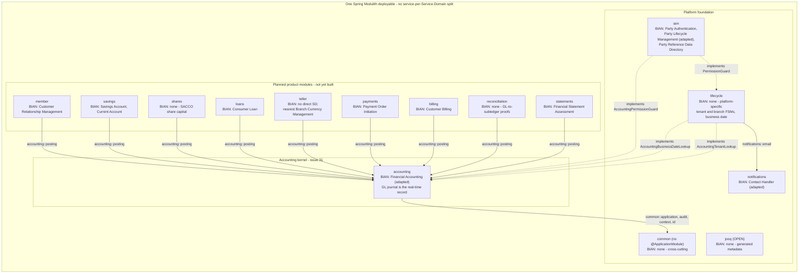

# BIAN service landscape map

> BIAN is a semantic reference architecture for Finaxis, not a deployment blueprint. It supplies
> vocabulary and a capability checklist. It does not dictate deployment topology, package
> structure, transport shape, or database schema. See
> [ADR 0017](../adr/0017-bian-semantic-reference-architecture.md).

Sources verified on: 2026-08-31.

## Scope and non-goals

### What this document decides

- Which BIAN Service Domain each Finaxis module maps to, and how faithfully.
- Where a Finaxis boundary is deliberately platform-specific and has no Service Domain.
- Which BIAN vocabulary Finaxis borrows for cross-module ports and events.
- Which BIAN semantics Finaxis deliberately rejects, and why.

### What this document does not decide

- **It does not split Finaxis into services.** A BIAN Service Domain is a capability, not a
  deployable. Finaxis remains one Spring Modulith deployable.
- It creates no schema, no migration, and no production Kotlin.
- It does not constrain the accounting design records, which are owned by issue #30.

## BIAN release used

### Version and access

**BIAN Service Landscape 14.0**, released February 2026. Metrics taken from the v14.0.0 release
notes (a directly downloadable PDF, no registration):

| Release | Service Domains | Business Domains | Business Capabilities | Semantic APIs |
| --- | --- | --- | --- | --- |
| v11.0 | 326 | 38 | 568 | 249 |
| v12.0 | 327 | 38 | 582 | 250 |
| v13.0 | 327 | 38 | 586 | 249 |
| **v14.0** | **322** | **38** | **586** | **242** |

The Service Domain count **fell** from 327 to 322 in v14.0, consistent with the release notes
describing Service Domain renaming, removal and addition, particularly in the Payments area.

Two cautions on this figure. Secondary sources circulate "340 Service Domains" for v14.0; nothing
in the primary material supports it. BIAN's own release-history page also states a different
count for v11.0 than the release-notes metrics table does. Where they disagree, this document
follows the release-notes metrics table, because it is versioned, dated and directly downloadable.
Quote a Service Domain count only from that table.

### Publicly reachable sources

| Source | Status | Provides |
| --- | --- | --- |
| `https://bian.org/deliverables/service-landscape/` | 200 HTML | Release history and portal access form |
| `https://bian.org/wp-content/uploads/2026/02/BIAN-v14.0-Release-Notes-v1.0_-Final-Version.pdf` | 200 PDF | The metrics table above; v14.0 change summary |
| `https://raw.githubusercontent.com/bian-official/public/master/release14.0.0/semantic-apis/asyncapi-3.x/yamls/<ServiceDomain>.yaml` | 200 | Per-Service-Domain v14.0.0 definitions, one file each |
| `https://raw.githubusercontent.com/bianapis/wave1/master/sd-<service-domain>.yaml` | 200 | Older narrative prose ("Service Domain Role", "General comment") that v14 no longer carries |

The `bian-official/public` repository publishes the v14.0.0 Service Domain definitions without
registration. It is the evidence base for every quotation below.

### Sources that are not machine-fetchable

- The Service Landscape **portal** requires registration via an access form.
- `https://bian.org/servicelandscape-11-0-0/object_41.html?object=43420` — the URL cited in issue
  #28 — is JavaScript-rendered and returns an empty `InSite` shell to any non-browser fetch. It is
  not usable as an evidence source and is not cited as one.

### Re-verification trigger

Re-verify this mapping when any of the following occurs, whichever is first:

1. BIAN publishes a release above 14.0 (check the release history page above).
2. A new `release*` directory appears in `bian-official/public`.
3. Finaxis adds a new `@ApplicationModule` carrying financial capability.
4. Twelve months elapse from the "Sources verified on" date at the top of this document.

On re-verification, bump that date. It is the only place the freshness of this document is
recorded.

## How Finaxis uses BIAN

### Mapping levels

A BIAN Service Domain maps onto **at most** one of these, never onto a deployable:

| Level | Meaning |
| --- | --- |
| Module | A Spring Modulith `@ApplicationModule`, e.g. `accounting` |
| Package | A package inside a module |
| Named interface | A `@NamedInterface` other modules may consume, e.g. `accounting::posting` |

### Adoption qualifiers

Every mapping carries exactly one qualifier:

| Qualifier | Meaning |
| --- | --- |
| `adopted` | Finaxis takes the BIAN semantic essentially as written |
| `adapted` | Finaxis takes the concept but changes timing, scope or guarantees; the change is recorded in the deviation register |
| `deviates` | Finaxis rejects the BIAN semantic outright; recorded in the deviation register |
| `none` | No Service Domain applies; the boundary is platform-specific |

### The modular-monolith constraint

Finaxis is one deployable. The reason is the ledger invariant, not convenience: a balance-affecting
product transaction must commit its business effect, its subsidiary-ledger effect and its
general-ledger posting **in one PostgreSQL transaction**. Splitting product fulfilment from
accounting across a network boundary would make that guarantee impossible to hold, and would
replace it with eventual reconciliation — which is precisely the property this platform refuses.
Changing deployment topology therefore requires an ADR that supersedes ADR 0017.

## Capability landscape

### Current modules

`accounting`, `iam`, `lifecycle`, `notifications`, `common`, `config`, `jooq`.

### Planned modules

member, savings/deposits, shares, loans, teller/cash, payments,
billing/fees, reconciliation and financial statements as the product phases land.

### Capability and context diagram



Two things the diagram asserts:

- **Solid arrows are consumer to provider public API. Dotted arrows are inverted ports**: the
  consumer declares the interface and the provider ships the adapter, listing the consumer in its
  own `allowedDependencies`. That is why `iam` depends on `lifecycle` and no module depends on
  `iam`.
- Every node is inside the single deployable. This is a **capability** map, not a topology map.

## Module mappings

### iam

| Field | Value |
| --- | --- |
| BIAN Service Domain(s) | Party Authentication, Party Lifecycle Management, Party Reference Data Directory |
| Qualifier | adapted (partial) |

Keycloak authenticates; Finaxis authorizes. BIAN models party identity and lifecycle, but has no
permission-code RBAC model, no multi-tenant membership concept, and no active-organisation request
context. Those parts of `iam` are platform-specific and are not claimed as BIAN coverage.

### lifecycle

| Field | Value |
| --- | --- |
| BIAN Service Domain(s) | **none** |
| Qualifier | none — platform-specific |

Tenant, branch, user and membership state machines, tenant provisioning, and the controlled
business date with its close-of-business cycle. The nearest BIAN neighbours are
`Branch Location Operations` (which covers branch estate management, not tenant lifecycle) and
`Corporate Treasury` (which is adjacent to calendar concerns but is not a business-date authority).
Neither covers SaaS tenant lifecycle, so this module is explicitly **not** a Service Domain.

### notifications

| Field | Value |
| --- | --- |
| BIAN Service Domain(s) | Contact Handler |
| Qualifier | adapted |

BIAN models multi-channel customer contact. Finaxis implements outbound transactional email only,
driven by the outbox to RabbitMQ to JobRunr pipeline.

### common

| Field | Value |
| --- | --- |
| BIAN Service Domain(s) | **none** |
| Qualifier | none — not a boundary |

Cross-cutting infrastructure. Has no `@ApplicationModule` and is addressed only as
`common::<named-interface>`.

### config

| Field | Value |
| --- | --- |
| BIAN Service Domain(s) | **none** |
| Qualifier | none — not a boundary |

Infrastructure wiring, deliberately without an `@ApplicationModule`.

### jooq

| Field | Value |
| --- | --- |
| BIAN Service Domain(s) | **none** |
| Qualifier | none — not a boundary |

Generated PostgreSQL schema metadata, declared `Type.OPEN`.

### accounting

| Field | Value |
| --- | --- |
| BIAN Service Domain(s) | Financial Accounting |
| Qualifier | **adapted** |

The accounting semantic anchor. See the next two sections.

## Accounting semantic anchor: BIAN Financial Accounting

### BIAN definition, quoted

From `release14.0.0/semantic-apis/asyncapi-3.x/yamls/FinancialAccounting.yaml`, `info.version:
14.0.0`:

> The Financial Accounting Service Domain takes in financial facts and based on these, creates
> accounting instructions that will update the general ledger and sub ledger accounts

Its control record is `FinancialBookingLog` (channels `FinancialBookingLog/Created` and
`/Updated`); its behaviour qualifier is `LedgerPosting` (channels `LedgerPosting/Created` and
`/Updated`).

The older narrative form (`bianapis/wave1/sd-financial-accounting.yaml`) adds that the domain
covers "double entry ledgers and can include multiple levels of consolidation (sub-ledgers)" and
that accounts "conform to the bank's chart of accounts".

### Finaxis mapping

The `accounting` module maps to `Financial Accounting`. The BIAN control record and behaviour
qualifier map onto Finaxis concepts as follows:

| BIAN | Finaxis |
| --- | --- |
| financial fact | posting intent carried in a `PostFinancialFactsCommand` |
| accounting instruction | `posting_request`, persisted as durable lineage |
| `FinancialBookingLog` entry | `journal_entry` |
| `LedgerPosting` | `journal_line` |
| chart of accounts | `gl_account` |
| levels of consolidation (sub-ledgers) | control accounts plus product-owned subsidiary ledgers |

### What Finaxis adopts

The **fact-in, instruction-out** semantic. Product modules state what economically happened;
accounting decides which accounts move and by how much. Product modules never choose GL accounts
and never write accounting persistence.

### What Finaxis adapts

The **timing**. BIAN's phrasing ("creates accounting instructions that *will* update the general
ledger") admits a downstream, deferred or batched update. Finaxis does not. The posting is
synchronous and commits in the same PostgreSQL transaction as the source-domain mutation and the
subsidiary-ledger effect. There is no interval in which a business fact exists and the ledger does
not know about it.

## BIAN Position Keeping evaluation

### BIAN definition, quoted

From `release14.0.0/semantic-apis/asyncapi-3.x/yamls/PositionKeeping.yaml`, `info.version:
14.0.0`:

> This service domain maintains a log of monetary or value transactions and entitlements log posted
> to product facilities. Reconciled financial transactions are subsequently used for posting to the
> accounting systems.

The older narrative form (`bianapis/wave1/sd-position-keeping.yaml`) is more explicit:

> Any product fulfillment domain, current account, savings account, credit card, etc, delegates
> transaction posting/track to the Position Keeping service domain.

> Position Keeping is the service domain that maintains transaction journals for a wide range of
> bank activities - product fulfillment in particular. It keeps a record of all debit and credit
> entries to the position.

### Why Finaxis does not create a Position Keeping boundary

Finaxis adopts the **shape** — product-level transaction journals that track debit and credit
entries against a position — and rejects the **sequencing**. Creating a `positionkeeping` module
would institutionalise the very staging-then-reconcile flow the platform refuses.

### Where subsidiary-ledger positions live

In the **product module that owns them**. A savings position belongs to `savings`, a loan position
to `loans`, a share position to `shares`. Accounting owns the general ledger and nothing else.
Product modules never write accounting persistence, and accounting holds no foreign key into a
product-owned table.

### Real-time journal versus interval booking

BIAN's Position Keeping is a transaction journal that product fulfilment domains delegate posting
to, whose "reconciled financial transactions are subsequently used for posting to the accounting
systems". **Finaxis rejects that sequencing.** The Finaxis general-ledger journal is written
synchronously, inside the same PostgreSQL transaction as the source-domain mutation and the product
subsidiary-ledger effect. There is no window in which a position exists that the ledger does not
know about, and there is no reconciliation step that promotes positions into the ledger.

Interval and summary bookings — daily rollups, period aggregates, current-balance caches — are
**derived optimisations** built from immutable journal lines. They are never the only source of
truth and must be fully reconstructable by replaying the journal. **Any design that makes a rollup
authoritative is a defect, not a variation.**

### Derived balances and rollups are projections

Every balance, every rollup and every reporting aggregate is a projection over immutable journal
lines, and every one of them must ship with the deterministic query that rebuilds it. Reconciliation
runs prove the projection matches the journal; when they disagree, the journal wins.

## Deviation register

| ID | BIAN position | Finaxis position | Driver | Enforced by |
| --- | --- | --- | --- | --- |
| FX-DEV-001 | Positions are kept by Position Keeping, reconciled, then posted to accounting | Source mutation, subsidiary-ledger effect and GL journal commit in one PostgreSQL transaction | Transactional guarantee | Issue #29 atomicity tests; issue #41 posting engine |
| FX-DEV-002 | Service Domains are candidate deployable services | One Spring Modulith deployable; a Service Domain maps to a module, package or named interface | Ledger invariant, operability | ADR 0017 and review. `ModulithArchitectureTest` verifies the module graph *within* the single application; it cannot see a second application, subproject or deployment artifact, so it does not enforce the one-deployable count |
| FX-DEV-003 | Service Operation verbs and control-record ids form the API | Finaxis uses `<Verb><Thing>Command` and `<Thing>Store\|Queries\|Lookup\|Gateway`, with REST under `/api/v1` | API governance, readability | `docs/architecture/api-governance.md`, review |
| FX-DEV-004 | Single-bank model with no tenant concept | Every accounting fact is organisation-scoped and branch-aware | Multi-tenant SACCO SaaS | Schema composite foreign keys, application-layer tenant filtering |
| FX-DEV-005 | Financial Accounting creates accounting instructions that *will* update the ledgers, which admits downstream, deferred or batched posting (it does not mandate asynchronous receipt) | Product modules call the accounting public API synchronously; no asynchronous GL reconstruction after commit | Correctness, audit | Issue #41 acceptance criteria; messaging architecture rules |
| FX-DEV-006 | No shares or member-equity Service Domain exists | SACCO share capital and member equity are first-class Finaxis capabilities with no BIAN anchor | SACCO requirement | Mapping template records `BIAN: none` |
| FX-DEV-007 | BIAN offers no maker-checker primitive | Privileged accounting operations require maker-checker with a persisted checker identity | SACCO and core-banking control | Issue #30 invariants; issue #34 policy |

## Mapping template for new financial capabilities

### When to use it

Required for every new `@ApplicationModule` carrying financial capability. Encouraged, but not
required, for non-financial modules. The filled-in template becomes that module's
`## Module mappings` subsection in this document, and its first line becomes the module's `BIAN:`
Javadoc line.

### Template fields

```
### <finaxis module name>

- Finaxis capability:
- Owning Spring Modulith module:
- Public named interface(s) other modules consume:
- BIAN Service Domain(s):                    (exact v14.0.0 name, or `none`)
- BIAN source URL and fetch date:
- Adoption qualifier:                        adopted | adapted | deviates | none
- BIAN control record / asset type:
- BIAN behaviour qualifiers considered:
- What Finaxis adopts:
- What Finaxis adapts, and why:
- What Finaxis rejects, and why:
- Deviation register IDs raised:             FX-DEV-xxx
- Accounting relationship:                   posts via `accounting::posting` | none
- Subsidiary-ledger / position ownership:    owning module | none
- Transaction participation:                 same PostgreSQL transaction as GL posting? yes/no + why
- Tenant and branch scoping:
- Cross-module ports declared by this module:
- Cross-module ports this module implements for others:
- Events externalized (target strings):
- `package-info.java` BIAN line (verbatim):
```

Before filling in the `BIAN Service Domain(s)` field, **verify the name resolves**. Each Service
Domain is one file:

```bash
base=https://raw.githubusercontent.com/bian-official/public/master/release14.0.0/semantic-apis/asyncapi-3.x/yamls
curl -sS -o /dev/null -w "%{http_code}\n" -L "$base/<PascalCaseName>.yaml"
```

Names verified to exist in v14.0.0 (2026-08-31): `FinancialAccounting`, `PositionKeeping`,
`PartyAuthentication`, `PartyLifecycleManagement`, `PartyReferenceDataDirectory`,
`CustomerRelationshipManagement`, `CustomerAgreement`, `CustomerPosition`, `CurrentAccount`,
`SavingsAccount`, `TermDeposit`, `ConsumerLoan`, `CorporateLoan`, `PaymentOrderInitiation`,
`BranchCurrencyManagement`, `BranchLocationOperations`, `CustomerBilling`, `ProductDirectory`,
`FinancialStatementAssessment`, `FinancialInstrumentValuation`, `RegulatoryReporting`,
`ContactHandler`, `CorporateTreasury`.

Names verified **not** to exist in v14.0.0 — do not invent them: `TellerOperations`,
`CashManagement`, `CashHandling`, `FinancialStatements`, `FinancialControl`, `SubLedgerAccounting`,
`LedgerAccounting`, `ManagementAccounting`, `ShareCapital`, `MemberEquity`, `Reconciliation`,
`LoanArrangement`, `PaymentInitiation`.

Teller/cash and member equity therefore have **no** direct v14.0.0 Service Domain. Record them as
`BIAN: none — nearest is <X>` rather than guessing a name.

### Worked example: accounting

```
### accounting

- Finaxis capability: general ledger, chart of accounts, fiscal calendar, posting rules
- Owning Spring Modulith module: accounting
- Public named interface(s): accounting::posting, accounting::domain
- BIAN Service Domain(s): Financial Accounting
- BIAN source URL and fetch date:
  raw.githubusercontent.com/bian-official/public/master/release14.0.0/semantic-apis/
  asyncapi-3.x/yamls/FinancialAccounting.yaml, 2026-08-31
- Adoption qualifier: adapted
- BIAN control record / asset type: FinancialBookingLog
- BIAN behaviour qualifiers considered: LedgerPosting
- What Finaxis adopts: the fact-in, instruction-out semantic
- What Finaxis adapts, and why: posting is synchronous and in-transaction, not downstream
- What Finaxis rejects, and why: BIAN Service Operation verbs and payload schemas in the domain
  model; they would leak transport shape into the ledger contract
- Deviation register IDs raised: FX-DEV-001, FX-DEV-005
- Accounting relationship: owns the general ledger; other modules post via accounting::posting
- Subsidiary-ledger / position ownership: none - product modules own their positions
- Transaction participation: yes - the GL posting commits with the caller's transaction
- Tenant and branch scoping: every accounting row carries organisation_id; branch is a posting
  dimension
- Cross-module ports declared: AccountingPermissionGuard, AccountingBusinessDateLookup,
  AccountingTenantLookup
- Cross-module ports implemented for others: none
- Events externalized: none yet
- package-info.java BIAN line: BIAN: Financial Accounting (adapted) - see
  docs/architecture/bian-service-landscape.md
```

## Naming guidance for ports and events

### Nouns Finaxis borrows from BIAN

*Financial fact*, *posting*, *ledger*, *sub-ledger*, *position*, *chart of accounts*, *control
account*. These improve semantic consistency at no cost.

### BIAN shapes Finaxis does not import

- **Service Operation verbs** — `Initiate`, `Update`, `Retrieve`, `Execute`, `Request`, `Exchange`,
  `Control`.
- **Control-record identifiers** as API or type names.
- **Behaviour-qualifier URL segments** such as `/PositionKeeping/Initiate`.
- **BIAN and ISO 20022 payload schemas** in `domain` or `application` code.

If a BIAN-shaped external API is ever required, it is an **inbound adapter** with its own DTOs,
never the domain contract.

### Port naming rules

BIAN supplies the noun; the repository supplies the suffix (`Store`, `Queries`, `Lookup`,
`Gateway`, `Repository`).

| Write this | Not this |
| --- | --- |
| `AccountingBusinessDateLookup` | `BusinessDateControlRecordRetrieve` |
| `PostingService` | `FinancialAccountingServiceDomain` |
| `PostFinancialFactsCommand` | `InitiateFinancialBookingLog` |

### Event naming rules

Externalized event `target` strings keep the existing
`finaxis.<module>.<aggregate>.<past-tense>` shape — matching
`finaxis.lifecycle.organisation.business-date-advanced` — never BIAN channel names such as
`FinancialBookingLog/Created`.

## Glossary: Finaxis term to BIAN term

| Finaxis term | BIAN term | Relationship | Note |
| --- | --- | --- | --- |
| organisation / tenant | (none) | Finaxis-only | BIAN models one bank; Finaxis is multi-tenant SaaS |
| branch | Branch Location | partial | `Branch Location Operations` covers estate management, not accounting scope |
| business date / COB | (none) | Finaxis-only | Controlled, optimistically locked, tenant-scoped; owned by `lifecycle` |
| actor / permission code | (none) | Finaxis-only | BIAN has no runtime authorization model |
| posting intent | financial fact | adapted | Carried synchronously in a command |
| posting request | accounting instruction | adapted | Persisted as durable lineage |
| journal entry | Financial Booking Log entry | adapted | Immutable and real-time in Finaxis |
| journal line | Ledger Posting | adapted | BIAN behaviour qualifier |
| GL account | financial account / chart of accounts | adopted | Same concept |
| sub-ledger / product position | Financial Position Log | shape adopted, sequencing rejected | See FX-DEV-001 |
| control account | level of consolidation | adapted | BIAN speaks of "multiple levels of consolidation" |
| derived balance / rollup | (none) | Finaxis-only | Explicitly a projection, never authoritative |
| reversal | (none explicit) | Finaxis-only | No update or delete of posted history |
| fiscal period | (none explicit) | Finaxis-only | Open and closed period gating for posting |
| share account | (none) | Finaxis-only | SACCO share capital; see FX-DEV-006 |
| member | Customer / Party | adapted | A SACCO member is customer *and* owner |
| externalized transition event | BIAN event channel | shape rejected | Finaxis uses `finaxis.<module>.<aggregate>.<past-tense>` |

## Enforcement

### The `BIAN:` module documentation convention

Every `@ApplicationModule` `package-info.java` must carry a line in its Javadoc beginning `BIAN:`,
either naming the Service Domain(s) with an `(adopted)` or `(adapted)` qualifier, or reading
`BIAN: none —` followed by why the boundary is platform-specific. This is a canonical repository
rule, recorded in `CLAUDE.md`.

### Architecture test

`BianModuleMappingTests` enforces three things:

1. The module descriptors are actually discovered, so a path typo cannot make the suite vacuous.
2. Every `@ApplicationModule` descriptor carries a `BIAN:` line.
3. Every module directory name has a matching `### <module>` section in this document.

The third rule ties code and documentation together in both directions: a new module cannot merge
without a section here, and a renamed module breaks the test until this document is updated.

### Adding a new financial module

1. Fill in the mapping template, verifying the Service Domain name resolves.
2. Add the filled template as a `### <module>` section under **Module mappings**.
3. Put the `BIAN:` line in the module's `package-info.java` Javadoc.
4. Raise any new deviations in the register with a fresh `FX-DEV-xxx` id.
5. Run `./gradlew test --tests '*BianModuleMappingTests*'`.

## Related documents

- [ADR 0017: BIAN as semantic reference architecture](../adr/0017-bian-semantic-reference-architecture.md)
- [ADR 0008: Namastack-only transactional outbox](../adr/0008-transactional-outbox-over-direct-amqp.md)
- [API governance](api-governance.md)
- [Foundation schema](../database/foundation-schema.md)
