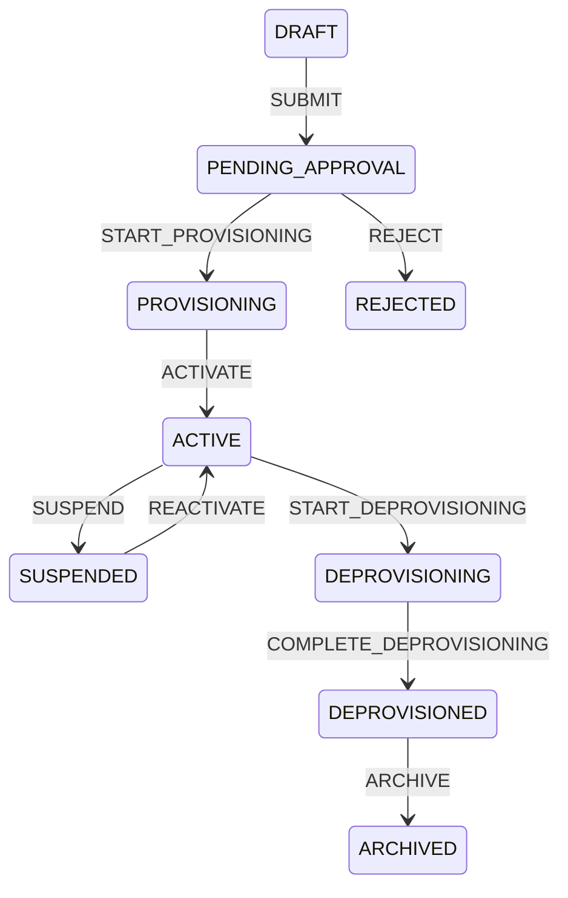
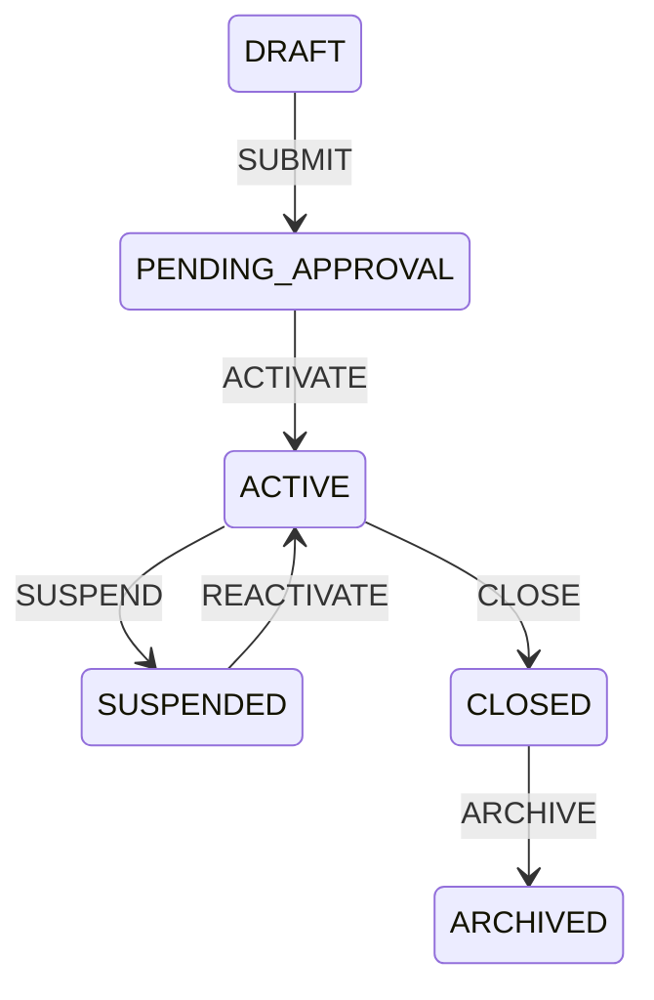
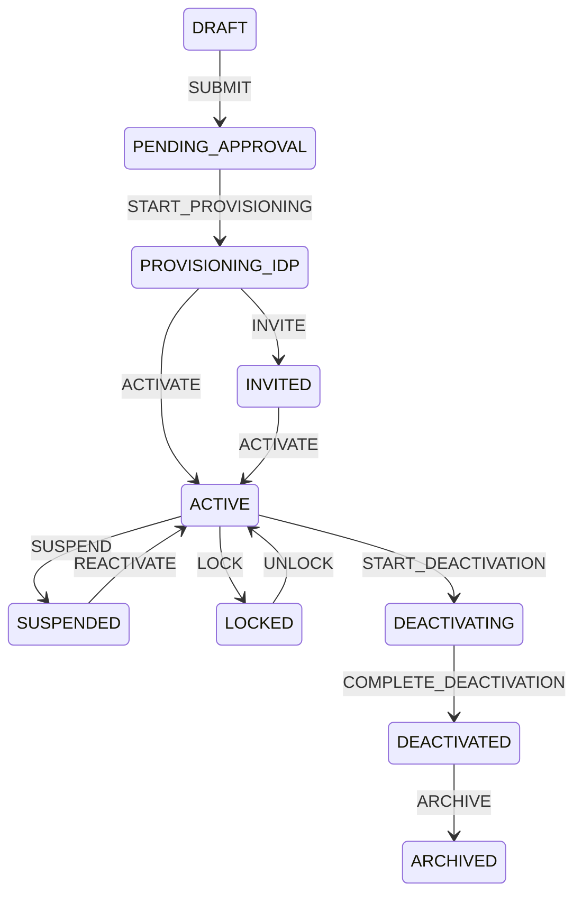
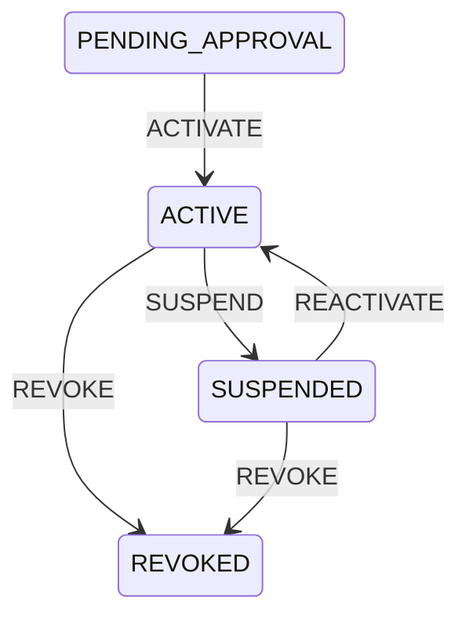

# Foundation Lifecycle FSMs

The foundation uses `common.transitions.TransitionGraph` and `TransitionExecutor`; it does not add
a second FSM engine. State changes must go through lifecycle application services, persist a
per-aggregate transition log, record an audit event, and publish selected Modulith events for
Namastack/RabbitMQ externalization.

Branch activation requires an active or provisioning organisation. Closing a branch requires no
active assignment unless the command has first revoked or reassigned it. User activation requires
a Keycloak link or explicit invitation completion. Membership activation requires an active
organisation and user, plus active branch and role assignments when operational access is needed.

Each transition is an explicit command. Guard failures expose a safe business message and retain
diagnostic logging. A successful lifecycle transaction updates only through its lifecycle service,
writes the per-aggregate transition log and `audit_event`, and records the required selected
outbox event such as `TenantActivated`, `BranchSuspended`, `UserInvited`, or
`MembershipActivated`.
