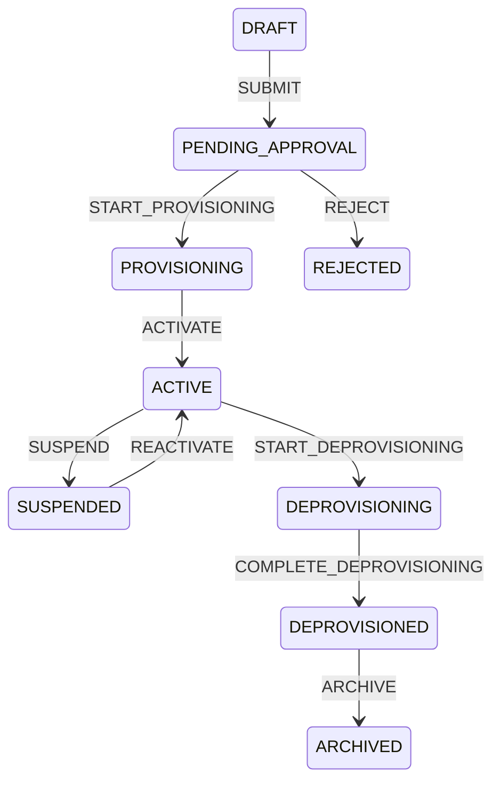
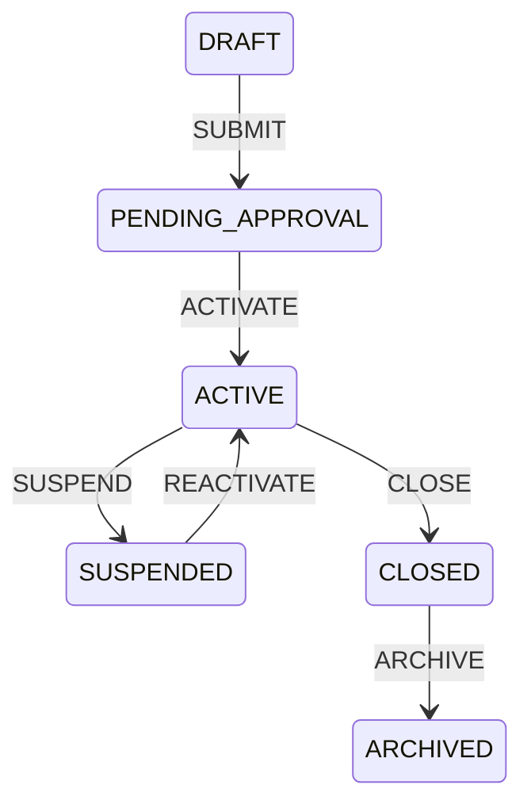
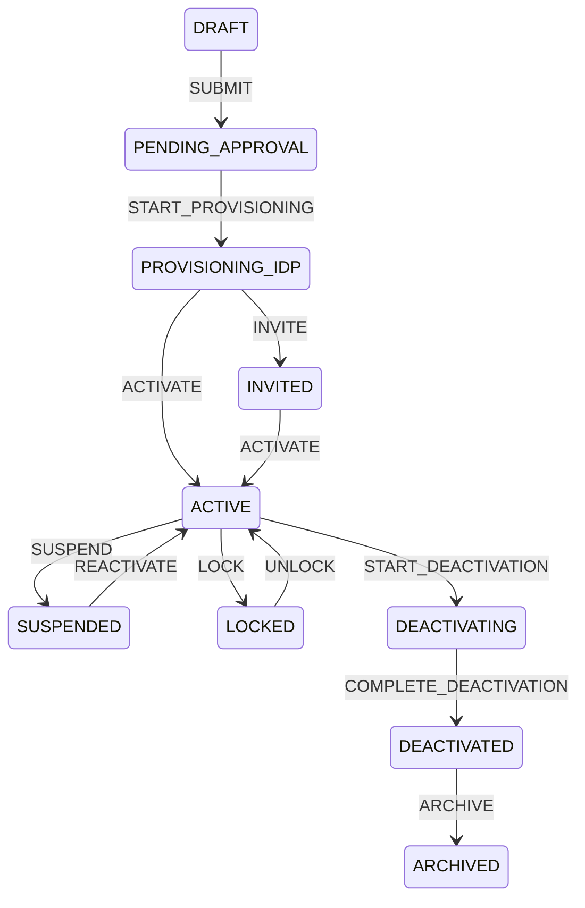
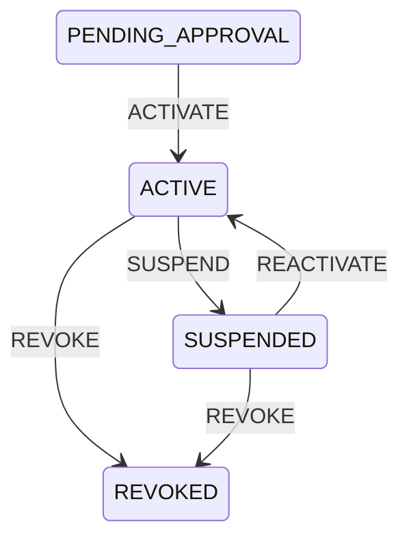

# Foundation Lifecycle FSMs

The foundation uses `common.transitions.TransitionGraph` and `TransitionExecutor`; it does not add
a second FSM engine. State changes must go through lifecycle application services, persist a
per-aggregate transition log, record an audit event, and publish events through transition
`eventFactories`. `InternalTransitionEvent` remains in-process; selected
`ExternalizedTransitionEvent` instances are externalized through Modulith and Namastack to
RabbitMQ.

```mermaid
stateDiagram-v2
    DRAFT --> PENDING_APPROVAL: SUBMIT
    PENDING_APPROVAL --> PROVISIONING: START_PROVISIONING
    PROVISIONING --> ACTIVE: ACTIVATE
    PENDING_APPROVAL --> REJECTED: REJECT
    ACTIVE --> SUSPENDED: SUSPEND
    SUSPENDED --> ACTIVE: REACTIVATE
    ACTIVE --> DEPROVISIONING: START_DEPROVISIONING
    DEPROVISIONING --> DEPROVISIONED: COMPLETE_DEPROVISIONING
    DEPROVISIONED --> ARCHIVED: ARCHIVE
```

```mermaid
stateDiagram-v2
    DRAFT --> PENDING_APPROVAL: SUBMIT
    PENDING_APPROVAL --> ACTIVE: ACTIVATE
    ACTIVE --> SUSPENDED: SUSPEND
    SUSPENDED --> ACTIVE: REACTIVATE
    ACTIVE --> CLOSED: CLOSE
    CLOSED --> ARCHIVED: ARCHIVE
```

Branch activation requires an active or provisioning organisation. Closing a branch requires no
active assignment unless the command has first revoked or reassigned it. User activation requires
a Keycloak link or explicit invitation completion. Membership activation requires an active
organisation and user, plus active branch and role assignments when operational access is needed.

```mermaid
stateDiagram-v2
    DRAFT --> PENDING_APPROVAL: SUBMIT
    PENDING_APPROVAL --> PROVISIONING_IDP: START_PROVISIONING
    PROVISIONING_IDP --> INVITED: INVITE
    PROVISIONING_IDP --> ACTIVE: ACTIVATE
    INVITED --> ACTIVE: ACTIVATE
    ACTIVE --> SUSPENDED: SUSPEND
    SUSPENDED --> ACTIVE: REACTIVATE
    ACTIVE --> LOCKED: LOCK
    LOCKED --> ACTIVE: UNLOCK
    ACTIVE --> DEACTIVATING: START_DEACTIVATION
    DEACTIVATING --> DEACTIVATED: COMPLETE_DEACTIVATION
    DEACTIVATED --> ARCHIVED: ARCHIVE
```

```mermaid
stateDiagram-v2
    PENDING_APPROVAL --> ACTIVE: ACTIVATE
    ACTIVE --> SUSPENDED: SUSPEND
    SUSPENDED --> ACTIVE: REACTIVATE
    ACTIVE --> REVOKED: REVOKE
    SUSPENDED --> REVOKED: REVOKE
```

Maker-checker is enforced around the `ACTIVATE` transitions, not inside the graph: a membership
is not approved by its inviter or by the invited user, and a branch is not activated by its
creator. A platform-context actor may be the checker of a pending membership (only while the
tenant has no `ACTIVE` member beyond its bootstrap administrator) or of a pending branch (only
while it has no `ACTIVE` branch beyond the bootstrap head office) through the same services
(`ActingScope.PLATFORM`), so the graphs, guards, transition logs and event factories are the same on
both paths and a platform-approved membership raises the same activation event. See
[ADR 0028](../adr/0028-platform-checker-for-first-tenant-approvals.md).

Each transition is an explicit command. Guard failures expose a safe business message and retain
diagnostic logging. A successful lifecycle transaction updates only through its lifecycle service,
writes the per-aggregate transition log and `audit_event`, then publishes the events created by
its `eventFactories`. The membership activation factory produces an
`ExternalizedTransitionEvent`; the notifications module consumes it after Namastack externalizes
it to RabbitMQ.
