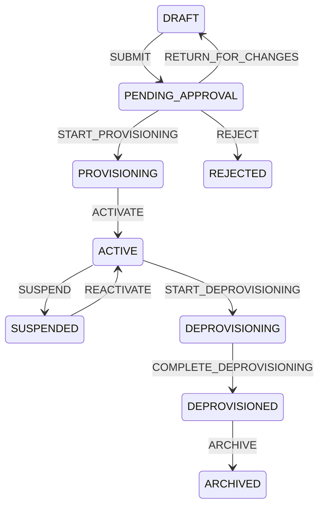
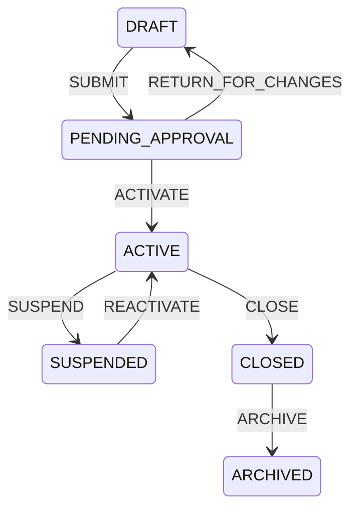
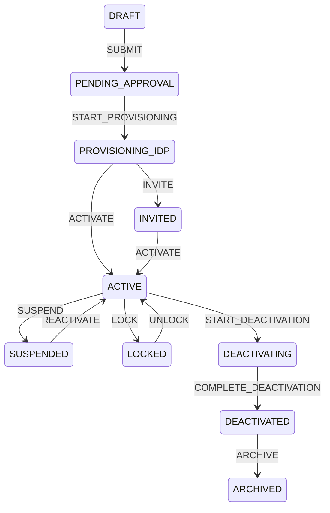
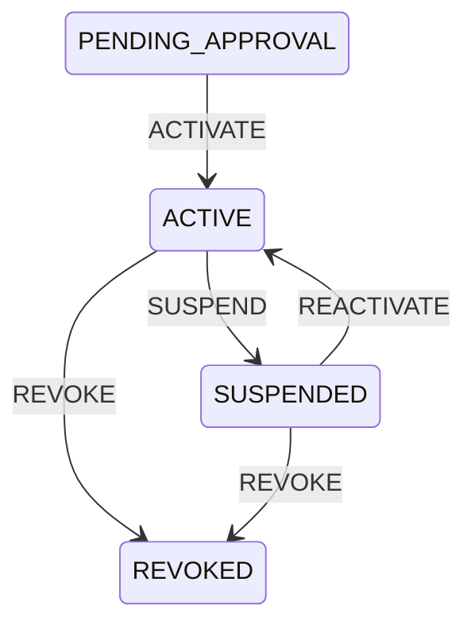

# Foundation Lifecycle FSMs

The foundation uses `common.transitions.TransitionGraph` and `TransitionExecutor`; it does not add
a second FSM engine. State changes must go through lifecycle application services, persist a
per-aggregate transition log, record an audit event, and publish events through transition
`eventFactories`. `InternalTransitionEvent` remains in-process; selected
`ExternalizedTransitionEvent` instances are externalized through Modulith and Namastack to
RabbitMQ.

```mermaid
stateDiagram-v2
    DRAFT --> PENDING_APPROVAL: SUBMIT
    PENDING_APPROVAL --> PROVISIONING: START_PROVISIONING
    PROVISIONING --> ACTIVE: ACTIVATE
    PENDING_APPROVAL --> REJECTED: REJECT
    PENDING_APPROVAL --> DRAFT: RETURN_FOR_CHANGES
    ACTIVE --> SUSPENDED: SUSPEND
    SUSPENDED --> ACTIVE: REACTIVATE
    ACTIVE --> DEPROVISIONING: START_DEPROVISIONING
    DEPROVISIONING --> DEPROVISIONED: COMPLETE_DEPROVISIONING
    DEPROVISIONED --> ARCHIVED: ARCHIVE
```

```mermaid
stateDiagram-v2
    DRAFT --> PENDING_APPROVAL: SUBMIT
    PENDING_APPROVAL --> ACTIVE: ACTIVATE
    PENDING_APPROVAL --> DRAFT: RETURN_FOR_CHANGES
    ACTIVE --> SUSPENDED: SUSPEND
    SUSPENDED --> ACTIVE: REACTIVATE
    ACTIVE --> CLOSED: CLOSE
    CLOSED --> ARCHIVED: ARCHIVE
```

**The platform organisation never transitions.** Every edge of the organisation graph carries a
guard (`FoundationLifecycleDefinitions.organisationGraph`) that refuses the reserved `PLATFORM`
organisation, so no caller of `FoundationLifecycleService` can suspend, deprovision or otherwise
move it; the refusal is a `TransitionGuardException`, mapped to a `409` and audited as `DENIED` like
any guard. `OrganisationProvisioningService` refuses it earlier and with its own code
(`lifecycle.platform_organisation_protected`), recording a `DENIED` audit row first through
`AuditService.recordIndependently` (a new transaction, so the `409`'s rollback cannot take it), and
`V20` pins its status to `ACTIVE` in the database (#205). The guard is on the organisation aggregate
only: platform branches and memberships keep their ordinary lifecycles. See
[the platform organisation is never a tenant](../security/authorization-model.md#the-platform-organisation-is-never-a-tenant).

Branch activation requires an active or provisioning organisation. Closing a branch requires no
active assignment unless the command has first revoked or reassigned it. User activation requires
a Keycloak link or explicit invitation completion. Membership activation requires an active
organisation and user, plus active branch and role assignments when operational access is needed.

A branch's name, parent, timezone and address change through `PATCH /branches/{id}`
(`BranchProvisioningService.update`), which is deliberately **not** a transition: it moves no
state, so it has no transition-log row and publishes no event. It writes a `branch.update` audit
row and increments `row_version`, and is allowed only in `DRAFT` and `ACTIVE`, so a draft returned
for changes (below) is amendable. It needs its own permission, `branch.update`, not `branch.create`
(#203). See [foundation API](../api/foundation-api.md#update-branch).

The closure guard refuses to close a branch with an `ACTIVE` child, and the update is the way to
re-parent one, so it refuses a `CLOSED`/`ARCHIVED` parent (409) and claims the new parent by
bumping its `row_version` in the same transaction: a close that already read the parent then fails
its optimistic-lock check instead of closing a branch that now has an active child.

**Known limitation:** the other ways a branch gets a parent do not enforce this. Creating a branch
under, or submitting or activating a branch beneath, a `CLOSED` or `ARCHIVED` parent is not
refused, so that state is still reachable through them. The update does not repair it either.

Branch transitions also stamp two columns in the same `UPDATE` that writes the new state
(`JooqFoundationLifecyclePersistence.saveBranch`), from the organisation's current business date
and not the wall clock: `opened_on` on entry to `ACTIVE` (only when still null, so a
`REACTIVATE` keeps the first opening date, and the head office that tenant approval activates is
stamped the same way) and `closed_on` on entry to `CLOSED`. `CLOSED` only moves on to `ARCHIVED`,
so `closed_on` is never cleared.

This only applies to transitions made after the release. Branches that already had such a
transition on record (whatever state they are in now, including `SUSPENDED` and `ARCHIVED`) were
backfilled once by the forward-only data migration `V18__branch_opened_closed_on_backfill.sql`,
best-effort and approximate: the date of the earliest `branch_transition_log` row entering
`ACTIVE` / `CLOSED`, in the organisation's timezone rather than the business date at that moment.
A zone not in the IANA list (including offset ids such as `+03:00`, `UTC+03:00` or `GMT+3`) is
dated in UTC and can be a day off. A branch with no such row keeps `NULL`. `closed_on` is clamped
up to `opened_on`, and a derived `opened_on` down to a stored `closed_on`, so `chk_branch_dates`
holds.

```mermaid
stateDiagram-v2
    DRAFT --> PENDING_APPROVAL: SUBMIT
    PENDING_APPROVAL --> PROVISIONING_IDP: START_PROVISIONING
    PROVISIONING_IDP --> INVITED: INVITE
    PROVISIONING_IDP --> ACTIVE: ACTIVATE
    INVITED --> ACTIVE: ACTIVATE
    ACTIVE --> SUSPENDED: SUSPEND
    SUSPENDED --> ACTIVE: REACTIVATE
    ACTIVE --> LOCKED: LOCK
    LOCKED --> ACTIVE: UNLOCK
    ACTIVE --> DEACTIVATING: START_DEACTIVATION
    DEACTIVATING --> DEACTIVATED: COMPLETE_DEACTIVATION
    DEACTIVATED --> ARCHIVED: ARCHIVE
```

```mermaid
stateDiagram-v2
    PENDING_APPROVAL --> ACTIVE: ACTIVATE
    ACTIVE --> SUSPENDED: SUSPEND
    SUSPENDED --> ACTIVE: REACTIVATE
    ACTIVE --> REVOKED: REVOKE
    SUSPENDED --> REVOKED: REVOKE
```

Maker-checker is enforced around the `ACTIVATE` transitions, not inside the graph: a membership
is not approved by its inviter or by the invited user, and a branch is not activated by its
creator. A platform-context actor may be the checker of a pending membership (only while the
tenant has no `ACTIVE` member beyond its bootstrap administrator) or of a pending branch (only
while it has no `ACTIVE` branch beyond the bootstrap head office) through the same services
(`ActingScope.PLATFORM`), so the graphs, guards, transition logs and event factories are the same on
both paths and a platform-approved membership raises the same activation event. See
[ADR 0028](../adr/0028-platform-checker-for-first-tenant-approvals.md).

Each transition is an explicit command. Guard failures expose a safe business message and retain
diagnostic logging. A successful lifecycle transaction updates only through its lifecycle service,
writes the per-aggregate transition log and `audit_event`, then publishes the events created by
its `eventFactories`. The membership activation factory produces an
`ExternalizedTransitionEvent`; the notifications module consumes it after Namastack externalizes
it to RabbitMQ.

## Return or withdraw a pending branch (ADR 0029, #180)

The branch graph has one edge out of `PENDING_APPROVAL` back to `DRAFT`,
`BranchLifecycleTransition.RETURN_FOR_CHANGES`, with a required reason (3 to 500 characters)
persisted as `status_reason`, in the transition log and on the audit row. It is a state change
only: the branch keeps its code, its parent and its `created_by`, so the code stays taken and the
branch is amended (`PATCH /branches/{id}`, allowed in `DRAFT`) and resubmitted (`SUBMIT`) rather
than recreated. The edge has no guard of its own; `BranchProvisioningService.returnForChanges`
checks the organisation (`ACTIVE` or `PROVISIONING`) before the FSM answers the state conflict.

One transition serves two intents, told apart by the actor, not by a second edge: the branch's
creator or latest submitter **withdraws** (permission `branch.create`), anyone else **returns** it
as a checker (`branch.activate`). The FSM writes `branch.return_for_changes` for both; a withdrawal
adds `branch.withdraw`, and a platform actor returning as a checker adds
`branch.return_for_changes_as_platform_checker` with `checkerScope = PLATFORM` and is bounded like
activation (ADR 0028); a platform withdrawal is not. The order of checks is classify, permission,
platform-organisation and branch 404, platform window (checker only), organisation state, then the
FSM state. See [foundation API](../api/foundation-api.md#return-or-withdraw-a-pending-branch) and
[authorization model](../security/authorization-model.md#branch-return-and-withdrawal).

The transition uses `internalEventFactories()` and publishes no externalized event, as
`SUSPEND_PENDING_APPROVAL` does. Consumers of `branch.approval-requested` therefore see a repeat on
each resubmission with no exit event in between; externalizing a `*.returned-for-changes` event is
a follow-up of its own if a consumer needs it
([transactional outbox](transactional-outbox-amqp.md)).

## Return a pending tenant to draft (ADR 0029, #181)

The organisation graph has one edge out of `PENDING_APPROVAL` back to `DRAFT`,
`OrganisationLifecycleTransition.RETURN_FOR_CHANGES`, with a required reason (3 to 500 characters)
persisted as `status_reason`, in the transition log and on the `organisation.return_for_changes`
audit row. `REJECT` is unchanged and stays terminal; recovering a rejected tenant is #172, not this
edge. The edge has no guard of its own and uses `internalEventFactories()`, so it publishes no
externalized event: consumers of `organisation.approval-requested` see a repeat on each
resubmission with no exit event in between
([transactional outbox](transactional-outbox-amqp.md)).

`OrganisationProvisioningService.returnForChanges` is **checker only**, behind `tenant.reject`: the
actor may be neither the requester nor the submitter (`requested_by` and `submitted_by` on the
bootstrap record, the rule `approveProvisioning` applies) and may not be the system actor, so a
maker cannot pull their own submission back through it. The order is permission (so a caller
without it learns nothing), the refusal of the platform organisation (409
`lifecycle.platform_organisation_protected`), the organisation lock, the bootstrap record (404 for
an unknown tenant), the maker-checker rule, then the FSM's own state conflict (409). The
transition runs first and the record is reset after, so a tenant
that is not pending is refused without touching the record.

Every provisioning decision (approve, return, reject, submit and amend) locks the organisation row
(`FOR NO KEY UPDATE`) **before** it reads the bootstrap record or the state and holds the lock
through the transition in the same transaction. Without it a request could commit return, amend
and resubmit between an approval's reads and the transition's re-read of the organisation, and
the approval would apply the old submitter and administrator to the new submission. The lock order
is organisation, then record, in all five. See ADR 0029, "Locking rule".

The lock is taken before the state is known, so a decision against a tenant that is not pending
(for example an `ACTIVE` one) now briefly holds the `NO KEY UPDATE` lock before it answers 409.
For the duration of that request it conflicts with the posting path's base-currency `FOR SHARE`
and with the branch-hierarchy lock. Every one of these routes needs platform permissions, and
the lock is always taken first and held to the end of the transaction, so it cannot deadlock.

`organisation_initial_administrator_bootstrap` is reset exactly as `REJECT` already resets it:
status back to `DRAFT`, `submitted_by`/`submitted_at` and `approved_by`/`approved_at` cleared,
`requested_by` and the administrator block untouched, in the same transaction as the transition.
The invariant is that the record describes the draft as currently amended and its submitter is the
actor of the current submission. A returned tenant is a `DRAFT`: `PATCH /platform/tenants/{id}`
amends it (replacing the administrator block), `POST .../submit` resubmits it (setting the new
submitter), and the maker-checker rule and the approver-is-the-initial-administrator refusal
(ADR 0028) are read from the record at approval, never cached, so they hold across the loop. The
returning checker, like any amender, is not a maker and may approve a later resubmission.

The reason is the tenant's `status_reason` until its next transition (an amend keeps it, the next
`SUBMIT` replaces it); the history stays in the transition log and the audit trail. The platform
tenant detail and the tenant's own `GET /tenant` expose it as an always-present, nullable
`status_reason`. See
[foundation API](../api/foundation-api.md#return-tenant-for-changes) and
[authorization model](../security/authorization-model.md#tenant-return-for-changes).

See [ADR 0029](../adr/0029-approval-model-per-resource-extensions.md).
