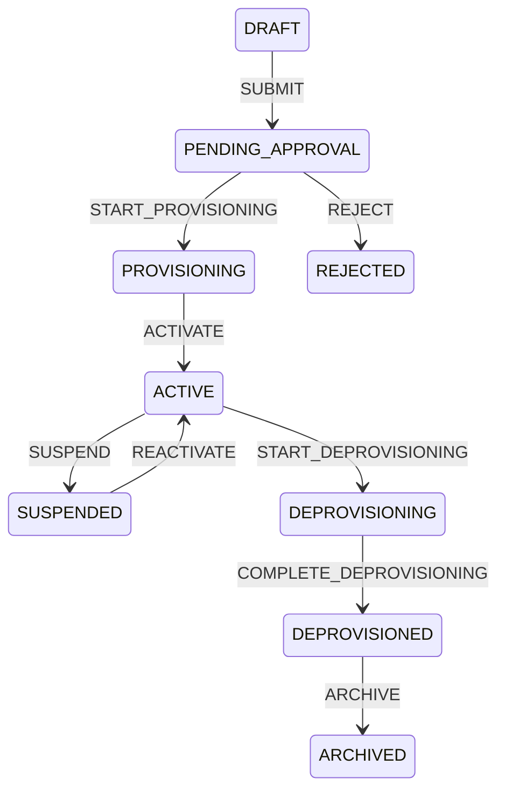
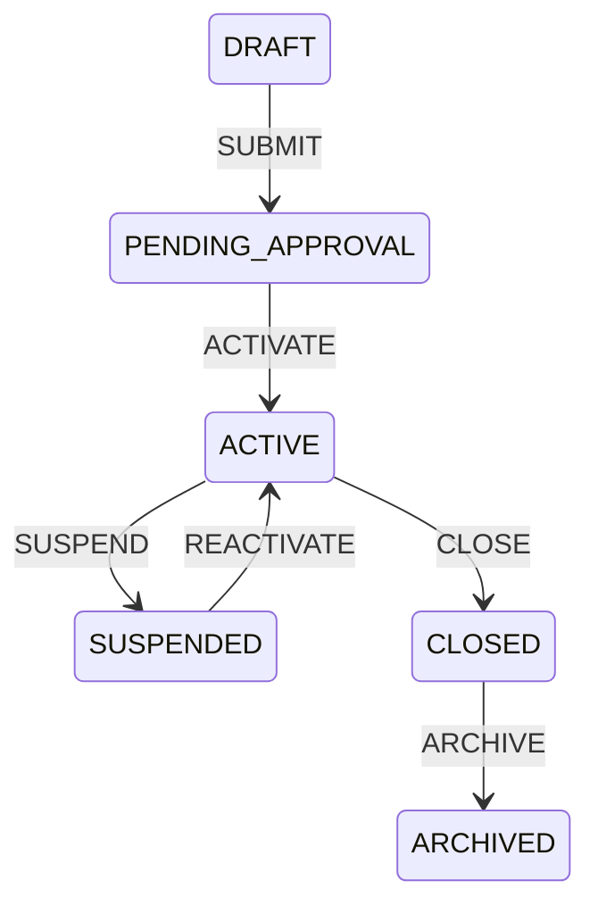
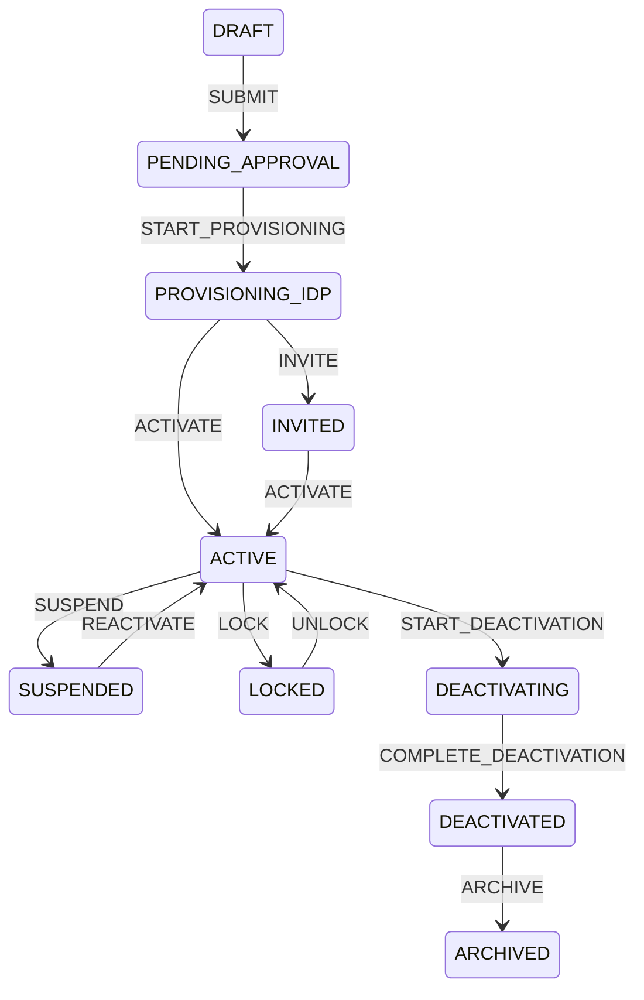
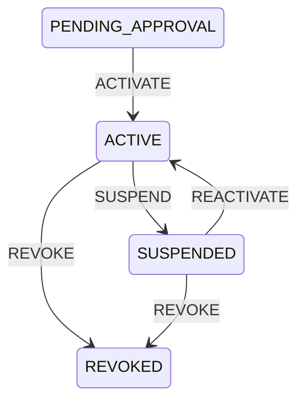

# Foundation Lifecycle FSMs

The foundation uses `common.transitions.TransitionGraph` and `TransitionExecutor`; it does not add
a second FSM engine. State changes must go through lifecycle application services, persist a
per-aggregate transition log, record an audit event, and publish events through transition
`eventFactories`. `InternalTransitionEvent` remains in-process; selected
`ExternalizedTransitionEvent` instances are externalized through Modulith and Namastack to
RabbitMQ.

```mermaid
stateDiagram-v2
    DRAFT --> PENDING_APPROVAL: SUBMIT
    PENDING_APPROVAL --> PROVISIONING: START_PROVISIONING
    PROVISIONING --> ACTIVE: ACTIVATE
    PENDING_APPROVAL --> REJECTED: REJECT
    ACTIVE --> SUSPENDED: SUSPEND
    SUSPENDED --> ACTIVE: REACTIVATE
    ACTIVE --> DEPROVISIONING: START_DEPROVISIONING
    DEPROVISIONING --> DEPROVISIONED: COMPLETE_DEPROVISIONING
    DEPROVISIONED --> ARCHIVED: ARCHIVE
```

```mermaid
stateDiagram-v2
    DRAFT --> PENDING_APPROVAL: SUBMIT
    PENDING_APPROVAL --> ACTIVE: ACTIVATE
    ACTIVE --> SUSPENDED: SUSPEND
    SUSPENDED --> ACTIVE: REACTIVATE
    ACTIVE --> CLOSED: CLOSE
    CLOSED --> ARCHIVED: ARCHIVE
```

Branch activation requires an active or provisioning organisation. Closing a branch requires no
active assignment unless the command has first revoked or reassigned it. User activation requires
a Keycloak link or explicit invitation completion. Membership activation requires an active
organisation and user, plus active branch and role assignments when operational access is needed.

A branch's name, parent, timezone and address change through `PATCH /branches/{id}`
(`BranchProvisioningService.update`), which is deliberately **not** a transition: it moves no
state, so it has no transition-log row and publishes no event. It writes a `branch.update` audit
row and increments `row_version`, and is allowed only in `DRAFT` and `ACTIVE`, so a draft returned
for changes (below) is amendable. See [foundation API](../api/foundation-api.md#update-branch).

The closure guard refuses to close a branch with an `ACTIVE` child, and the update is the way to
re-parent one, so it refuses a `CLOSED`/`ARCHIVED` parent (409) and claims the new parent by
bumping its `row_version` in the same transaction: a close that already read the parent then fails
its optimistic-lock check instead of closing a branch that now has an active child.

**Known limitation:** the other ways a branch gets a parent do not enforce this. Creating a branch
under, or submitting or activating a branch beneath, a `CLOSED` or `ARCHIVED` parent is not
refused, so that state is still reachable through them. The update does not repair it either.

Branch transitions also stamp two columns in the same `UPDATE` that writes the new state
(`JooqFoundationLifecyclePersistence.saveBranch`), from the organisation's current business date
and not the wall clock: `opened_on` on entry to `ACTIVE` (only when still null, so a
`REACTIVATE` keeps the first opening date, and the head office that tenant approval activates is
stamped the same way) and `closed_on` on entry to `CLOSED`. `CLOSED` only moves on to `ARCHIVED`,
so `closed_on` is never cleared.

This only applies to transitions made after the release. Branches that already had such a
transition on record (whatever state they are in now, including `SUSPENDED` and `ARCHIVED`) were
backfilled once by the forward-only data migration `V18__branch_opened_closed_on_backfill.sql`,
best-effort and approximate: the date of the earliest `branch_transition_log` row entering
`ACTIVE` / `CLOSED`, in the organisation's timezone rather than the business date at that moment.
A zone not in the IANA list (including offset ids such as `+03:00`, `UTC+03:00` or `GMT+3`) is
dated in UTC and can be a day off. A branch with no such row keeps `NULL`. `closed_on` is clamped
up to `opened_on`, and a derived `opened_on` down to a stored `closed_on`, so `chk_branch_dates`
holds.

```mermaid
stateDiagram-v2
    DRAFT --> PENDING_APPROVAL: SUBMIT
    PENDING_APPROVAL --> PROVISIONING_IDP: START_PROVISIONING
    PROVISIONING_IDP --> INVITED: INVITE
    PROVISIONING_IDP --> ACTIVE: ACTIVATE
    INVITED --> ACTIVE: ACTIVATE
    ACTIVE --> SUSPENDED: SUSPEND
    SUSPENDED --> ACTIVE: REACTIVATE
    ACTIVE --> LOCKED: LOCK
    LOCKED --> ACTIVE: UNLOCK
    ACTIVE --> DEACTIVATING: START_DEACTIVATION
    DEACTIVATING --> DEACTIVATED: COMPLETE_DEACTIVATION
    DEACTIVATED --> ARCHIVED: ARCHIVE
```

```mermaid
stateDiagram-v2
    PENDING_APPROVAL --> ACTIVE: ACTIVATE
    ACTIVE --> SUSPENDED: SUSPEND
    SUSPENDED --> ACTIVE: REACTIVATE
    ACTIVE --> REVOKED: REVOKE
    SUSPENDED --> REVOKED: REVOKE
```

Maker-checker is enforced around the `ACTIVATE` transitions, not inside the graph: a membership
is not approved by its inviter or by the invited user, and a branch is not activated by its
creator. A platform-context actor may be the checker of a pending membership (only while the
tenant has no `ACTIVE` member beyond its bootstrap administrator) or of a pending branch (only
while it has no `ACTIVE` branch beyond the bootstrap head office) through the same services
(`ActingScope.PLATFORM`), so the graphs, guards, transition logs and event factories are the same on
both paths and a platform-approved membership raises the same activation event. See
[ADR 0028](../adr/0028-platform-checker-for-first-tenant-approvals.md).

Each transition is an explicit command. Guard failures expose a safe business message and retain
diagnostic logging. A successful lifecycle transaction updates only through its lifecycle service,
writes the per-aggregate transition log and `audit_event`, then publishes the events created by
its `eventFactories`. The membership activation factory produces an
`ExternalizedTransitionEvent`; the notifications module consumes it after Namastack externalizes
it to RabbitMQ.

## Planned transitions (ADR 0029)

**Accepted but not yet implemented.** The graphs above do not contain these edges; they are
recorded here so the plan is findable, and this section must be rewritten as each lands.

- Branch: `PENDING_APPROVAL --> DRAFT: RETURN_FOR_CHANGES` (reason required; a checker returns, or
  the maker withdraws; internal event only). **Accepted, planned after #165** (branch update, now
  in place): without it a returned draft could not be amended, closed, suspended or recreated.
  Issue #180.
- Organisation: `PENDING_APPROVAL --> DRAFT: RETURN_FOR_CHANGES` (reason required; checker only;
  internal event only). **Accepted, planned** (#181). `REJECT` stays terminal.

See [ADR 0029](../adr/0029-approval-model-per-resource-extensions.md).
