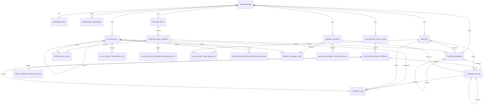

# Accounting Schema

This document is the database-design authority for accounting. Issues #36, #40, #44, #46 and #47
implement it: if implementation proves a change is required, change this document first, record
why, then write the forward-only migration.

The five tables issue #36 created, the three tables issue #40 created, the four tables issue #44
created and the evidence table issue #46 creates are specified below to column, constraint and
index level, so each migration is a transcription rather than a design exercise. Issue #47's
projection is still specified at relationship level only and will be brought to column level by the
change that implements it — the same way the earlier ones were, and for the same reason. An earlier revision of this
document promised that an implementing agent *"never has to invent a table, a column or a
constraint"* while carrying no column definitions for any table, which made the promise false for
the first issue that tried to keep it.

Read it with [the accounting foundation](../architecture/accounting-foundation.md), which holds the
invariants and the benchmark reasoning, and with
[the foundation schema](foundation-schema.md), whose conventions every table below inherits.

`V6` is the first accounting migration. The later ones take the next free version **at
implementation time** — never assume the numbers below, and check `db/migration` rather than this
sentence.

| Migration | Contents | Issue |
| --- | --- | --- |
| `V6` | `accounting_fiscal_year`, `accounting_fiscal_period`, `gl_account`, two transition logs | #36 |
| `V7` | `posting_request`, `journal_entry`, `journal_line`, and the `reference_sequence` backfill | #40 |
| `V8` | `posting_rule`, `posting_rule_version`, `posting_rule_leg`, one transition log, and the `posting_request` rule-version foreign key | #44 |
| `V9` | `gl_account.is_control_account` and `control_subledger_kind`, `control_account_reconciliation_run`, `idx_journal_line_subledger` | #46 |
| `V10` | `manual_journal`, `manual_journal_line`, one transition log | #48 |
| `V11` | `uq_gl_account_control_kind` replacing `idx_gl_account_control` | #91 |
| Then | `gl_account_daily_balance` | #47 |

Issue #34's permission migration carries no accounting tables — only reference data.

## Entity relationships



## Table classification

Two axes matter. **Authoritative** tables are the system of record; a **projection** is derived and
must be rebuildable from authoritative rows by a documented query. **Accounting-owned** tables are
created by accounting migrations; **product-owned-future** tables belong to modules that do not
exist yet, and accounting holds no foreign key into them.

| Table | Class | Ownership | Issue |
| --- | --- | --- | --- |
| `accounting_fiscal_year` | Authoritative | Accounting | #36 |
| `accounting_fiscal_period` | Authoritative | Accounting | #36 |
| `gl_account` | Authoritative | Accounting | #36 |
| `gl_account_transition_log` | Authoritative, append-only | Accounting | #36 |
| `fiscal_period_transition_log` | Authoritative, append-only | Accounting | #36 |
| `posting_request` | Authoritative | Accounting | #40 |
| `journal_entry` | Authoritative, **immutable** | Accounting | #40 |
| `journal_line` | Authoritative, **immutable** | Accounting | #40 |
| `posting_rule` | Authoritative | Accounting | #44 |
| `posting_rule_version` | Authoritative | Accounting | #44 |
| `posting_rule_leg` | Authoritative | Accounting | #44 |
| `posting_rule_version_transition_log` | Authoritative, append-only | Accounting | #44 |
| `control_account_reconciliation_run` | Authoritative evidence | Accounting | #46 |
| `manual_journal` | Authoritative | Accounting | #48 |
| `manual_journal_line` | Authoritative | Accounting | #48 |
| `manual_journal_transition_log` | Authoritative, append-only | Accounting | #48 |
| `gl_account_daily_balance` | **Projection**, rebuildable | Accounting | #47 |
| savings, loan, share and teller positions | Authoritative | **Product-owned-future** | Out of Phase B |

## Identifier conventions

Accounting inherits [the foundation conventions](foundation-schema.md) unchanged: `id UUID PRIMARY
KEY DEFAULT uuidv7()`, a client-suppliable `guid UUID NOT NULL DEFAULT uuidv7()` with a unique
constraint, and application-owned generation. There are no deltas. Every accounting table has both
columns; none of the `id`-less exceptions in the foundation schema apply here.

## Tenant isolation

Accounting follows the foundation's composite-foreign-key mechanism rather than relying on
application filtering alone:

- every accounting table carries `organisation_id UUID NOT NULL`. The entity tables reference
  `organisation (id)` directly; the append-only transition logs inherit the reference through
  their composite parent foreign key instead, exactly as the foundation's transition logs do, so
  the same guarantee is made once rather than twice;
- every reference to another accounting or foundation row is a composite foreign key on
  `(organisation_id, <parent_id>)`;
- every accounting table that is ever a parent declares
  `CONSTRAINT uq_<table>_organisation_id UNIQUE (organisation_id, id)` in the same `CREATE TABLE`,
  purely as that foreign key's target — exactly as `branch`, `role` and
  `user_organisation_membership` do.

A cross-tenant write then fails at the database even with an application bug.

`gl_account` is **tenant-scoped, never branch-scoped**: there is one chart of accounts per tenant,
and branch is a *dimension on the posting*, carried on `journal_entry` and `journal_line`.

## Settled design questions

Issue #36's first acceptance criterion is *"schema matches #30 ERD exactly **or** #30 is
deliberately updated first with the approved design change"*. Everything in this section takes the
second branch. Eight questions were settled here for issue #36, four more for issue #40, four for
issue #44, two for issue #46, and one for issue #48. Most
had no answer anywhere in the design record; two had answers that contradict each other; one had an
answer that was wrong. Each is settled before the migration exists, with the reasoning attached,
rather than decided by accident in SQL.

### Fiscal-period status is `FUTURE`, `OPEN`, `CLOSED`, `LOCKED`

Issue #36's text names three values. `FiscalPeriodStatus`, shipped by #35, declares four, and the
fourth is load-bearing rather than decorative: [the accounting
foundation](../architecture/accounting-foundation.md) states that a closed period may be reopened
and a locked one may not, and rejects Fineract's `acc_gl_closure` model *precisely* because it
cannot express that difference. `FiscalPeriodStateChangeGuard` already refuses every transition out
of `LOCKED`. A `CHECK` written to the three-value list would reject a row the shipped guard can
produce, so all four are adopted.

`FUTURE` is adopted for the same reason it exists in the enum: a period is provisioned before it is
postable, and without the state a calendar can only be materialised on the day it opens.

`SOFT_CLOSED` stays out, but not for the reason an earlier revision of this section gave. That
revision said the distinction was *"already expressed by `CLOSED` plus
`journal.post_prior_period`"*, which is false: `PostingPeriodResolver` rejects a `CLOSED` period
with `accounting.fiscal_period_closed` **regardless of permission**, and
`journal.post_prior_period` gates posting into an *earlier* period that is still `OPEN` — it is
not a key to a closed one. No permission posts into a closed period.

The correct reason is that `SOFT_CLOSED` would create a second, implicit reopening path. The
foundation makes reopening an explicit, audited, maker-checker transition; a state whose meaning
is *"closed unless you hold the right code"* lets a privileged caller post into a period nobody
reopened and no log row records. The capability it appears to add — a cut-off that ordinary users
respect while adjustments continue — is served by keeping the period `OPEN` and gating the
backdated posting, which is the mechanism that already exists and which leaves the period's status
honest.

An earlier revision of `FiscalPeriodPorts` justified excluding `SOFT_CLOSED` on the ground that
this document does not adopt it. That reasoning was sound and applied to only one state: `FUTURE`
appeared in no design record either. Both are now named here, so the enum and the authority agree.

### `accounting_fiscal_year` carries no status and no state machine

A year is a container. Its closure is exactly *"every one of its periods is `CLOSED` or `LOCKED`"*,
which is derivable from rows that already exist, cannot drift from them, and needs no second
source of truth. A stored year status would be a denormalisation of period state with no invariant
holding the two together.

Migration `V5` already reasons this way where it seeds the permission catalogue: the four
`fiscal_period.*` codes are shared by year and period *"because the year is a container and no
realistic role closes periods but not years"*. `fiscal_period.open` is described there as *"open a
fiscal year or period for posting"*. So a year-level operation is a bulk operation over period
transitions, each one logged in `fiscal_period_transition_log`, and no `fiscal_year_transition_log`
is needed.

This is also why the table classification below lists exactly two transition logs for #36.

### `gl_account` has no `REJECTED` state

Issue #36 sketches `DRAFT → PENDING_APPROVAL → ACTIVE → INACTIVE/REJECTED`; issue #38 sketches
rejection *"back to a safe editable state or `REJECTED`"*. The adopted set is
**`DRAFT`, `PENDING_APPROVAL`, `ACTIVE`, `INACTIVE`**, and rejection returns the account to `DRAFT`
with a `status_reason`.

The reason is a constraint interaction, not a preference. `account_code` is unique per
organisation. A terminal `REJECTED` row keeps its code forever, so the second attempt at the same
account cannot reuse it and the chart accumulates tombstones that block the codes an accountant
actually wants. Returning to `DRAFT` keeps the code with the work in progress, which is where it
belongs. The foundation FSMs set the precedent: `branch` and `organisation` both carry `DRAFT` and
`PENDING_APPROVAL` and neither has a rejected state.

Issue #38 implements the transition graph over this set.

### `normal_balance` is stored, and constrained against `account_class`

Deriving it from `account_class` is correct for every ordinary account and wrong for every contra
account — an allowance for loan impairment is an `ASSET` whose balance is a credit, and a
microfinance chart has several. Storing it unconstrained loses a real invariant: nothing would stop
a liability being created with a debit normal balance.

So it is **generated**, not supplied. The side is a total function of two columns already on the
row — `(account_class implies debit) XOR is_contra_account` — so `normal_balance` is a stored
generated column and no caller can state it. A contra `ASSET` is therefore a credit by
construction, and the flag stays explicit, greppable and reportable.

An earlier draft of this section stored the column and policed it with
`chk_gl_account_normal_balance_class`, written as `is_contra_account OR normal_balance = …`. That
is a disjunction, so setting the contra flag did not *invert* the requirement, it **removed** it:
a contra `ASSET` with a `DEBIT` balance satisfied the check, which is precisely the row the rule
exists to reject. The lesson generalises past this column: where a value is fully determined by
others on the same row, storing it independently creates a second source of truth that a `CHECK`
can only police, and policing is the part that failed. Generate it instead. If an API ever accepts
an explicit `normal_balance`, it validates the caller's value against the generated one at the
boundary and never writes it.

A contra account is presented as a deduction from its own class, never as a balance of the
opposite class.

### Header versus postable is adopted, and the parent rule is a foreign key

`account_usage` is `HEADER` or `POSTABLE`. Fineract's `HEADER`/`DETAIL` naming is the benchmark;
`POSTABLE` is preferred because it names the capability the ledger actually tests, and it matches
the `accounting.account_not_postable` error code already published in `PostingErrorCodes`.

The rule *"only a header account may be a parent"* is enforced **by the database**, not by the
domain. `parent_account_usage` is a stored generated column that is `'HEADER'` whenever
`parent_account_id` is set and `NULL` otherwise, and the parent foreign key is composite over
`(organisation_id, parent_account_id, parent_account_usage)`. A row whose parent is postable has no
matching target, and — the part worth having — promoting a parent from `HEADER` to `POSTABLE`
while it still has children is rejected too. Because the column is generated, no application code
can forget to populate it.

Deeper hierarchy rules are not expressible in a constraint. Self-parenting is
(`chk_gl_account_not_own_parent`); longer cycles, depth and parent/child class compatibility belong
to `ChartHierarchyPolicy` in issue #37.

### Period bounds are stored at both ends

`start_date` and `end_date` are both stored. Deriving the end from the next period's start would
make `findCovering` a window function or a `LATERAL` join, and the whole locking protocol depends
on that lookup resolving to one row that can then be locked with a plain `SELECT … FOR SHARE`.
A derived end would also leave a fiscal year's final period unbounded.

Non-overlap is then a database guarantee rather than a consequence of the representation, which is
what issue #36 asks for explicitly.

### Reopening a period is gated by permission and by actor identity, not by a second code

[The accounting foundation](../architecture/accounting-foundation.md) requires maker-checker for
period close and reopen (`INV-10`). The permission catalogue seeded by `V5` gives fiscal periods
four codes — `view`, `open`, `close`, `reopen` — with **no** `submit`/`approve` pair, unlike
`gl_account.submit`/`gl_account.approve`. The catalogue is frozen, so a submit/approve workflow
would need a new code and a second permission migration.

It does not need one, and the reason is worth stating precisely, because "close, lock and reopen are
all privileged" reads as though all three take two actors and they do not.

A transition log records an act **after** it has happened, so it cannot gate the act that creates
it. A different-actor rule between two operations constrains the *second* one; there is no second
actor available for a first close without a `fiscal_period.close_request` code and a
submit-then-approve model, which the frozen catalogue does not allow. What `INV-10` is protecting is
that no single principal can, alone, produce a reporting state nobody else agreed to — and a close
is **reversible**. The steps that are not are `LOCKED`, which nothing transitions out of, and
`REOPEN`, which undoes a period that has already been reported. Both carry the different-actor rule
and the no-exemption break-glass check; a close is single-actor, audited at `CRITICAL` with the
actor's identity. The foundation's `INV-10` table now says exactly this, and the platform's own
`user.invite`/`user.approve` precedent puts maker-checker on the committing step rather than on
every step leading to it.

So `INV-10` is satisfied by `fiscal_period.close` and `fiscal_period.reopen` being separate
`CRITICAL` codes plus `fiscal_period_transition_log` persisting the actor of every transition. The
control is:

- reopening requires `fiscal_period.reopen`, a mandatory reason, and an audit record;
- the actor reopening a period must not be the actor who closed it, resolved from the most recent
  close row in `fiscal_period_transition_log`.

That is the same shape as `UserProvisioningService.approveUser`, which is the repository's existing
maker-checker precedent. Issue #39 implements it; this document is where the obligation is now
recorded, because until now no design record specified it either way and no code path enforced it.

The same reasoning extends to the `CLOSED` → `LOCKED` transition, and it needs stating because the
catalogue has no `fiscal_period.lock`. Locking is **authorised by `fiscal_period.close`** — the
`CRITICAL` code for taking a period out of postability — and subject to the same different-actor
rule against the latest close row, so one principal cannot both close a period and irreversibly
finalise it. Because locking is irreversible, it is additionally checked against the
no-exemption break-glass path rather than the ordinary tenant-permission path, so a system actor
cannot finalise a period without a principal holding the authority.

Reusing `close` is a deliberate compromise, not a claim that the codes are equivalent: a dedicated
`fiscal_period.lock` code would let a role close periods without being able to finalise them, and
the catalogue freeze plus the one-migration-per-issue rule put it out of reach of issue #39.
It is the recommended follow-up, and until it exists no role should hold `fiscal_period.close`
unless it is also trusted to lock.

### The functional-currency freeze is not enforceable by issue #36

[The accounting foundation](../architecture/accounting-foundation.md) states that a tenant's
functional currency is frozen *"once the tenant has a single posted journal"* and assigns the
enforcement to issue #36. It cannot be: the predicate is a read of `journal_entry`, which issue #40
creates. Issue #36 creates no table the rule can be evaluated against.

The enforcement point is therefore the first issue that can express it — #40, where
`journal_entry` appears. That correction is made in the foundation document as part of this change
rather than left as a promise the schema cannot keep.

Precisely where inside #40's stack it lands is worth one more sentence, because #40 is two pull
requests. The migration creates the table the predicate reads; the *check* is a read of that table
from the two places the functional currency can change — lifecycle's organisation update and the
`base_currency` tenant setting — through an accounting-declared query port, and it ships with the
posting engine (#41), which is the first change that can write a row for the predicate to find.

### `posting_request` has no persistable `REJECTED` state

[The accounting foundation](../architecture/accounting-foundation.md)'s posting walkthrough
described status-aware collision handling with three branches — completed, rejected, in flight —
and warned that treating a rejected request as a duplicate would strand its source. The middle
branch cannot exist, and the reason is the atomicity invariant itself.

A posting is rejected by throwing: an unbalanced set, an account that is not postable, a closed
period, a missing rule. The throw rolls back the transaction that attempted the posting, and with
it the `posting_request` row the engine had claimed. `INV-12` forbids a `REQUIRES_NEW` write in the
posting path, and the one exception it names — an independent audit of a rejection — is an
`audit_event`, not a ledger row. So after a rejection there is nothing in `posting_request` to be
in a `REJECTED` state.

The status domain is therefore **`PENDING`, `POSTED`**. `PENDING` is the state of the row between
the idempotency claim and the journal write, which is to say it is visible only inside the posting
transaction and to a concurrent duplicate blocked on the same key; no committed row is ever
`PENDING`. A retry after a rejection finds no row and posts afresh — exactly the outcome the
walkthrough wanted for the rejected case, reached without a second transaction. The walkthrough is
corrected in the same change as this section.

A consequence for the retry story: `posting_request` **is** the mutable half of the design, as
ADR 0020 says, but its mutability is bounded to one transaction. After commit it is written again
only by a correction's `corrects_posting_request_id` pointing *at* it, never by an update *of* it.

### A request produces at most one journal, and the link is a unique key, not a cycle

`POSTING_REQUEST ||--o| JOURNAL_ENTRY : produces` could be modelled two ways: a nullable
`journal_entry_id` on `posting_request` pointing forward, or the `posting_request_id` that
`journal_entry` must carry anyway, made unique. The forward pointer creates a circular foreign key
between the two tables — insertable only in a fixed order with a trailing `UPDATE`, and an
`UPDATE` is exactly the statement issue #54's privilege model is designed to make rare.

Adopted: **`UNIQUE (organisation_id, posting_request_id)` on `journal_entry`**, and no
`journal_entry_id` column on `posting_request`. "Which journal did this request produce" is one
unique-index lookup; "which request produced this journal" is a column read. The request's status
flips to `POSTED` in the same transaction as the journal insert, so a committed `POSTED` request
with no journal is unrepresentable in practice and detectable in one anti-join if it ever were.

### `entry_type` is `STANDARD`, `MANUAL` or `REVERSAL`, and the reversal link is a `CHECK`

ADR 0020 names `REVERSAL` and forbids `CORRECTION`. It does not name the others. Two more are
adopted: `STANDARD` for a journal produced from a product module's posting intent through a
posting rule, and `MANUAL` for one produced from a manual journal approved under `journal.approve`
(issue #48). `MANUAL` is not decorative: every reporting filter an auditor asks for first —
*"show me the hand-written entries in this period"* — would otherwise be a join to
`posting_request.source_module`, and the two columns cannot drift because both are written once
by the engine in the same statement sequence.

`entry_type = 'REVERSAL'` and `reverses_journal_entry_id IS NOT NULL` are made **equivalent by a
`CHECK`**, so neither a reversal with no link nor a linked non-reversal is representable. The
partial unique index over `(organisation_id, reverses_journal_entry_id)` then gives at most one
reversal per journal, and the reversal of a `REVERSAL` is refused by the engine rather than the
schema (issue #43): correction of a reversal is a fresh posting, which keeps *"has this journal
been reversed"* a one-index question.

### Serialisation never relies on a row lock over the immutable tables

`SELECT … FOR UPDATE` and `SELECT … FOR SHARE` require the `UPDATE` privilege on the table.
Issue #54 revokes `UPDATE` and `DELETE` on `journal_entry` and `journal_line` from the application
role, so a design that took a row lock on a journal — to guard against a concurrent second
reversal, say — would work in every test and fail on the day the privilege model it exists for is
switched on.

Every serialisation the engine needs is therefore taken on a **mutable** row or an advisory lock:
`reference_sequence` for the gapless number, `posting_request` under `FOR UPDATE` for the
idempotency claim, and a two-int transaction advisory lock in
`AdvisoryLockNamespace.ACCOUNTING_JOURNAL_REVERSAL`, keyed on the original journal's id, for
reversal. The partial unique index stays the authoritative backstop for at-most-one reversal; the
advisory lock exists so the race resolves to a named conflict rather than to a unique violation
that aborts the caller's whole transaction.

### A posting rule carries no status; its versions do

`posting_rule` is a container the way `accounting_fiscal_year` is: it names the event and the
selector dimensions, and its versions carry the lifecycle. A stored rule status would be a
denormalisation of *"does this rule have an approved version in force"*, which is derivable and
cannot drift. Retiring a rule is retiring its head version; a rule with no approved version is a
rule that resolves nothing.

The rule's identity and selectors — `event_code`, `product_class`, `currency_code` — are frozen
once any version has been approved, and the application enforces it: a historical posting names
the version it used, and the version's meaning includes which event and dimensions it answered.

### Selectors are unique with `NULLS NOT DISTINCT`, and specificity resolves; ties fail fast

`UNIQUE NULLS NOT DISTINCT (organisation_id, event_code, product_class, currency_code)` admits at
most one rule per selector combination, treating *"any product class"* as a value rather than as
PostgreSQL's default distinct-null. The resolver then chooses the **most specific** rule whose
selectors match the intent — both dimensions over one, one over none — which is deterministic by
construction. Two rules matching at the *same* specificity — one by product class, one by
currency — are a configuration defect, and the resolver fails with
`accounting.posting_rule_ambiguous` rather than picking one. Issue #45 owns the resolver; the
constraint is what makes its determinism a schema property rather than a code property.

### `account_resolution` admits `FIXED_ACCOUNT` only

An earlier revision of this document named `PRODUCT_PARAMETER` as *"the single indirection
point"*. It is still the intended extension — a leg whose account comes from a product's own
configuration rather than being named in the rule — but no product module exists to bind the
parameter, so a schema that admitted the value would admit a leg that no code path can resolve.
`chk_posting_rule_leg_resolution` therefore names one value, `gl_account_id` is `NOT NULL`, and
adding the strategy is a forward-only widening of the `CHECK` and a relaxing of the column in the
migration that ships the first product binding. YAGNI wins over completeness here because the
alternative is a version that can be approved and never posts.

### A version is immutable once approved, except for the two columns that close it

`posting_rule_version` keeps the standard mutable audit set, and that is deliberate: `status`,
`status_reason` and `effective_to` legitimately change after approval — a successor supersedes it,
or it is retired — and `row_version` is what makes those writes safe. What is immutable is the
version's **content**: its legs and its `effective_from`. The application enforces that by
allowing leg writes only while the version is `DRAFT`, and `ex_posting_rule_version_no_overlap`
enforces that approved versions of one rule never govern the same posting date. Three approved
statuses — `ACTIVE`, `SUPERSEDED`, `RETIRED` — all resolve a posting whose date falls inside their
range; the status says how the version's window came to be closed, not whether it may be used for
the dates it covers. That is what lets a prior-period correction re-post under the version that was
in force on its posting date.

### A reconciliation compares two signed balances in the ledger's convention

`control_account_reconciliation_run` records `gl_balance` and `subledger_balance` as **signed
functional amounts, debits positive and credits negative** — the same convention as
`journal_line.signed_functional_amount`. The owning module reports its aggregate in that
convention too, so member deposits of 1,000 arrive as `-1000` and equality is the subtraction the
generated `difference` column performs, not a rule that depends on the account's class. The
alternative — comparing magnitudes and letting each control class say which side it lives on — would
put accounting knowledge into every product module and make a sign error look like a match.

### Exact equality is the default, and a tolerance is recorded on the run that used it

Financial control accounts default to exact monetary equality. A run may be given a non-negative
`tolerance` for a specifically approved rounding or timing policy, and the row keeps it, so a
`MATCHED` verdict is never separable from the bound it was judged against.
`chk_control_account_reconciliation_run_matched` refuses a `MATCHED` row whose difference exceeds
its tolerance, which is the part of the verdict a row can see.

### A manual journal draft is its own aggregate, not a `posting_request`

Issue #48 allows a dedicated persisted draft model *"if #30 defines"* one, and this document did not.
It does now, for a reason that follows from what `posting_request` is. That row is created by the
engine at posting time; its mutability is bounded to the posting transaction; its unique source
reference is an idempotency key; and it never carries legs, because legs live on the immutable
`journal_line`. A manual adjustment is edited over days, submitted, rejected, amended and
resubmitted before anything reaches the ledger, and its legs must exist before any posting does.
Fitting that into `posting_request` would mean a long-lived mutable request with legs in a JSON
column and a status domain the engine does not use - the two lifecycles blurred into one row.

So `manual_journal` and `manual_journal_line` are the draft, with a transition log for the
maker-checker control, and approval posts through the engine exactly as a product module would:
`source_module = 'accounting'`, `source_entity_type = 'MANUAL_JOURNAL'`, `entry_type = 'MANUAL'`,
one `posting_request` and one `journal_entry`, ordinary in every way. The draft keeps the journal's
id in `journal_entry_id`, unique, so one draft posts at most once. Correction of a posted manual
journal is a reversal; the draft is never edited after approval.

## Column definitions for the issue #36 tables

Every column, constraint, index and comment the first accounting migration creates. The audit set
(`created_at`, `created_by`, `updated_at`, `updated_by`, `row_version`) and the identifier pair
(`id`, `guid`) are specified once under the conventions above and are not repeated in each table.

### The overlap mechanism, and why an extension schema

`accounting_fiscal_period` and `accounting_fiscal_year` both need *"no two rows of this tenant
cover the same date"*, which is an `EXCLUDE USING gist` constraint over `organisation_id WITH =`
and `daterange(start_date, end_date, '[]') WITH &&`. PostgreSQL 18 ships btree, hash and BRIN
operator classes for `uuid` but no GiST one, so the `=` half needs `btree_gist`, and this is the
repository's first extension.

It is installed into a dedicated `extensions` schema, not `public` — and the install has to
**relocate an existing installation rather than assume there is none**:

```sql
CREATE SCHEMA IF NOT EXISTS extensions;

DO $$
BEGIN
    IF NOT EXISTS (SELECT 1 FROM pg_extension WHERE extname = 'btree_gist') THEN
        CREATE EXTENSION btree_gist WITH SCHEMA extensions;
    ELSIF (SELECT n.nspname FROM pg_extension e
           JOIN pg_namespace n ON n.oid = e.extnamespace
           WHERE e.extname = 'btree_gist') <> 'extensions' THEN
        ALTER EXTENSION btree_gist SET SCHEMA extensions;
    END IF;
END
$$;
```

`CREATE EXTENSION IF NOT EXISTS btree_gist WITH SCHEMA extensions` is **not** sufficient, and the
difference is a failed deploy rather than a preference. When the extension already exists anywhere,
PostgreSQL emits `NOTICE: extension "btree_gist" already exists, skipping` and ignores
`WITH SCHEMA` entirely — so on any database where an operator or a managed-PostgreSQL image
pre-installed it into `public`, the extension stays there and the next statement fails with
`operator class "extensions.gist_uuid_ops" does not exist for access method "gist"`. Verified
against `postgres:18.4` in all three states: pre-installed in `public` (relocated), absent
(created), and already correct (no-op). `btree_gist` is relocatable, so `ALTER EXTENSION … SET
SCHEMA` is available.

**This introduces a deployment prerequisite the repository did not have before.** `CREATE
EXTENSION` and `ALTER EXTENSION … SET SCHEMA` need CREATE on the database, which a role holding
only DDL rights inside `public` does not have. `btree_gist` has been a trusted extension since
PostgreSQL 13, so a database **owner** suffices and superuser is not required — but a deployment
that runs Flyway as a deliberately least-privileged migration role must grant that role database
ownership, or pre-install the extension into `extensions` out of band, before `V6` can apply.
On a managed PostgreSQL service the extension must also appear on the provider's allow-list.
Because the block above is idempotent and relocating, pre-installing it correctly makes `V6` a
no-op for that statement.

The operator class is named schema-qualified at the constraint:

```sql
CONSTRAINT ex_accounting_fiscal_period_no_overlap EXCLUDE USING gist (
    organisation_id extensions.gist_uuid_ops WITH =,
    daterange(start_date, end_date, '[]') WITH &&
)
```

The reason is the build, and it is specific. `build.gradle.kts` runs jOOQ code generation against
`inputSchema = "public"` with no excludes, and `compileKotlin` depends on `jooqCodegen`. Installed
into `public`, the extension's functions are generated into `com.finaxis.platform.jooq` on every
build — **213 routine classes in a new `routines` package**, measured by installing it there and
regenerating rather than estimated — so an extension in `public` would gate compilation. Installed
into `extensions`, code generation never sees it. Nothing needs `extensions` on its `search_path`
at runtime, because an exclusion constraint stores its operator class by OID once created.

Both halves were verified before this document adopted the mechanism, because a build-gating
mistake here is expensive to unwind:

| Harness | Verified |
| --- | --- |
| `postgres:18.4`, the image the integration tests run on | The extension installs into `extensions`; `public` gains zero routines; same-tenant overlap and inclusive-boundary touch are rejected; identical ranges in two tenants are accepted; every `CHECK` and composite foreign key below rejects exactly the row it names |
| Zonky embedded PostgreSQL 18.6, the code-generation harness | Flyway applies the migration and `jooqCodegen` succeeds; the generated tree gains exactly the five new tables and no extension function, index or UDT |

Bounds are **inclusive on both ends** (`'[]'`). Two periods that merely touch — one ending
`2026-01-31`, the next starting `2026-01-31` — overlap and are rejected. Adjacent periods must be
a day apart.

Operationally this means a deploy role needs `CREATE` on the database. `btree_gist` has been a
trusted extension since PostgreSQL 13, so a database owner can install it without superuser.

### `accounting_fiscal_year`

| Column | Type | Null | Meaning |
| --- | --- | --- | --- |
| `year_code` | `TEXT` | no | Tenant-unique short code, e.g. `FY2026` |
| `year_name` | `TEXT` | no | Display name |
| `start_date` | `DATE` | no | First day of the year, inclusive |
| `end_date` | `DATE` | no | Last day of the year, inclusive |

| Constraint | Kind | Purpose |
| --- | --- | --- |
| `uq_accounting_fiscal_year_guid` | `UNIQUE (guid)` | Alternate key |
| `uq_accounting_fiscal_year_organisation_code` | `UNIQUE (organisation_id, year_code)` | One code per tenant |
| `uq_accounting_fiscal_year_organisation_id` | `UNIQUE (organisation_id, id)` | Composite foreign-key target for periods |
| `chk_accounting_fiscal_year_dates` | `CHECK (end_date >= start_date)` | A year cannot end before it starts |
| `chk_accounting_fiscal_year_version` | `CHECK (row_version >= 0)` | Convention |
| `ex_accounting_fiscal_year_no_overlap` | `EXCLUDE USING gist` | Two years of one tenant cannot cover the same date |

No status column, and no index beyond the constraint-backing ones: a tenant has a handful of years,
and they are read through their periods.

### `accounting_fiscal_period`

| Column | Type | Null | Meaning |
| --- | --- | --- | --- |
| `fiscal_year_id` | `UUID` | no | Owning year, referenced tenant-safely |
| `period_number` | `INTEGER` | no | Ordinal within the year, `1`-based |
| `period_name` | `TEXT` | no | Display name, e.g. `January 2026` |
| `start_date` | `DATE` | no | First posting date in the period, inclusive |
| `end_date` | `DATE` | no | Last posting date in the period, inclusive |
| `status` | `TEXT` | no | `FUTURE`, `OPEN`, `CLOSED` or `LOCKED` |
| `status_reason` | `TEXT` | yes | Why the period is in its current state; mandatory on reopen at the application layer |

| Constraint | Kind | Purpose |
| --- | --- | --- |
| `uq_accounting_fiscal_period_guid` | `UNIQUE (guid)` | Alternate key |
| `uq_accounting_fiscal_period_organisation_id` | `UNIQUE (organisation_id, id)` | Composite foreign-key target for the transition log, and later for `journal_entry` and `journal_line` |
| `uq_accounting_fiscal_period_year_number` | `UNIQUE (organisation_id, fiscal_year_id, period_number)` | Period numbers do not repeat within a year |
| `fk_accounting_fiscal_period_year` | `FOREIGN KEY (organisation_id, fiscal_year_id)` | A period cannot belong to another tenant's year |
| `chk_accounting_fiscal_period_number` | `CHECK (period_number > 0)` | Ordinals are 1-based |
| `chk_accounting_fiscal_period_dates` | `CHECK (end_date >= start_date)` | A period cannot end before it starts |
| `chk_accounting_fiscal_period_status` | `CHECK (status IN (…))` | The four adopted states |
| `chk_accounting_fiscal_period_version` | `CHECK (row_version >= 0)` | Convention |
| `ex_accounting_fiscal_period_no_overlap` | `EXCLUDE USING gist` | A posting date resolves to at most one period |

The exclusion constraint is scoped to the **tenant**, not to the fiscal year. `INV-9` requires a
posting date to select exactly one period, so two periods in *different* years may not overlap
either. Scoping it to the year would let a badly built calendar make period resolution
ambiguous — precisely the failure the constraint exists to prevent.

`ex_…_no_overlap` bans overlaps; nothing at the database level bans **gaps**, and nothing forces a
period to lie inside its year's bounds. Both are cross-row properties of a whole calendar rather
than of a row, so both are enforced by issue #39's `FiscalCalendarService`, which is the only path
that creates a year or a period: it rejects a period outside its year's bounds, and materialises a
year's periods as one contiguous, gapless set. A gap that arises some other way is not a silent
corruption — a posting into it is rejected with `accounting.fiscal_period_not_found` — but a
period outside its year would be, because a year's closure is defined as *"all of its periods are
closed"* and a stray period makes that answer meaningless.

| Index | Definition | Justifying query |
| --- | --- | --- |
| `idx_accounting_fiscal_period_year` | `(organisation_id, fiscal_year_id)` | The foreign key, and *"list the periods of this year"* — the calendar screen and issue #39's bulk year operations |

`findCovering(organisationId, postingDate)` gets **no index of its own**. A tenant holds tens of
period rows — twelve or thirteen a year — so any plan over that table is a few pages, and the
exclusion constraint's GiST index already bounds a scan by tenant. Adding one would be exactly the
speculative index `V1`'s rule forbids.

### `gl_account`

| Column | Type | Null | Meaning |
| --- | --- | --- | --- |
| `account_code` | `TEXT` | no | Tenant-unique code an accountant recognises, e.g. `1010` |
| `account_name` | `TEXT` | no | Display name |
| `description` | `TEXT` | yes | Free text |
| `account_class` | `TEXT` | no | `ASSET`, `LIABILITY`, `EQUITY`, `INCOME` or `EXPENSE` |
| `account_usage` | `TEXT` | no | `HEADER` groups; `POSTABLE` can receive journal lines |
| `normal_balance` | `TEXT` | no | **Generated** from `account_class` and `is_contra_account`; `DEBIT` or `CREDIT` — the side that increases the account |
| `is_contra_account` | `BOOLEAN` | no | Deliberate inversion of the class-implied normal balance; defaults false |
| `manual_posting_allowed` | `BOOLEAN` | no | Whether a manual journal may target the account; defaults **false** |
| `parent_account_id` | `UUID` | yes | Parent in the chart hierarchy |
| `parent_account_usage` | `TEXT` | yes | **Generated**; `'HEADER'` when a parent is set, else `NULL` |
| `status` | `TEXT` | no | `DRAFT`, `PENDING_APPROVAL`, `ACTIVE` or `INACTIVE` |
| `status_reason` | `TEXT` | yes | Why the account is in its current state, including a rejection reason |

| Constraint | Kind | Purpose |
| --- | --- | --- |
| `uq_gl_account_guid` | `UNIQUE (guid)` | Alternate key |
| `chk_gl_account_code` | `CHECK (account_code ~ '^[A-Za-z0-9._-]{1,32}$')` | The same bound `AccountCode` enforces, so a row the database accepted can always be read back into the value object |
| `uq_gl_account_organisation_code` | `UNIQUE (organisation_id, account_code)` | Account codes are unique per tenant |
| `uq_gl_account_organisation_id` | `UNIQUE (organisation_id, id)` | Composite foreign-key target for the transition log, and later for `journal_line` and `posting_rule_leg` |
| `uq_gl_account_parent_target` | `UNIQUE (organisation_id, id, account_usage)` | Target of the parent foreign key below; its only purpose |
| `fk_gl_account_parent_same_organisation` | `FOREIGN KEY (organisation_id, parent_account_id, parent_account_usage)` | A parent is in the same tenant **and** is a `HEADER` account |
| `chk_gl_account_not_own_parent` | `CHECK (parent_account_id IS NULL OR parent_account_id <> id)` | Row-local half of cycle prevention |
| `chk_gl_account_class` | `CHECK (account_class IN (…))` | The five classes |
| `chk_gl_account_usage` | `CHECK (account_usage IN ('HEADER','POSTABLE'))` | Header and posting accounts are distinguishable |
| `chk_gl_account_manual_posting` | `CHECK (account_usage = 'POSTABLE' OR NOT manual_posting_allowed)` | A header account can never take a manual entry |
| `chk_gl_account_status` | `CHECK (status IN (…))` | The four adopted states |
| `chk_gl_account_version` | `CHECK (row_version >= 0)` | Convention |

`row_version` on `gl_account` is **load-bearing rather than decorative**: every update matches on
it and fails when it has moved. A chart-of-accounts edit and an approval touch the same row, and
without the predicate the edit's stale snapshot would write the pre-approval status back — leaving
the row and `gl_account_transition_log` disagreeing about whether the account was ever approved.
The two paths are also separated by what they may write: the edit path never writes `status`, and
the lifecycle path (issue #38) writes `status` and `status_reason` and nothing else, under
`SELECT … FOR UPDATE`.

`status_reason` is written on every status change, not left null. It is what a rejection reason and
a deactivation reason are recorded in on the row itself; the transition log holds the same reason
alongside the actor.

| Index | Definition | Justifying query |
| --- | --- | --- |
| `idx_gl_account_organisation_status` | `(organisation_id, status)` | *"List this tenant's active accounts"* — the chart screen and every posting-eligibility read |
| `idx_gl_account_parent` | `(organisation_id, parent_account_id)` | The parent foreign key, and the recursive descent below |

The chart is **listed by keyset over `account_code`**, bounded by
`finaxis.pagination.max-page-size` — the platform-wide ceiling every other listing endpoint
honours, rather than a second constant accounting would drift from. An over-large request is
refused in the application layer with a named error, never by an `IllegalArgumentException`
escaping a persistence adapter. There is deliberately no unpaginated variant: an "all accounts"
method is how `INV-15` gets quietly broken.

**Hierarchy retrieval is a recursive CTE, and there is no materialised path.** A tenant holds 500
to 2,000 accounts, so a `WITH RECURSIVE` descent from a root is a few index lookups over a table
that fits in cache, in one statement with no N+1. A materialised path or closure table would add a
write-amplification and a rebuild obligation to buy nothing at this volume. `ChartHierarchyPolicy`
(#37) bounds depth at **six** levels — class, group, sub-group, control, account, sub-account is
the deepest structure a chart of this size needs — which also bounds the recursion.

The bound is measured over **both** sides of a move: the proposed parent's own height above it, and
the height of the subtree being moved below it. Measuring only the parent's side lets a move push
descendants past the bound, and because the recursive descent is itself capped at six, the result
is not an error but a **silently truncated ancestry** — a rollup that never reaches the root and
quietly reports the wrong total.

`account_code` carries `chk_gl_account_code`, matching `AccountCode`'s bound exactly. Without it a
row written outside the application — a data migration, a bulk import, an operator fix — could
hold a code the value object refuses, and every subsequent read of that tenant's chart would throw
while constructing it. A constraint the application also enforces is not redundant here: the value
object protects the write path the application owns, and the `CHECK` protects the read path from
every write path it does not.

There is **no currency column.** Currency lives on the money-bearing row, not on the account, so
one account can carry balances in several currencies and the functional-amount invariant holds
across all of them.

There is **no delete path and no soft-delete flag.** `INACTIVE` is deactivation, and issue #54's
`REVOKE DELETE` covers the physical guarantee.

**Identity is frozen; position is not.** Once an account has structure beneath it, its
`account_code`, `account_class` and `account_usage` cannot change: every posted line was recorded
against that code, under that class, on an account that was postable. Its **parent** deliberately
can change, for two reasons. A posted journal line references its account, not the account's place
in the chart, so a move reinterprets no history — reorganising a chart is ordinary work. And
blocking it would make the cycle rule unreachable: a cycle requires descendants, so a rule that
froze the parent of any account with children would leave `ChartHierarchyPolicy`'s cycle branch
unable to fire for any caller.

Both halves are enforced by `ChartHierarchyPolicy` (#37) against the accounts an account already
has beneath it. That is the knowable half of *"has been used"*: the full rule also freezes identity
once a journal line references the account, and `journal_line` is issue #40's.

**And a position change is serialised per tenant, because the cycle rule is not a row constraint.**
Validating a re-parenting means reading the ancestry and then writing the parent, and at the
repository's READ COMMITTED isolation those are two snapshots. Two moves can each validate against
a chart that predates the other's write — reparent A under B while reparenting B under A — and
both commit, because `chk_gl_account_not_own_parent` sees only the one-hop case. Issue #37 therefore
takes a tenant-scoped advisory lock (`AdvisoryLockNamespace.ACCOUNTING_CHART_HIERARCHY`) before the
read that validation depends on, and holds it for the transaction. It is keyed on the organisation
rather than on an account, because a cycle is a property of a *pair* of moves and locking the two
accounts a caller names would not exclude the move that closes the cycle from the other end. Chart
edits are rare administrative operations, not the posting path, so serialising them per tenant
costs nothing measurable — this is the one place in accounting where a coarse lock is right.

### The GL-account lifecycle is two-actor at both ends, and an amendment is not a third way

`gl_account` has `submit`/`approve` codes where the fiscal period has none, so the maker-checker
control here is the conventional pair: approval requires `gl_account.approve` and an actor who is
not the account's **most recent** submitter, resolved from `gl_account_transition_log`. Most recent,
not the creator: an account submitted, rejected, corrected by someone else and resubmitted has a
different maker from its creator, and reading `gl_account.created_by` would let the resubmitter
approve their own submission.

Two consequences of that shape are recorded here because neither is obvious and both were wrong in
an earlier revision.

**Deactivation is two-actor as well, against the approver.** `INV-10` names GL-account deactivation
as privileged, and it is the transition most easily left single-actor: there is no
`gl_account.deactivate_request` code to build a submit/approve pair from, and the catalogue is
frozen. It does not need one. Deactivation's maker is the actor who **approved** the account — that
is the act that put it into service — so a deactivation is refused when the approver performs it.
Withdrawing an account changes the shape of every future report, which is exactly the class of
change `INV-10` exists to require two people for.

**An amendment cannot become a third path around approval.** Preserving the stored status during an
update is not sufficient, and reading it as sufficient is the mistake: an actor holding only
`gl_account.update` could rewrite the code, placement, usage or manual-posting flag of an already
approved account, the status would stay `ACTIVE`, nothing would be re-approved, and what the checker
approved would no longer be what the ledger has. A maker could do the same to their own submission
while it sat in `PENDING_APPROVAL`, so the checker would approve a record that had changed
underneath them. So amendment is bounded by state: everything in `DRAFT`, nothing in
`PENDING_APPROVAL` or `INACTIVE`, and in `ACTIVE` only the name and description — neither of which
changes what posts to the account or where it rolls up. A structural change to a live account is
`DEACTIVATE` plus a replacement, which is also what keeps history readable.

**Both actor-identity lookups run under the account's row lock.** They read the transition log, not
the account row, so they look independent of any lock — the trap. Resolved before the lock, an
approval whose lookup runs while the submission is still uncommitted resolves *no* submitter at
all; the submission then commits, the transition reads `PENDING_APPROVAL`, and the same actor
approves their own work. Every transition writes the log while holding `FOR UPDATE` on the account,
so holding that lock is what makes "the most recent submitter" a stable answer for the rest of the
transaction. The fiscal-period service has the identical obligation for the same reason.

Two columns are specified here and **created by issue #46's `V9`**, following this document's
convention for later-issue additions: `is_control_account BOOLEAN NOT NULL DEFAULT FALSE` and
`control_subledger_kind TEXT`, the classification `INV-14`'s reconciliation proofs are keyed on.
Their constraints are under [the #46 column definitions](#column-definitions-for-the-issue-46-tables).

### `gl_account_transition_log` and `fiscal_period_transition_log`

Both are append-only and both copy `user_organisation_membership_transition_log` exactly:
`organisation_id`, `entity_id`, `transition_name`, `status_from`, `status_to`, `metadata_jsonb`,
`reason`, the audit set and the identifier pair. Neither carries a duplicate entity column; the
composite foreign key is `(organisation_id, entity_id)` against the parent table directly.

| Table | Foreign key | Index |
| --- | --- | --- |
| `gl_account_transition_log` | `(organisation_id, entity_id) → gl_account` | `(organisation_id, entity_id, created_at DESC)` |
| `fiscal_period_transition_log` | `(organisation_id, entity_id) → accounting_fiscal_period` | `(organisation_id, entity_id, created_at DESC)` |

`created_by` is the actor of the transition, which is what makes the reopen actor-identity check
above answerable from data.

### A prerequisite issue #36 does not close, and #40 does

`reference_sequence` is seeded with `MEMBER`, `TRANSACTION` and `JOURNAL` when an organisation is
provisioned through `OrganisationProvisioningService`. The bootstrap tenant created by `V3` in SQL
has **no** `reference_sequence` rows at all, so the gapless journal number issue #40 depends on has
no counter for it. `V7` closes it: it inserts the three rows for every organisation that lacks them,
with `ON CONFLICT DO NOTHING` on `uq_reference_sequence_organisation_code` so a tenant provisioned
through the application is untouched. The engine still fails loudly, with
`accounting.journal_sequence_missing`, if a tenant somehow has no `JOURNAL` row — a silent
fallback to a different numbering path is exactly the failure the backfill exists to prevent.

## Column definitions for the issue #40 tables

Every column, constraint, index and comment the second accounting migration creates. As above, the
identifier pair (`id`, `guid`) is specified once under the conventions and not repeated. The audit
columns differ per table and are stated per table, because that difference is the immutability
design: `posting_request` carries the mutable set, the two journal tables carry `created_at` and
`created_by` only.

Every money column follows [the money and currency section](#money-and-currency-columns), every
date column follows [the period selector](#the-period-selector), and every parent reference is a
composite foreign key on `(organisation_id, <parent_id>)` with the `uq_<table>_organisation_id`
target declared in the same `CREATE TABLE`.

### `posting_request`

The durable identity of one business transaction's accounting effect: what asked for the posting,
which rule version answered, and the idempotency key that makes a retry a no-op. One row per
source reference, ever.

| Column | Type | Null | Meaning |
| --- | --- | --- | --- |
| `branch_id` | `UUID` | yes | Originating branch; null for a head-office or tenant-level posting |
| `source_module` | `TEXT` | no | Module that owns the business transaction, e.g. `savings`; `accounting` for reversals and manual journals |
| `source_entity_type` | `TEXT` | no | Kind of business entity, for drill-down, e.g. `SAVINGS_DEPOSIT`, `JOURNAL_REVERSAL`, `MANUAL_JOURNAL`. Bounded like `source_module`, because it is a key column of an index and an unbounded value can exceed the B-tree tuple limit |
| `source_entity_id` | `UUID` | no | Identity of that entity, for drill-down. Descriptive: **not** a foreign key (`INV-16`) |
| `source_reference` | `TEXT` | no | The durable idempotency identity, unique per tenant and module (`INV-7`) |
| `event_code` | `TEXT` | no | Semantic posting event the legs were resolved from, e.g. `SAVINGS_DEPOSIT` |
| `request_fingerprint` | `TEXT` | no | SHA-256, hex, of the canonical request — source triple, event, entry type, branch, correction/reversal lineage, dates and currency. Never the raw payload, never the resolved legs |
| `posting_rule_version_id` | `UUID` | yes | The exact rule version that resolved the legs; null for a reversal or a manual journal. Column created here, foreign key added by #44's migration |
| `corrects_posting_request_id` | `UUID` | yes | The request this replacement posting corrects, after its journal was reversed |
| `business_date` | `DATE` | no | The tenant business date when the posting was made |
| `transaction_date` | `DATE` | no | When the source event occurred |
| `value_date` | `DATE` | no | From when it affects interest or float |
| `posting_date` | `DATE` | no | The day whose books it lands in; selects the period |
| `currency_code` | `CHAR(3)` | no | The transaction currency of the request |
| `narrative` | `TEXT` | yes | Free text, at most 500 characters |
| `status` | `TEXT` | no | `PENDING` inside the posting transaction, `POSTED` once committed |
| `posted_at` | `TIMESTAMPTZ` | yes | The instant the journal became immutable; set exactly when `status` is `POSTED` |
| `correlation_id` | `TEXT` | yes | The request correlation the posting was made under |
| `request_id` | `TEXT` | yes | The `X-Request-Id` of the originating request |

Plus the mutable audit set: `created_at`, `created_by`, `updated_at`, `updated_by`, `row_version`.

| Constraint | Kind | Purpose |
| --- | --- | --- |
| `uq_posting_request_guid` | `UNIQUE (guid)` | Alternate key |
| `uq_posting_request_organisation_id` | `UNIQUE (organisation_id, id)` | Composite foreign-key target for `journal_entry` and for the correction link |
| `uq_posting_request_source` | `UNIQUE (organisation_id, source_module, source_reference)` | **The idempotency mechanism.** One financial effect per durable source identity, per tenant |
| `fk_posting_request_branch` | `FOREIGN KEY (organisation_id, branch_id)` | A request cannot name another tenant's branch |
| `fk_posting_request_corrects` | `FOREIGN KEY (organisation_id, corrects_posting_request_id)` | Correction lineage stays inside the tenant |
| `chk_posting_request_not_self_correction` | `CHECK (corrects_posting_request_id IS NULL OR corrects_posting_request_id <> id)` | A request cannot correct itself |
| `chk_posting_request_status` | `CHECK (status IN ('PENDING', 'POSTED'))` | The two adopted states |
| `chk_posting_request_posted_at` | `CHECK ((status = 'POSTED') = (posted_at IS NOT NULL))` | `posted_at` is set exactly when posted |
| `chk_posting_request_dates` | `CHECK (posting_date <= business_date AND transaction_date <= business_date)` | Neither date may follow the business date, mirroring `PostingDatePolicy` |
| `chk_posting_request_currency` | `CHECK (currency_code ~ '^[A-Z]{3}$')` | The foundation currency regex |
| `chk_posting_request_source_module` | `CHECK (source_module ~ '^[a-z][a-z0-9_]{0,63}$')` | A module name, lower-case, bounded |
| `chk_posting_request_source_entity_type` | `CHECK (source_entity_type ~ '^[A-Z][A-Z0-9_]{0,63}$')` | An entity kind, upper-case, bounded: it is a key column of `idx_posting_request_source_entity` |
| `chk_posting_request_source_reference` | `CHECK (char_length(source_reference) BETWEEN 1 AND 200 AND btrim(source_reference) <> '')` | Bounded, and genuinely non-blank: `'   '` passes a length check and would make every later operation of that module a retry of the first |
| `chk_posting_request_event_code` | `CHECK (event_code ~ '^[A-Z][A-Z0-9_]{0,63}$')` | An event code, upper-case, bounded |
| `chk_posting_request_fingerprint` | `CHECK (request_fingerprint ~ '^[0-9a-f]{64}$')` | A SHA-256 digest, lower-case hex |
| `chk_posting_request_narrative` | `CHECK (narrative IS NULL OR char_length(narrative) <= 500)` | Bounded free text |
| `chk_posting_request_version` | `CHECK (row_version >= 0)` | Convention |

`request_fingerprint` is what lets issue #42 tell a safe retry from a conflicting reuse of the
same key without storing the request. Issue #89 (ADR 0023) settled its final composition: it is
computed by the engine over the caller's own inputs — the source triple, the event code, the entry
type, the branch, the correction and reversal lineage, the resolved transaction/value/posting
dates, the functional currency, the product class selector, and the caller's asserted financial
facts (`PostingIntent.Facts`, sorted, each amount settled to `MoneyPolicy.STORAGE_SCALE` before
hashing so a caller-supplied `500.0` and `500.00` hash identically, each with its
`positionReference`, which identifies the subsidiary position the amount moved and so makes a
re-presented reference against a different position a conflict rather than a replay) — encoded
field-by-field as a
null/present marker byte plus, when present, a fixed 4-byte length and the value's UTF-8 bytes,
never a delimiter-joined string a value could itself contain. It is deliberately **not** computed
over the resolved legs: the claim happens before a rule-resolved posting's legs are asked for, so
nothing the digest covers may depend on resolving them. The product class and financial facts are
what still give a rule-resolved posting selector- and amount-level discrimination without that
resolution — they are the caller's own asserted inputs, known before any rule ever runs (see ADR
0023 for why, and for the idempotency-contract consequence of the branch/lineage widening).

| Index | Definition | Justifying query |
| --- | --- | --- |
| `idx_posting_request_source_entity` | `(organisation_id, source_module, source_entity_type, source_entity_id, id DESC)` | Q5 drill-down from a business entity to its postings — *"every posting this deposit produced"*. Ends in the keyset column so one index serves both the drill-down and the paging order; without it a later page of a busy entity costs more than an earlier one |
| `uq_posting_request_corrects` | `UNIQUE (organisation_id, corrects_posting_request_id) WHERE corrects_posting_request_id IS NOT NULL` | The correction foreign key, and *"what replaced this request"*. Partial, because almost no request corrects another. **Unique**, because a request is replaced at most once: two attempts with different source references would otherwise each produce a journal and duplicate the replacement effect |

`uq_posting_request_source` is the third index and serves the idempotency claim directly.

**Two foreign keys deliberately get no index, and the reason is stated rather than left as an
oversight of `V1`'s rule.** `branch_id` is never a lookup key here — branch reporting reads
`journal_line`, whose branch index is issue #49's — and `branch` rows are never deleted, so the
index would only ever be maintained, never read. `posting_rule_version_id` receives its foreign key
and its index together in #44's migration, where the reporting question *"which postings used this
rule version"* first has an answer. This table receives one row per financial transaction, roughly
200,000 a day at the design envelope, and every index on it is paid on every one of them.

### `journal_entry`

The balanced header. Immutable once committed: no `updated_at`, no `updated_by`, no `row_version`,
and `REVOKE UPDATE, DELETE` under issue #54.

| Column | Type | Null | Meaning |
| --- | --- | --- | --- |
| `branch_id` | `UUID` | yes | The branch the journal is booked to |
| `posting_request_id` | `UUID` | no | The request that produced this journal; unique, so a request produces at most one |
| `fiscal_period_id` | `UUID` | no | The period `posting_date` resolved to, bound at posting time (`INV-9`) |
| `entry_number` | `BIGINT` | no | Gapless, tenant-scoped, from `reference_sequence` code `JOURNAL` |
| `entry_type` | `TEXT` | no | `STANDARD`, `MANUAL` or `REVERSAL` |
| `reverses_journal_entry_id` | `UUID` | yes | The journal this one reverses; set exactly when `entry_type` is `REVERSAL` |
| `business_date` | `DATE` | no | Copied from the request |
| `transaction_date` | `DATE` | no | Copied from the request |
| `value_date` | `DATE` | no | Copied from the request |
| `posting_date` | `DATE` | no | Copied from the request; the period selector |
| `currency_code` | `CHAR(3)` | no | The transaction currency |
| `functional_currency_code` | `CHAR(3)` | no | The tenant's functional currency at posting time |
| `total_debit_functional` | `NUMERIC(23, 6)` | no | Sum of the debit lines' `functional_amount` |
| `total_credit_functional` | `NUMERIC(23, 6)` | no | Sum of the credit lines' `functional_amount`; equal to the debit total |
| `line_count` | `INTEGER` | no | How many lines the journal has; at least two |
| `narrative` | `TEXT` | yes | Free text, at most 500 characters |
| `posted_at` | `TIMESTAMPTZ` | no | The instant the journal became immutable |
| `created_at` | `TIMESTAMPTZ` | no | When the row was written |
| `created_by` | `UUID` | yes | The actor of the posting |

| Constraint | Kind | Purpose |
| --- | --- | --- |
| `uq_journal_entry_guid` | `UNIQUE (guid)` | Alternate key |
| `uq_journal_entry_organisation_id` | `UNIQUE (organisation_id, id)` | Composite foreign-key target for `journal_line`, for the reversal link, and later for #48's manual journal |
| `uq_journal_entry_number` | `UNIQUE (organisation_id, entry_number)` | Gapless numbering is also unique numbering; Q5 drill-down by entry number |
| `uq_journal_entry_posting_request` | `UNIQUE (organisation_id, posting_request_id)` | A request produces at most one journal |
| `fk_journal_entry_posting_request` | `FOREIGN KEY (organisation_id, posting_request_id)` | Lineage stays inside the tenant |
| `fk_journal_entry_fiscal_period` | `FOREIGN KEY (organisation_id, fiscal_period_id)` | A journal cannot bind to another tenant's period |
| `fk_journal_entry_branch` | `FOREIGN KEY (organisation_id, branch_id)` | A journal cannot be booked to another tenant's branch |
| `fk_journal_entry_reverses` | `FOREIGN KEY (organisation_id, reverses_journal_entry_id)` | A reversal cannot point across tenants |
| `chk_journal_entry_number` | `CHECK (entry_number > 0)` | Numbering starts at one |
| `chk_journal_entry_type` | `CHECK (entry_type IN ('STANDARD', 'MANUAL', 'REVERSAL'))` | The three adopted types |
| `chk_journal_entry_reversal_link` | `CHECK ((entry_type = 'REVERSAL') = (reverses_journal_entry_id IS NOT NULL))` | A reversal always names its original, and nothing else does |
| `chk_journal_entry_not_self_reversal` | `CHECK (reverses_journal_entry_id IS NULL OR reverses_journal_entry_id <> id)` | A journal cannot reverse itself |
| `chk_journal_entry_balanced` | `CHECK (total_debit_functional = total_credit_functional)` | The header half of `INV-4` |
| `chk_journal_entry_total_positive` | `CHECK (total_debit_functional > 0)` | An empty journal is unrepresentable |
| `chk_journal_entry_line_count` | `CHECK (line_count >= 2)` | Double entry needs two sides |
| `chk_journal_entry_dates` | `CHECK (posting_date <= business_date AND transaction_date <= business_date)` | Mirrors the request |
| `chk_journal_entry_currency` | `CHECK (currency_code ~ '^[A-Z]{3}$')` | The foundation currency regex |
| `chk_journal_entry_functional_currency` | `CHECK (functional_currency_code ~ '^[A-Z]{3}$')` | The foundation currency regex |
| `chk_journal_entry_narrative` | `CHECK (narrative IS NULL OR char_length(narrative) <= 500)` | Bounded free text |

The header constraints cover only what one row can see. `INV-4` is *enforced* by the posting
engine's verification read inside the posting transaction — see
[enforcing the balance invariant](../architecture/accounting-foundation.md#enforcing-the-balance-invariant)
— and *detected* after the fact by the header-versus-lines proof query.

| Index | Definition | Justifying query |
| --- | --- | --- |
| `uq_journal_entry_reversal_once` | `UNIQUE (organisation_id, reverses_journal_entry_id) WHERE reverses_journal_entry_id IS NOT NULL` | At most one reversal per journal (`INV-6`), and *"has this journal been reversed"* in one lookup |
| `idx_journal_entry_posting_date` | `(organisation_id, posting_date, id)` | The header-versus-lines proof query, which is bounded by tenant and date range; and *"the journals of this period"* in posting order |

`fiscal_period_id` and `branch_id` get no index here. A period *is* a `posting_date` range, so every
query that would filter by period filters by the indexed date instead; and branch reporting is a
`journal_line` question, whose index is #49's. Both parents are never deleted.

### `journal_line`

One debit or credit against one GL account. The largest table in the schema — roughly 800,000
rows a day at the design envelope — and the one every aggregate reads, so it deliberately
denormalises `branch_id`, `fiscal_period_id`, `posting_date` and the currency codes from its
header. That is safe **only because** the row is append-only under a hard no-update rule.

| Column | Type | Null | Meaning |
| --- | --- | --- | --- |
| `journal_entry_id` | `UUID` | no | The header |
| `line_number` | `INTEGER` | no | Stable ordinal within the journal, `1`-based |
| `gl_account_id` | `UUID` | no | The account debited or credited; `ACTIVE` and `POSTABLE` at posting time, enforced by the engine |
| `branch_id` | `UUID` | yes | Copied from the header |
| `fiscal_period_id` | `UUID` | no | Copied from the header |
| `posting_date` | `DATE` | no | Copied from the header; the read-path key |
| `direction` | `TEXT` | no | `DEBIT` or `CREDIT`; carries the sign |
| `currency_code` | `CHAR(3)` | no | The transaction currency |
| `amount` | `NUMERIC(23, 6)` | no | In the transaction currency, always positive |
| `functional_currency_code` | `CHAR(3)` | no | The tenant's functional currency |
| `functional_amount` | `NUMERIC(23, 6)` | no | In the functional currency, always positive; the balance invariant is over this column |
| `exchange_rate` | `NUMERIC(20, 10)` | no | Transaction to functional, positive; `1` in a single-currency tenant |
| `signed_functional_amount` | `NUMERIC(23, 6)` | no | **Generated**: `functional_amount` for a debit, its negation for a credit. For ad-hoc and reconciliation SQL |
| `source_module` | `TEXT` | no | Copied from the request, for Q6 without a join |
| `subledger_reference` | `TEXT` | yes | The product-owned position this line moved, for Q5 and Q6 drill-down. Descriptive, no foreign key (`INV-16`), at most 200 characters |
| `narrative` | `TEXT` | yes | Free text, at most 500 characters |
| `created_at` | `TIMESTAMPTZ` | no | When the row was written |
| `created_by` | `UUID` | yes | The actor of the posting |

| Constraint | Kind | Purpose |
| --- | --- | --- |
| `uq_journal_line_guid` | `UNIQUE (guid)` | Alternate key |
| `uq_journal_line_entry_number` | `UNIQUE (organisation_id, journal_entry_id, line_number)` | Deterministic line numbering within a journal, and the journal-drill-down path |
| `fk_journal_line_entry` | `FOREIGN KEY (organisation_id, journal_entry_id)` | A line cannot belong to another tenant's journal |
| `fk_journal_line_account` | `FOREIGN KEY (organisation_id, gl_account_id)` | A line cannot post to another tenant's account |
| `fk_journal_line_branch` | `FOREIGN KEY (organisation_id, branch_id)` | A line cannot be booked to another tenant's branch |
| `fk_journal_line_fiscal_period` | `FOREIGN KEY (organisation_id, fiscal_period_id)` | A line cannot bind to another tenant's period |
| `chk_journal_line_number` | `CHECK (line_number > 0)` | Ordinals are 1-based |
| `chk_journal_line_direction` | `CHECK (direction IN ('DEBIT', 'CREDIT'))` | Direction carries the sign (`INV-3`) |
| `chk_journal_line_amount` | `CHECK (amount > 0)` | No zero or negative line (`INV-3`) |
| `chk_journal_line_functional_amount` | `CHECK (functional_amount > 0)` | The invariant column cannot be zeroed by a conversion defect |
| `chk_journal_line_exchange_rate` | `CHECK (exchange_rate > 0)` | A rate is a positive ratio (`INV-1`) |
| `chk_journal_line_currency` | `CHECK (currency_code ~ '^[A-Z]{3}$')` | The foundation currency regex |
| `chk_journal_line_functional_currency` | `CHECK (functional_currency_code ~ '^[A-Z]{3}$')` | The foundation currency regex |
| `chk_journal_line_source_module` | `CHECK (source_module ~ '^[a-z][a-z0-9_]{0,63}$')` | Mirrors the request |
| `chk_journal_line_subledger_reference` | `CHECK (subledger_reference IS NULL OR char_length(subledger_reference) BETWEEN 1 AND 200)` | Bounded, non-blank when present |
| `chk_journal_line_narrative` | `CHECK (narrative IS NULL OR char_length(narrative) <= 500)` | Bounded free text |

Nothing at the database level requires `gl_account_id` to be `ACTIVE` and `POSTABLE`. Status is a
property of the account *at posting time*, and an account legitimately becomes `INACTIVE` after it
has received lines, so a foreign key over `(organisation_id, id, status)` would either reject the
deactivation or invalidate history. The engine enforces eligibility through
`GlAccountPostingPolicy`; the schema enforces tenant scope.

| Index | Definition | Justifying query |
| --- | --- | --- |
| `idx_journal_line_account_date` | `(organisation_id, gl_account_id, posting_date, id) INCLUDE (direction, functional_amount, branch_id, journal_entry_id)` | Q1, Q3 movements, Q7 keyset pages, and the header-versus-lines proof's inner aggregate. The one index that carries the ledger's read load |

`uq_journal_line_entry_number` is the second index and serves Q5 — *"the lines of this journal"*
— as well as the entry foreign key. `gl_account_id` is served by the read-path index. `branch_id`
and `fiscal_period_id` get no index here, for the reasons given under `journal_entry`; the branch
trial-balance index `idx_journal_line_branch_account_date` is #49's and the sub-ledger index
`idx_journal_line_subledger` is #46's, each created with its `EXPLAIN` plan.

### What `V7` proves before it merges

Every constraint above is exercised against PostgreSQL 18 through Testcontainers by
`JournalSchemaIntegrationTests`, asserting the *named* constraint rather than merely the exception
type: a zero and a negative amount; an unbalanced header; a one-line header; a `REVERSAL` with no
link and a `STANDARD` with one; a self-reversal; a second reversal of one journal; a line, a
journal and a reversal that cross tenants; a duplicate source reference; a `POSTED` request with
no `posted_at`; and the generated `signed_functional_amount` for both directions. The `V7`
backfill is proved by asserting every organisation has all three `reference_sequence` rows
afterwards, including the `V3` bootstrap tenant that had none.

`AccountingQueryPlanTests` seeds the fixture the foundation specifies and asserts the Q1 and Q5
plans against their shared-block budgets, which is what makes the index choices above a test
rather than a paragraph.

## Column definitions for the issue #44 tables

Every column, constraint, index and comment the third accounting migration creates. All four tables
carry the identifier pair and the standard mutable audit set; the reasoning for the mutable set on a
"versioned, immutable" table is under the settled questions above.

### `posting_rule`

| Column | Type | Null | Meaning |
| --- | --- | --- | --- |
| `rule_code` | `TEXT` | no | Tenant-unique code an accountant recognises, e.g. `SAVINGS-DEPOSIT` |
| `rule_name` | `TEXT` | no | Display name |
| `description` | `TEXT` | yes | Free text |
| `event_code` | `TEXT` | no | The financial event the rule answers, e.g. `SAVINGS_DEPOSIT`; matches `posting_request.event_code` |
| `product_class` | `TEXT` | yes | Optional selector, e.g. `SAVINGS:REGULAR`; `NULL` means every product class |
| `currency_code` | `CHAR(3)` | yes | Optional selector; `NULL` means every currency |

| Constraint | Kind | Purpose |
| --- | --- | --- |
| `uq_posting_rule_guid` | `UNIQUE (guid)` | Alternate key |
| `uq_posting_rule_organisation_id` | `UNIQUE (organisation_id, id)` | Composite foreign-key target for versions |
| `uq_posting_rule_organisation_code` | `UNIQUE (organisation_id, rule_code)` | One code per tenant |
| `uq_posting_rule_selector` | `UNIQUE NULLS NOT DISTINCT (organisation_id, event_code, product_class, currency_code)` | One rule per selector combination |
| `chk_posting_rule_code` | `CHECK (rule_code ~ '^[A-Za-z0-9._-]{1,64}$')` | Bounded, typeable |
| `chk_posting_rule_event_code` | `CHECK (event_code ~ '^[A-Z][A-Z0-9_]{0,63}$')` | The same shape `posting_request.event_code` enforces |
| `chk_posting_rule_product_class` | `CHECK (product_class IS NULL OR product_class ~ '^[A-Z][A-Z0-9_:.-]{0,63}$')` | Bounded selector |
| `chk_posting_rule_currency` | `CHECK (currency_code IS NULL OR currency_code ~ '^[A-Z]{3}$')` | The foundation currency regex |
| `chk_posting_rule_version` | `CHECK (row_version >= 0)` | Convention |

| Index | Definition | Justifying query |
| --- | --- | --- |
| `idx_posting_rule_event` | `(organisation_id, event_code)` | The resolver's candidate lookup: every rule for this event in this tenant, a handful of rows |

### `posting_rule_version`

| Column | Type | Null | Meaning |
| --- | --- | --- | --- |
| `posting_rule_id` | `UUID` | no | Owning rule |
| `version_number` | `INTEGER` | no | Ordinal within the rule, `1`-based |
| `status` | `TEXT` | no | `DRAFT`, `PENDING_APPROVAL`, `ACTIVE`, `SUPERSEDED` or `RETIRED` |
| `status_reason` | `TEXT` | yes | Why the version is in its current state, including a rejection reason |
| `effective_from` | `DATE` | no | First posting date the version governs, inclusive |
| `effective_to` | `DATE` | yes | Last posting date, inclusive; `NULL` while open-ended |
| `description` | `TEXT` | yes | What changed in this version |

| Constraint | Kind | Purpose |
| --- | --- | --- |
| `uq_posting_rule_version_guid` | `UNIQUE (guid)` | Alternate key |
| `uq_posting_rule_version_organisation_id` | `UNIQUE (organisation_id, id)` | Composite foreign-key target for legs, the transition log and `posting_request` |
| `uq_posting_rule_version_number` | `UNIQUE (organisation_id, posting_rule_id, version_number)` | Version numbers do not repeat within a rule |
| `fk_posting_rule_version_rule` | `FOREIGN KEY (organisation_id, posting_rule_id)` | A version cannot belong to another tenant's rule |
| `chk_posting_rule_version_number` | `CHECK (version_number > 0)` | Ordinals are 1-based |
| `chk_posting_rule_version_status` | `CHECK (status IN (…))` | The five adopted states |
| `chk_posting_rule_version_effective` | `CHECK (effective_to IS NULL OR effective_to >= effective_from)` | A window cannot end before it starts |
| `chk_posting_rule_version_closed_when_ended` | `CHECK (status NOT IN ('SUPERSEDED', 'RETIRED') OR effective_to IS NOT NULL)` | A closed version has a closing date |
| `chk_posting_rule_version_version` | `CHECK (row_version >= 0)` | Convention |
| `ex_posting_rule_version_no_overlap` | `EXCLUDE USING gist (…) WHERE (status IN ('ACTIVE', 'SUPERSEDED', 'RETIRED'))` | Approved versions of one rule never govern the same date |

The exclusion constraint reuses the `btree_gist` mechanism `V6` installed and is scoped to the
**rule**, not the tenant: two different rules may of course be in force on the same day. Drafts and
proposals are outside the constraint, so an administrator can prepare a successor while the current
version still runs.

| Index | Definition | Justifying query |
| --- | --- | --- |
| `idx_posting_rule_version_rule_status` | `(organisation_id, posting_rule_id, status)` | The rule foreign key, the resolver's *"approved versions of this rule"* read, and the lifecycle's *"is there a pending version"* check |

### `posting_rule_leg`

| Column | Type | Null | Meaning |
| --- | --- | --- | --- |
| `posting_rule_version_id` | `UUID` | no | Owning version |
| `leg_number` | `INTEGER` | no | Stable ordinal within the version, `1`-based; becomes the journal line order |
| `direction` | `TEXT` | no | `DEBIT` or `CREDIT` |
| `account_resolution` | `TEXT` | no | `FIXED_ACCOUNT`, the only admitted strategy |
| `gl_account_id` | `UUID` | no | The account the leg lands in; `ACTIVE` and `POSTABLE` at activation and at posting, enforced by the application |
| `amount_source` | `TEXT` | no | The `FinancialFact` code the leg takes its amount from |
| `amount_percentage` | `NUMERIC(9, 6)` | no | Share of the fact, `(0, 100]`; defaults to `100` |
| `is_residual` | `BOOLEAN` | no | Receives the fact total minus the other legs of the fact (`INV-2`) |
| `narrative` | `TEXT` | yes | Line description, at most 200 characters |

| Constraint | Kind | Purpose |
| --- | --- | --- |
| `uq_posting_rule_leg_guid` | `UNIQUE (guid)` | Alternate key |
| `uq_posting_rule_leg_number` | `UNIQUE (organisation_id, posting_rule_version_id, leg_number)` | Deterministic leg order, and the version foreign key's index |
| `fk_posting_rule_leg_version` | `FOREIGN KEY (organisation_id, posting_rule_version_id)` | A leg cannot belong to another tenant's version |
| `fk_posting_rule_leg_account` | `FOREIGN KEY (organisation_id, gl_account_id)` | A leg cannot target another tenant's account |
| `chk_posting_rule_leg_number` | `CHECK (leg_number > 0)` | Ordinals are 1-based |
| `chk_posting_rule_leg_direction` | `CHECK (direction IN ('DEBIT', 'CREDIT'))` | Direction carries the sign |
| `chk_posting_rule_leg_resolution` | `CHECK (account_resolution IN ('FIXED_ACCOUNT'))` | The one admitted strategy |
| `chk_posting_rule_leg_amount_source` | `CHECK (amount_source ~ '^[A-Z][A-Z0-9_]{0,63}$')` | A fact code |
| `chk_posting_rule_leg_percentage` | `CHECK (amount_percentage > 0 AND amount_percentage <= 100)` | A share, never zero, never more than the whole |
| `chk_posting_rule_leg_narrative` | `CHECK (narrative IS NULL OR char_length(narrative) <= 200)` | Bounded free text |
| `chk_posting_rule_leg_version` | `CHECK (row_version >= 0)` | Convention |

| Index | Definition | Justifying query |
| --- | --- | --- |
| `uq_posting_rule_leg_residual` | `UNIQUE (organisation_id, posting_rule_version_id, amount_source, direction) WHERE is_residual` | At most one residual leg per fact **per side**: each side of a split absorbs its own rounding remainder |
| `idx_posting_rule_leg_account` | `(organisation_id, gl_account_id)` | The account foreign key, and *"which rules target this account"* — the question deactivation asks |

Nothing at the database level requires the legs of a version to balance, because a rule's balance
depends on the facts it is applied to: two legs taking `100%` of `PRINCIPAL` on opposite sides
balance for every input, but a rule that debits `PRINCIPAL` and credits `PRINCIPAL` and `FEE`
balances only if the intent supplies both. Balance is proved per posting by the engine (`INV-4`),
and the lifecycle refuses to activate a version whose legs cannot balance for any input — no debit
leg, or no credit leg — which is the half that is knowable from the rule alone.

### `posting_rule_version_transition_log`

Copies `gl_account_transition_log` exactly, with the composite foreign key
`(organisation_id, entity_id) → posting_rule_version` and the index
`(organisation_id, entity_id, created_at DESC)`. `created_by` is what makes *"the approver is not
the most recent submitter"* answerable from data, as it is for GL accounts.

### The `posting_request` foreign key

`V7` created `posting_request.posting_rule_version_id` without its foreign key, because the table it
references did not exist. `V8` adds `fk_posting_request_rule_version` over
`(organisation_id, posting_rule_version_id)` and the partial index
`idx_posting_request_rule_version` that serves it and *"which postings used this version"*.

### What `V8` proves before it merges

`PostingRuleSchemaIntegrationTests` exercises every constraint above against PostgreSQL by name:
the selector uniqueness with nulls treated as values; a second approved version overlapping the
first, including an open-ended one; a draft overlapping an approved version being accepted; a
closed version with no closing date; a leg targeting another tenant's account or version; a zero
or over-100 percentage; a second residual leg for one fact; an unknown resolution strategy; and a
`posting_request` naming a version from another tenant.

## Column definitions for the issue #46 tables

### `gl_account` additions

| Column | Type | Null | Meaning |
| --- | --- | --- | --- |
| `is_control_account` | `BOOLEAN` | no | Whether the account represents the aggregate position of one subsidiary-ledger class; defaults false |
| `control_subledger_kind` | `TEXT` | yes | The class it controls; set exactly when `is_control_account` |

| Constraint | Kind | Purpose |
| --- | --- | --- |
| `chk_gl_account_control_kind_present` | `CHECK (is_control_account = (control_subledger_kind IS NOT NULL))` | The flag and the kind travel together |
| `chk_gl_account_control_kind` | `CHECK (control_subledger_kind IS NULL OR control_subledger_kind IN (…))` | `SAVINGS_DEPOSITS`, `SHARE_CAPITAL`, `LOAN_PRINCIPAL`, `ACCRUED_INTEREST_RECEIVABLE`, `ACCRUED_INTEREST_PAYABLE`, `TELLER_CASH`, `SUSPENSE` — the classes `ControlSubledgerKind` declares |
| `chk_gl_account_control_postable` | `CHECK (NOT is_control_account OR account_usage = 'POSTABLE')` | A header cannot hold a position |
| `chk_gl_account_control_no_manual_posting` | `CHECK (NOT is_control_account OR NOT manual_posting_allowed)` | A hand-written entry would break the reconciliation by definition |

| Index | Definition | Justifying query |
| --- | --- | --- |
| `uq_gl_account_control_kind` | `UNIQUE (organisation_id, control_subledger_kind) WHERE is_control_account` | *"The control account of this tenant for this class"* — what a period-close orchestration iterates, and what makes `SubledgerProofQuery` answerable |

`V11` made that index unique and dropped the non-unique `idx_gl_account_control` `V9` created.
`SubledgerProofQuery` names a tenant, a branch, a class, a date and a currency — never an account —
so a provider asked about `SAVINGS_DEPOSITS` answers for the whole class. With two control accounts
of one class in a tenant, the same whole-class total would be compared against each of them and at
least one verdict would be silently wrong. One control account per class per tenant is what makes
the aggregate the question has an answer to. Widening the port with an account or partition key is
the alternative, and is deliberately deferred until a product module needs it: a port is easier to
widen later than to narrow.

The index is partial on `is_control_account` and carries **no status predicate**. A deactivated
control account still holds its class, because a proof of a date on which it was live is legitimate
and would otherwise be compared against whichever account replaced it.

That permanence needs an escape hatch, or it is a trap: an approved account otherwise accepts only a
name or description change, and a withdrawn one accepted none, so a tenant that classified the wrong
account could never configure a replacement for the class. `ChartOfAccountsService.requireAmendable`
therefore admits exactly one amendment to an `INACTIVE` account — releasing its control
classification, with nothing else changed, and **only while no journal line has ever posted to the
account**. The replacement path is deactivate, release, then create and approve the new account.

Both restrictions are load-bearing. Deactivation is a maker-checker transition with its own `HIGH`
audit event, so a live control account cannot be quietly de-classified out from under the proofs
that depend on it. And the class is released only from an account that never carried anything,
because `INV-14` compares the whole sub-ledger aggregate against *the* control account of the class:
releasing a posted-to account would leave its balance outside the class while the positions behind
it stayed inside the aggregate, so every later proof would report a `BREAK` of exactly that balance,
permanently, against a replacement that was never out. A classification that has carried postings
needs the positions moved and the balance transferred — a migration, not an amendment — and
`CONTROL_ACCOUNT_HAS_HISTORY` refuses it here rather than letting it be attempted as one.

### `control_account_reconciliation_run`

| Column | Type | Null | Meaning |
| --- | --- | --- | --- |
| `gl_account_id` | `UUID` | no | The control account proved |
| `branch_id` | `UUID` | yes | Scope; null for the whole tenant |
| `control_subledger_kind` | `TEXT` | no | The class, copied from the account at run time |
| `as_of_date` | `DATE` | no | The business date the two sides were taken as of |
| `currency_code` | `CHAR(3)` | no | The functional currency both sides are in |
| `gl_balance` | `NUMERIC(23, 6)` | no | `SUM(signed_functional_amount)` over the account's lines with `posting_date <= as_of_date`, within the scope |
| `subledger_balance` | `NUMERIC(23, 6)` | no | The provider's aggregate, same sign convention |
| `difference` | `NUMERIC(23, 6)` | no | **Generated**: `gl_balance - subledger_balance` |
| `tolerance` | `NUMERIC(23, 6)` | no | The bound the verdict was judged against; defaults `0` |
| `status` | `TEXT` | no | `MATCHED`, `BREAK` or `RESOLVED` |
| `provider` | `TEXT` | no | The `SubledgerProofProvider.providerName` that answered |
| `subledger_detail_jsonb` | `JSONB` | no | Drill-down references the provider supplied; descriptive only |
| `resolution_reason` | `TEXT` | yes | Why a break was signed off |
| `resolved_by` | `UUID` | yes | The checker; never the runner |
| `resolved_at` | `TIMESTAMPTZ` | yes | When |

Plus the mutable audit set — a run is created once and moved to `RESOLVED` at most once.

| Constraint | Kind | Purpose |
| --- | --- | --- |
| `uq_control_account_reconciliation_run_guid` | `UNIQUE (guid)` | Alternate key |
| `fk_control_account_reconciliation_run_account` | `FOREIGN KEY (organisation_id, gl_account_id)` | A run cannot prove another tenant's account |
| `fk_control_account_reconciliation_run_branch` | `FOREIGN KEY (organisation_id, branch_id)` | A run cannot scope to another tenant's branch |
| `chk_control_account_reconciliation_run_status` | `CHECK (status IN (…))` | The three adopted states |
| `chk_control_account_reconciliation_run_matched` | `CHECK (status <> 'MATCHED' OR abs(gl_balance - subledger_balance) <= tolerance)` | A match is within its tolerance |
| `chk_control_account_reconciliation_run_resolved` | `CHECK (…)` | `RESOLVED` carries who, when and why, and nothing else does |
| `chk_control_account_reconciliation_run_tolerance` | `CHECK (tolerance >= 0)` | A bound is non-negative |
| `chk_control_account_reconciliation_run_currency` | `CHECK (currency_code ~ '^[A-Z]{3}$')` | The foundation currency regex |
| `chk_control_account_reconciliation_run_provider` | `CHECK (provider ~ '^[A-Za-z0-9._-]{1,128}$')` | A module name |
| `chk_control_account_reconciliation_run_version` | `CHECK (row_version >= 0)` | Convention |

| Index | Definition | Justifying query |
| --- | --- | --- |
| `idx_control_account_reconciliation_run_account_date` | `(organisation_id, gl_account_id, as_of_date DESC, id DESC)` | The account foreign key, and *"the runs of this control account, newest first"* |

### `idx_journal_line_subledger`

Deferred from #40 to here, where its query first exists:
`(organisation_id, source_module, subledger_reference, posting_date, id) WHERE subledger_reference
IS NOT NULL` — Q6, the GL lines that moved one subsidiary position, for reconciliation drill-down.
Partial, because lines with no position never need it.

### What `V9` proves before it merges

`ControlAccountSchemaIntegrationTests` exercises every constraint above against PostgreSQL by name;
`ControlAccountReconciliationIntegrationTests` proves the service through a test
`SubledgerProofProvider` — a matching proof, a break, repeatability, a recorded tolerance, as-of and
branch scoping, resolution by a different actor with a reason and an audit event, and that no run
ever touches a journal.

## Column definitions for the issue #48 tables

### `manual_journal`

| Column | Type | Null | Meaning |
| --- | --- | --- | --- |
| `branch_id` | `UUID` | yes | The branch the adjustment is booked to |
| `title` | `TEXT` | no | Short description, 1-200 characters |
| `narrative` | `TEXT` | no | The reason for the adjustment, 1-500 characters; carried onto the posted journal |
| `status` | `TEXT` | no | `DRAFT`, `PENDING_APPROVAL`, `POSTED` or `CANCELLED` |
| `status_reason` | `TEXT` | yes | Why the draft is in its current state, including a rejection reason |
| `transaction_date` | `DATE` | yes | Defaults to the business date at approval |
| `value_date` | `DATE` | yes | Defaults to the business date at approval |
| `posting_date` | `DATE` | yes | Defaults to the business date at approval; earlier is a backdated posting |
| `journal_entry_id` | `UUID` | yes | The immutable journal approval produced; set exactly when `POSTED` |

Plus the mutable audit set.

| Constraint | Kind | Purpose |
| --- | --- | --- |
| `uq_manual_journal_guid` | `UNIQUE (guid)` | Alternate key |
| `uq_manual_journal_organisation_id` | `UNIQUE (organisation_id, id)` | Composite foreign-key target for lines and the transition log |
| `uq_manual_journal_entry` | `UNIQUE (organisation_id, journal_entry_id)` | One draft posts at most once |
| `fk_manual_journal_branch` | `FOREIGN KEY (organisation_id, branch_id)` | Tenant-safe branch |
| `fk_manual_journal_entry` | `FOREIGN KEY (organisation_id, journal_entry_id)` | Tenant-safe link to the posted journal |
| `chk_manual_journal_status` | `CHECK (status IN (…))` | The four adopted states |
| `chk_manual_journal_posted_has_entry` | `CHECK ((status = 'POSTED') = (journal_entry_id IS NOT NULL))` | Posted means posted |
| `chk_manual_journal_title` | `CHECK (char_length(title) BETWEEN 1 AND 200)` | Bounded |
| `chk_manual_journal_narrative` | `CHECK (char_length(narrative) BETWEEN 1 AND 500)` | A reason is mandatory and bounded |
| `chk_manual_journal_version` | `CHECK (row_version >= 0)` | Convention |

| Index | Definition | Justifying query |
| --- | --- | --- |
| `idx_manual_journal_organisation_status` | `(organisation_id, status)` | *"The drafts awaiting my approval"* |

### `manual_journal_line`

| Column | Type | Null | Meaning |
| --- | --- | --- | --- |
| `manual_journal_id` | `UUID` | no | The draft |
| `line_number` | `INTEGER` | no | Stable ordinal, `1`-based; becomes the journal line order |
| `gl_account_id` | `UUID` | no | The account; must have opted into manual posting and must not be a control account (application-enforced) |
| `direction` | `TEXT` | no | `DEBIT` or `CREDIT` |
| `amount` | `NUMERIC(23, 6)` | no | Positive; the functional currency only, as every posting |
| `currency_code` | `CHAR(3)` | no | The tenant's functional currency |
| `narrative` | `TEXT` | yes | Line description, at most 500 characters |

| Constraint | Kind | Purpose |
| --- | --- | --- |
| `uq_manual_journal_line_guid` | `UNIQUE (guid)` | Alternate key |
| `uq_manual_journal_line_number` | `UNIQUE (organisation_id, manual_journal_id, line_number)` | Deterministic order, and the draft foreign key's index |
| `fk_manual_journal_line_journal` | `FOREIGN KEY (organisation_id, manual_journal_id)` | Tenant-safe draft |
| `fk_manual_journal_line_account` | `FOREIGN KEY (organisation_id, gl_account_id)` | Tenant-safe account |
| `chk_manual_journal_line_number` | `CHECK (line_number > 0)` | Ordinals are 1-based |
| `chk_manual_journal_line_direction` | `CHECK (direction IN ('DEBIT', 'CREDIT'))` | Direction carries the sign |
| `chk_manual_journal_line_amount` | `CHECK (amount > 0)` | No zero or negative line |
| `chk_manual_journal_line_currency` | `CHECK (currency_code ~ '^[A-Z]{3}$')` | The foundation currency regex |
| `chk_manual_journal_line_narrative` | `CHECK (narrative IS NULL OR char_length(narrative) <= 500)` | Bounded |
| `chk_manual_journal_line_version` | `CHECK (row_version >= 0)` | Convention |

| Index | Definition | Justifying query |
| --- | --- | --- |
| `idx_manual_journal_line_account` | `(organisation_id, gl_account_id)` | The account foreign key, and *"which drafts touch this account"* before deactivation |

### `manual_journal_transition_log`

Copies `gl_account_transition_log` exactly, with the composite foreign key
`(organisation_id, entity_id) → manual_journal` and the index
`(organisation_id, entity_id, created_at DESC)`. `created_by` is what makes *"the approver is not
the submitter"* answerable from data.

### What `V10` proves before it merges

`ManualJournalSchemaIntegrationTests` exercises every constraint above by name.
`ManualJournalIntegrationTests` proves the lifecycle through the service: a draft is created and
amended without touching the journal tables; self-approval is refused; an unbalanced draft, an
account without manual posting, a control account and a closed period cannot post; approval posts
through the engine and produces ordinary immutable `MANUAL` journal rows with the draft's id as
lineage; rejection returns to `DRAFT` with a reason; and every creation and approval is audited.

## The period selector

`journal_entry` and `journal_line` both carry `posting_date DATE NOT NULL`. **It is the only column
that selects a fiscal period** (`INV-9`), it is what `journal_line`'s read-path indexes are keyed
on, and it is what `PostingPeriodResolver` passes to `findCovering`.

It is deliberately *not* named `business_date`. The tenant's current business date lives in the
`business_date` table and is a different value: an ordinary posting has
`posting_date = business_date`, but a backdated correction into an earlier open period has
`posting_date < business_date`. An earlier draft of this document used one name for both, which
made backdating inexpressible. The full date model — the classification rules, the permission
gate for a backdated posting and the fiscal-period locking protocol — is settled by issue #35,
which added [ADR 0022](../adr/0022-accounting-date-and-fiscal-period-concurrency.md) and
[accounting dates and periods](../architecture/accounting-dates-and-periods.md). Read them together
with this document: the second holds the *"what issue #36 must not change"* checklist, and the
column definitions below are written to satisfy it.

## Money and currency columns

Every money-bearing row carries five columns, always populated:

| Column | Type | Meaning |
| --- | --- | --- |
| `currency_code` | `CHAR(3)` | The transaction currency |
| `amount` | `NUMERIC(23, 6)` | The amount in the transaction currency, always positive |
| `functional_currency_code` | `CHAR(3)` | The tenant's reporting currency |
| `functional_amount` | `NUMERIC(23, 6)` | The amount in the functional currency, always positive |
| `exchange_rate` | `NUMERIC(20, 10)` | Transaction to functional, `> 0` |

In a single-currency tenant the two currencies are equal, the two amounts are equal and the rate is
`1`. **The double-entry balance invariant is enforced on `functional_amount` only** — transaction
currency amounts never have to balance across currencies.

Direction carries the sign: `direction TEXT NOT NULL CHECK (direction IN ('DEBIT', 'CREDIT'))`
alongside `CHECK (amount > 0)` **and `CHECK (functional_amount > 0)`**. Both are required, and the
second is the one that matters most: the double-entry balance invariant is enforced on
`functional_amount` only, so a conversion defect writing a zero or negative functional amount would
satisfy every other constraint here while silently inverting or cancelling a balance. Binary
floating point is banned in accounting schema and code.

Currency validation stays in `java.util.Currency` where `TenantSettingCatalog` already does it —
there is deliberately **no** `currency` reference table, because a second source of truth for
currency codes is a bug factory. The column check is the same regex the foundation already uses:
`CHECK (currency_code ~ '^[A-Z]{3}$')`.

## Audit columns and immutability

Mutable accounting tables carry the standard foundation set: `created_at`, `created_by`,
`updated_at`, `updated_by`, `row_version BIGINT NOT NULL DEFAULT 0` and
`CONSTRAINT chk_<table>_version CHECK (row_version >= 0)`.

`journal_entry` and `journal_line` deliberately **do not**. They carry `created_at` and `created_by`
only — no `updated_at`, no `updated_by`, no `row_version` — following the `business_date_history`
precedent. The absence is the point: there is no column for an update to maintain, so the schema
itself says the row is append-only.

Application-level immutability is backed physically by
`REVOKE UPDATE, DELETE ON journal_entry, journal_line FROM <application role>`, which is
declarative and visible in `\dp`. A trigger was rejected: this repository has zero triggers, and
invisible PL/pgSQL business logic is the opposite of the declarative-`CHECK` culture `V1`
established. The least-privilege role is an operations prerequisite tracked by issue #54; until it
exists the guarantee is application-level plus tests.

## Indexing

Accounting follows `V1`'s stated rule — index every foreign key, index the tenant-scoped listing
paths, and add **no speculative indexes**. Indexes that serve a query introduced by a later issue
are specified in this document but created by that issue, each with an
`EXPLAIN (ANALYZE, BUFFERS)` plan in its pull request.

The three indexes issue #36 creates, and the one lookup that deliberately gets none, are listed
with their justifying queries under
[the #36 column definitions](#column-definitions-for-the-issue-36-tables); the six issue #40
creates, and the four foreign keys that deliberately get none, under
[the #40 column definitions](#column-definitions-for-the-issue-40-tables). What follows is the
ledger's read path, which issue #40 creates.

The one index that carries the ledger's read load:

```sql
CREATE INDEX idx_journal_line_account_date
    ON journal_line (organisation_id, gl_account_id, posting_date, id)
    INCLUDE (direction, functional_amount, branch_id, journal_entry_id);
```

Deferred, with the issue that creates each:

- `idx_journal_line_branch_account_date (organisation_id, branch_id, posting_date, gl_account_id)
  INCLUDE (direction, functional_amount)` — branch trial balance, issue #49.
- `idx_journal_line_subledger (organisation_id, source_module, subledger_reference, posting_date,
  id) WHERE subledger_reference IS NOT NULL` — control-account reconciliation, created by `V9`.

## Tables deliberately not created

- **`account_mapping`** — Apache Fineract ships both `acc_accounting_rule` and `acc_product_mapping`
  and a reviewer cannot tell which governs a given posting. Finaxis has one resolution path:
  `posting_rule` → effective `posting_rule_version` → `posting_rule_leg` → account, with
  `account_resolution = 'PRODUCT_PARAMETER'` as the single indirection point.
- **`control_account`** — a control account *is* a GL account with no independent lifecycle.
  Classification lives on `gl_account.is_control_account` and `control_subledger_kind`.
- **`gl_account_balance`** (an authoritative stored current balance) — a per-account write hotspot
  on every posting and a silent divergence risk. `gl_account_daily_balance` answers an as-of
  balance from one index-only row read instead, and is rebuildable from `journal_line`. Note that
  OFBiz trunk does not carry a running balance on `GlAccount` either; it keeps a `GlAccountHistory`
  period rollup, which is closer to the projection adopted here. See ADR 0020.
- **Any member or product subsidiary-ledger table** — product-owned-future. Accounting creates none
  and holds no foreign key to them.

## Cross-links to implementing issues

| Issue | Implements |
| --- | --- |
| #36 | The fiscal calendar and chart-of-accounts tables |
| #40 | `posting_request`, `journal_entry`, `journal_line`, the #40 index set only, and the `reference_sequence` backfill |
| #41, #42, #43 | The posting engine, its verification read, idempotency over `uq_posting_request_source`, and reversal |
| #44 | `posting_rule`, `posting_rule_version`, `posting_rule_leg`, their transition log, and the `posting_request` rule-version foreign key |
| #45 | The version lifecycle and the deterministic resolver over those tables |
| #46 | `V9`: the control-account classification, `control_account_reconciliation_run`, `idx_journal_line_subledger`, and the reconciliation proof contract |
| #91 | `V11`: one control account per class per tenant, so the class the proof query names has one answer |
| #48 | `V10`: `manual_journal`, `manual_journal_line`, their transition log, and approval through the engine |
| #47 | `gl_account_daily_balance` and its documented rebuild query |
| #49, #50, #51 | The read models, using the query patterns and pagination contract |
| #54 | The `REVOKE UPDATE, DELETE` operational prerequisite |
