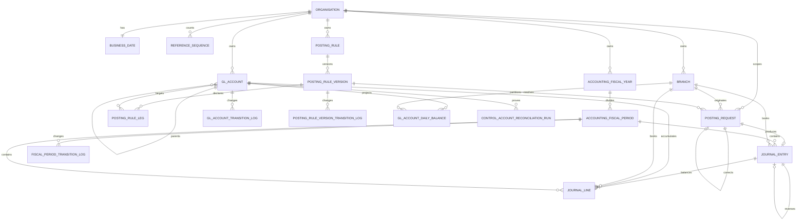

# Accounting Schema

No accounting migration exists yet. This document is the frozen design record that issues #36, #40,
#44, #46 and #47 implement verbatim, so an implementing agent never has to invent a table, a column
or a constraint. It is the database-design authority for accounting: if implementation proves a
change is required, change this document first, record why, then write the forward-only migration.

Read it with [the accounting foundation](../architecture/accounting-foundation.md), which holds the
invariants and the benchmark reasoning, and with
[the foundation schema](foundation-schema.md), whose conventions every table below inherits.

The application schema is `V1`–`V5`; `V5` seeds the accounting permission catalogue and creates no
tables. Accounting migrations take the next free versions
**at implementation time** — never assume the numbers below, and check `db/migration` rather than
this sentence.

| Planned migration | Contents | Issue |
| --- | --- | --- |
| First accounting migration | `accounting_fiscal_year`, `accounting_fiscal_period`, `gl_account`, two transition logs | #36 |
| Second | `posting_request`, `journal_entry`, `journal_line` | #40 |
| Third | `posting_rule`, `posting_rule_version`, `posting_rule_leg`, one transition log | #44 |
| Fourth | `control_account_reconciliation_run` | #46 |
| Fifth | `gl_account_daily_balance` | #47 |

Issue #34's permission migration carries no accounting tables — only reference data.

## Entity relationships



## Table classification

Two axes matter. **Authoritative** tables are the system of record; a **projection** is derived and
must be rebuildable from authoritative rows by a documented query. **Accounting-owned** tables are
created by accounting migrations; **product-owned-future** tables belong to modules that do not
exist yet, and accounting holds no foreign key into them.

| Table | Class | Ownership | Issue |
| --- | --- | --- | --- |
| `accounting_fiscal_year` | Authoritative | Accounting | #36 |
| `accounting_fiscal_period` | Authoritative | Accounting | #36 |
| `gl_account` | Authoritative | Accounting | #36 |
| `gl_account_transition_log` | Authoritative, append-only | Accounting | #36 |
| `fiscal_period_transition_log` | Authoritative, append-only | Accounting | #36 |
| `posting_request` | Authoritative | Accounting | #40 |
| `journal_entry` | Authoritative, **immutable** | Accounting | #40 |
| `journal_line` | Authoritative, **immutable** | Accounting | #40 |
| `posting_rule` | Authoritative | Accounting | #44 |
| `posting_rule_version` | Authoritative | Accounting | #44 |
| `posting_rule_leg` | Authoritative | Accounting | #44 |
| `posting_rule_version_transition_log` | Authoritative, append-only | Accounting | #44 |
| `control_account_reconciliation_run` | Authoritative evidence | Accounting | #46 |
| `gl_account_daily_balance` | **Projection**, rebuildable | Accounting | #47 |
| savings, loan, share and teller positions | Authoritative | **Product-owned-future** | Out of Phase B |

## Identifier conventions

Accounting inherits [the foundation conventions](foundation-schema.md) unchanged: `id UUID PRIMARY
KEY DEFAULT uuidv7()`, a client-suppliable `guid UUID NOT NULL DEFAULT uuidv7()` with a unique
constraint, and application-owned generation. There are no deltas. Every accounting table has both
columns; none of the `id`-less exceptions in the foundation schema apply here.

## Tenant isolation

Accounting follows the foundation's composite-foreign-key mechanism rather than relying on
application filtering alone:

- every accounting table carries `organisation_id UUID NOT NULL REFERENCES organisation (id)`;
- every reference to another accounting or foundation row is a composite foreign key on
  `(organisation_id, <parent_id>)`;
- every accounting table that is ever a parent declares
  `CONSTRAINT uq_<table>_organisation_id UNIQUE (organisation_id, id)` in the same `CREATE TABLE`,
  purely as that foreign key's target — exactly as `branch`, `role` and
  `user_organisation_membership` do.

A cross-tenant write then fails at the database even with an application bug.

`gl_account` is **tenant-scoped, never branch-scoped**: there is one chart of accounts per tenant,
and branch is a *dimension on the posting*, carried on `journal_entry` and `journal_line`.

## The period selector

`journal_entry` and `journal_line` both carry `posting_date DATE NOT NULL`. **It is the only column
that selects a fiscal period** (`INV-9`), it is what `journal_line`'s read-path indexes are keyed
on, and it is what `PostingPeriodResolver` passes to `findCovering`.

It is deliberately *not* named `business_date`. The tenant's current business date lives in the
`business_date` table and is a different value: an ordinary posting has
`posting_date = business_date`, but a backdated correction into an earlier open period has
`posting_date < business_date`. An earlier draft of this document used one name for both, which
made backdating inexpressible. The full date model — the classification rules, the permission
gate for a backdated posting and the fiscal-period locking protocol — is settled by issue #35,
which adds ADR 0022 and `docs/architecture/accounting-dates-and-periods.md`. Neither exists yet at
this point in the stack, so this document states the column and its meaning rather than pointing a
reader at a record they cannot open.

## Money and currency columns

Every money-bearing row carries five columns, always populated:

| Column | Type | Meaning |
| --- | --- | --- |
| `currency_code` | `CHAR(3)` | The transaction currency |
| `amount` | `NUMERIC(23, 6)` | The amount in the transaction currency, always positive |
| `functional_currency_code` | `CHAR(3)` | The tenant's reporting currency |
| `functional_amount` | `NUMERIC(23, 6)` | The amount in the functional currency, always positive |
| `exchange_rate` | `NUMERIC(20, 10)` | Transaction to functional, `> 0` |

In a single-currency tenant the two currencies are equal, the two amounts are equal and the rate is
`1`. **The double-entry balance invariant is enforced on `functional_amount` only** — transaction
currency amounts never have to balance across currencies.

Direction carries the sign: `direction TEXT NOT NULL CHECK (direction IN ('DEBIT', 'CREDIT'))`
alongside `CHECK (amount > 0)` **and `CHECK (functional_amount > 0)`**. Both are required, and the
second is the one that matters most: the double-entry balance invariant is enforced on
`functional_amount` only, so a conversion defect writing a zero or negative functional amount would
satisfy every other constraint here while silently inverting or cancelling a balance. Binary
floating point is banned in accounting schema and code.

Currency validation stays in `java.util.Currency` where `TenantSettingCatalog` already does it —
there is deliberately **no** `currency` reference table, because a second source of truth for
currency codes is a bug factory. The column check is the same regex the foundation already uses:
`CHECK (currency_code ~ '^[A-Z]{3}$')`.

## Audit columns and immutability

Mutable accounting tables carry the standard foundation set: `created_at`, `created_by`,
`updated_at`, `updated_by`, `row_version BIGINT NOT NULL DEFAULT 0` and
`CONSTRAINT chk_<table>_version CHECK (row_version >= 0)`.

`journal_entry` and `journal_line` deliberately **do not**. They carry `created_at` and `created_by`
only — no `updated_at`, no `updated_by`, no `row_version` — following the `business_date_history`
precedent. The absence is the point: there is no column for an update to maintain, so the schema
itself says the row is append-only.

Application-level immutability is backed physically by
`REVOKE UPDATE, DELETE ON journal_entry, journal_line FROM <application role>`, which is
declarative and visible in `\dp`. A trigger was rejected: this repository has zero triggers, and
invisible PL/pgSQL business logic is the opposite of the declarative-`CHECK` culture `V1`
established. The least-privilege role is an operations prerequisite tracked by issue #54; until it
exists the guarantee is application-level plus tests.

## Indexing

Accounting follows `V1`'s stated rule — index every foreign key, index the tenant-scoped listing
paths, and add **no speculative indexes**. Indexes that serve a query introduced by a later issue
are specified in this document but created by that issue, each with an
`EXPLAIN (ANALYZE, BUFFERS)` plan in its pull request.

The one index that carries the ledger's read load:

```sql
CREATE INDEX idx_journal_line_account_date
    ON journal_line (organisation_id, gl_account_id, posting_date, id)
    INCLUDE (direction, functional_amount, branch_id, journal_entry_id);
```

Deferred, with the issue that creates each:

- `idx_journal_line_branch_account_date (organisation_id, branch_id, posting_date, gl_account_id)
  INCLUDE (direction, functional_amount)` — branch trial balance, issue #49.
- `idx_journal_line_subledger (organisation_id, source_module, subledger_reference, posting_date,
  id) WHERE subledger_reference IS NOT NULL` — control-account reconciliation, issue #46.

## Tables deliberately not created

- **`account_mapping`** — Apache Fineract ships both `acc_accounting_rule` and `acc_product_mapping`
  and a reviewer cannot tell which governs a given posting. Finaxis has one resolution path:
  `posting_rule` → effective `posting_rule_version` → `posting_rule_leg` → account, with
  `account_resolution = 'PRODUCT_PARAMETER'` as the single indirection point.
- **`control_account`** — a control account *is* a GL account with no independent lifecycle.
  Classification lives on `gl_account.is_control_account` and `control_subledger_kind`.
- **`gl_account_balance`** (an authoritative stored current balance) — a per-account write hotspot
  on every posting and a silent divergence risk. `gl_account_daily_balance` answers an as-of
  balance from one index-only row read instead, and is rebuildable from `journal_line`. Note that
  OFBiz trunk does not carry a running balance on `GlAccount` either; it keeps a `GlAccountHistory`
  period rollup, which is closer to the projection adopted here. See ADR 0020.
- **Any member or product subsidiary-ledger table** — product-owned-future. Accounting creates none
  and holds no foreign key to them.

## Cross-links to implementing issues

| Issue | Implements |
| --- | --- |
| #36 | The fiscal calendar and chart-of-accounts tables |
| #40 | `posting_request`, `journal_entry`, `journal_line`, and the #40 index set only |
| #44, #45 | The posting-rule tables and deterministic resolution |
| #46 | Control-account classification and the reconciliation proof contract |
| #47 | `gl_account_daily_balance` and its documented rebuild query |
| #49, #50, #51 | The read models, using the query patterns and pagination contract |
| #54 | The `REVOKE UPDATE, DELETE` operational prerequisite |
