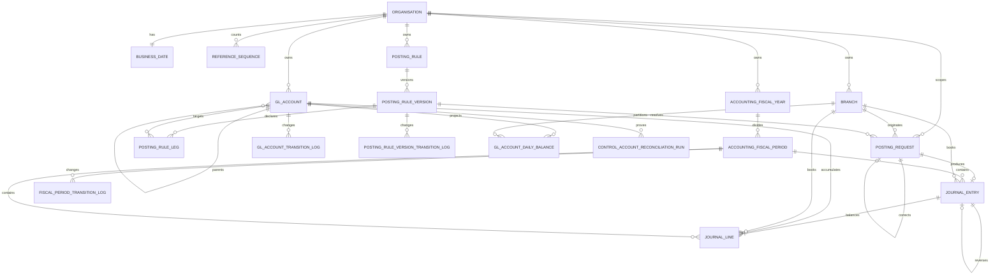

# Accounting Schema

This document is the database-design authority for accounting. Issues #36, #40, #44, #46 and #47
implement it: if implementation proves a change is required, change this document first, record
why, then write the forward-only migration.

The five tables issue #36 creates are specified below to column, constraint and index level, so
that migration is a transcription rather than a design exercise. The later issues' tables are still
specified at relationship level only, and each will be brought to column level by the change that
implements it — the same way #36's were, and for the same reason. An earlier revision of this
document promised that an implementing agent *"never has to invent a table, a column or a
constraint"* while carrying no column definitions for any table, which made the promise false for
the first issue that tried to keep it.

Read it with [the accounting foundation](../architecture/accounting-foundation.md), which holds the
invariants and the benchmark reasoning, and with
[the foundation schema](foundation-schema.md), whose conventions every table below inherits.

The application schema is `V1`–`V5`; `V5` seeds the accounting permission catalogue and creates no
tables. Accounting migrations take the next free versions
**at implementation time** — never assume the numbers below, and check `db/migration` rather than
this sentence.

| Planned migration | Contents | Issue |
| --- | --- | --- |
| First accounting migration | `accounting_fiscal_year`, `accounting_fiscal_period`, `gl_account`, two transition logs | #36 |
| Second | `posting_request`, `journal_entry`, `journal_line` | #40 |
| Third | `posting_rule`, `posting_rule_version`, `posting_rule_leg`, one transition log | #44 |
| Fourth | `control_account_reconciliation_run` | #46 |
| Fifth | `gl_account_daily_balance` | #47 |

Issue #34's permission migration carries no accounting tables — only reference data.

## Entity relationships



## Table classification

Two axes matter. **Authoritative** tables are the system of record; a **projection** is derived and
must be rebuildable from authoritative rows by a documented query. **Accounting-owned** tables are
created by accounting migrations; **product-owned-future** tables belong to modules that do not
exist yet, and accounting holds no foreign key into them.

| Table | Class | Ownership | Issue |
| --- | --- | --- | --- |
| `accounting_fiscal_year` | Authoritative | Accounting | #36 |
| `accounting_fiscal_period` | Authoritative | Accounting | #36 |
| `gl_account` | Authoritative | Accounting | #36 |
| `gl_account_transition_log` | Authoritative, append-only | Accounting | #36 |
| `fiscal_period_transition_log` | Authoritative, append-only | Accounting | #36 |
| `posting_request` | Authoritative | Accounting | #40 |
| `journal_entry` | Authoritative, **immutable** | Accounting | #40 |
| `journal_line` | Authoritative, **immutable** | Accounting | #40 |
| `posting_rule` | Authoritative | Accounting | #44 |
| `posting_rule_version` | Authoritative | Accounting | #44 |
| `posting_rule_leg` | Authoritative | Accounting | #44 |
| `posting_rule_version_transition_log` | Authoritative, append-only | Accounting | #44 |
| `control_account_reconciliation_run` | Authoritative evidence | Accounting | #46 |
| `gl_account_daily_balance` | **Projection**, rebuildable | Accounting | #47 |
| savings, loan, share and teller positions | Authoritative | **Product-owned-future** | Out of Phase B |

## Identifier conventions

Accounting inherits [the foundation conventions](foundation-schema.md) unchanged: `id UUID PRIMARY
KEY DEFAULT uuidv7()`, a client-suppliable `guid UUID NOT NULL DEFAULT uuidv7()` with a unique
constraint, and application-owned generation. There are no deltas. Every accounting table has both
columns; none of the `id`-less exceptions in the foundation schema apply here.

## Tenant isolation

Accounting follows the foundation's composite-foreign-key mechanism rather than relying on
application filtering alone:

- every accounting table carries `organisation_id UUID NOT NULL`. The entity tables reference
  `organisation (id)` directly; the append-only transition logs inherit the reference through
  their composite parent foreign key instead, exactly as the foundation's transition logs do, so
  the same guarantee is made once rather than twice;
- every reference to another accounting or foundation row is a composite foreign key on
  `(organisation_id, <parent_id>)`;
- every accounting table that is ever a parent declares
  `CONSTRAINT uq_<table>_organisation_id UNIQUE (organisation_id, id)` in the same `CREATE TABLE`,
  purely as that foreign key's target — exactly as `branch`, `role` and
  `user_organisation_membership` do.

A cross-tenant write then fails at the database even with an application bug.

`gl_account` is **tenant-scoped, never branch-scoped**: there is one chart of accounts per tenant,
and branch is a *dimension on the posting*, carried on `journal_entry` and `journal_line`.

## Settled design questions

Issue #36's first acceptance criterion is *"schema matches #30 ERD exactly **or** #30 is
deliberately updated first with the approved design change"*. Everything in this section takes the
second branch. Eight questions are settled here. Most had no answer anywhere in the design record;
two had answers that contradict each other; one had an answer that was wrong. Each is settled
before the migration exists, with the reasoning attached, rather than decided by accident in SQL.

### Fiscal-period status is `FUTURE`, `OPEN`, `CLOSED`, `LOCKED`

Issue #36's text names three values. `FiscalPeriodStatus`, shipped by #35, declares four, and the
fourth is load-bearing rather than decorative: [the accounting
foundation](../architecture/accounting-foundation.md) states that a closed period may be reopened
and a locked one may not, and rejects Fineract's `acc_gl_closure` model *precisely* because it
cannot express that difference. `FiscalPeriodStateChangeGuard` already refuses every transition out
of `LOCKED`. A `CHECK` written to the three-value list would reject a row the shipped guard can
produce, so all four are adopted.

`FUTURE` is adopted for the same reason it exists in the enum: a period is provisioned before it is
postable, and without the state a calendar can only be materialised on the day it opens.

`SOFT_CLOSED` stays out, but not for the reason an earlier revision of this section gave. That
revision said the distinction was *"already expressed by `CLOSED` plus
`journal.post_prior_period`"*, which is false: `PostingPeriodResolver` rejects a `CLOSED` period
with `accounting.fiscal_period_closed` **regardless of permission**, and
`journal.post_prior_period` gates posting into an *earlier* period that is still `OPEN` — it is
not a key to a closed one. No permission posts into a closed period.

The correct reason is that `SOFT_CLOSED` would create a second, implicit reopening path. The
foundation makes reopening an explicit, audited, maker-checker transition; a state whose meaning
is *"closed unless you hold the right code"* lets a privileged caller post into a period nobody
reopened and no log row records. The capability it appears to add — a cut-off that ordinary users
respect while adjustments continue — is served by keeping the period `OPEN` and gating the
backdated posting, which is the mechanism that already exists and which leaves the period's status
honest.

An earlier revision of `FiscalPeriodPorts` justified excluding `SOFT_CLOSED` on the ground that
this document does not adopt it. That reasoning was sound and applied to only one state: `FUTURE`
appeared in no design record either. Both are now named here, so the enum and the authority agree.

### `accounting_fiscal_year` carries no status and no state machine

A year is a container. Its closure is exactly *"every one of its periods is `CLOSED` or `LOCKED`"*,
which is derivable from rows that already exist, cannot drift from them, and needs no second
source of truth. A stored year status would be a denormalisation of period state with no invariant
holding the two together.

Migration `V5` already reasons this way where it seeds the permission catalogue: the four
`fiscal_period.*` codes are shared by year and period *"because the year is a container and no
realistic role closes periods but not years"*. `fiscal_period.open` is described there as *"open a
fiscal year or period for posting"*. So a year-level operation is a bulk operation over period
transitions, each one logged in `fiscal_period_transition_log`, and no `fiscal_year_transition_log`
is needed.

This is also why the table classification below lists exactly two transition logs for #36.

### `gl_account` has no `REJECTED` state

Issue #36 sketches `DRAFT → PENDING_APPROVAL → ACTIVE → INACTIVE/REJECTED`; issue #38 sketches
rejection *"back to a safe editable state or `REJECTED`"*. The adopted set is
**`DRAFT`, `PENDING_APPROVAL`, `ACTIVE`, `INACTIVE`**, and rejection returns the account to `DRAFT`
with a `status_reason`.

The reason is a constraint interaction, not a preference. `account_code` is unique per
organisation. A terminal `REJECTED` row keeps its code forever, so the second attempt at the same
account cannot reuse it and the chart accumulates tombstones that block the codes an accountant
actually wants. Returning to `DRAFT` keeps the code with the work in progress, which is where it
belongs. The foundation FSMs set the precedent: `branch` and `organisation` both carry `DRAFT` and
`PENDING_APPROVAL` and neither has a rejected state.

Issue #38 implements the transition graph over this set.

### `normal_balance` is stored, and constrained against `account_class`

Deriving it from `account_class` is correct for every ordinary account and wrong for every contra
account — an allowance for loan impairment is an `ASSET` whose balance is a credit, and a
microfinance chart has several. Storing it unconstrained loses a real invariant: nothing would stop
a liability being created with a debit normal balance.

So it is **generated**, not supplied. The side is a total function of two columns already on the
row — `(account_class implies debit) XOR is_contra_account` — so `normal_balance` is a stored
generated column and no caller can state it. A contra `ASSET` is therefore a credit by
construction, and the flag stays explicit, greppable and reportable.

An earlier draft of this section stored the column and policed it with
`chk_gl_account_normal_balance_class`, written as `is_contra_account OR normal_balance = …`. That
is a disjunction, so setting the contra flag did not *invert* the requirement, it **removed** it:
a contra `ASSET` with a `DEBIT` balance satisfied the check, which is precisely the row the rule
exists to reject. The lesson generalises past this column: where a value is fully determined by
others on the same row, storing it independently creates a second source of truth that a `CHECK`
can only police, and policing is the part that failed. Generate it instead. If an API ever accepts
an explicit `normal_balance`, it validates the caller's value against the generated one at the
boundary and never writes it.

A contra account is presented as a deduction from its own class, never as a balance of the
opposite class.

### Header versus postable is adopted, and the parent rule is a foreign key

`account_usage` is `HEADER` or `POSTABLE`. Fineract's `HEADER`/`DETAIL` naming is the benchmark;
`POSTABLE` is preferred because it names the capability the ledger actually tests, and it matches
the `accounting.account_not_postable` error code already published in `PostingErrorCodes`.

The rule *"only a header account may be a parent"* is enforced **by the database**, not by the
domain. `parent_account_usage` is a stored generated column that is `'HEADER'` whenever
`parent_account_id` is set and `NULL` otherwise, and the parent foreign key is composite over
`(organisation_id, parent_account_id, parent_account_usage)`. A row whose parent is postable has no
matching target, and — the part worth having — promoting a parent from `HEADER` to `POSTABLE`
while it still has children is rejected too. Because the column is generated, no application code
can forget to populate it.

Deeper hierarchy rules are not expressible in a constraint. Self-parenting is
(`chk_gl_account_not_own_parent`); longer cycles, depth and parent/child class compatibility belong
to `ChartHierarchyPolicy` in issue #37.

### Period bounds are stored at both ends

`start_date` and `end_date` are both stored. Deriving the end from the next period's start would
make `findCovering` a window function or a `LATERAL` join, and the whole locking protocol depends
on that lookup resolving to one row that can then be locked with a plain `SELECT … FOR SHARE`.
A derived end would also leave a fiscal year's final period unbounded.

Non-overlap is then a database guarantee rather than a consequence of the representation, which is
what issue #36 asks for explicitly.

### Reopening a period is gated by permission and by actor identity, not by a second code

[The accounting foundation](../architecture/accounting-foundation.md) requires maker-checker for
period close and reopen (`INV-10`). The permission catalogue seeded by `V5` gives fiscal periods
four codes — `view`, `open`, `close`, `reopen` — with **no** `submit`/`approve` pair, unlike
`gl_account.submit`/`gl_account.approve`. The catalogue is frozen, so a submit/approve workflow
would need a new code and a second permission migration.

It does not need one, and the reason is worth stating precisely, because "close, lock and reopen are
all privileged" reads as though all three take two actors and they do not.

A transition log records an act **after** it has happened, so it cannot gate the act that creates
it. A different-actor rule between two operations constrains the *second* one; there is no second
actor available for a first close without a `fiscal_period.close_request` code and a
submit-then-approve model, which the frozen catalogue does not allow. What `INV-10` is protecting is
that no single principal can, alone, produce a reporting state nobody else agreed to — and a close
is **reversible**. The steps that are not are `LOCKED`, which nothing transitions out of, and
`REOPEN`, which undoes a period that has already been reported. Both carry the different-actor rule
and the no-exemption break-glass check; a close is single-actor, audited at `CRITICAL` with the
actor's identity. The foundation's `INV-10` table now says exactly this, and the platform's own
`user.invite`/`user.approve` precedent puts maker-checker on the committing step rather than on
every step leading to it.

So `INV-10` is satisfied by `fiscal_period.close` and `fiscal_period.reopen` being separate
`CRITICAL` codes plus `fiscal_period_transition_log` persisting the actor of every transition. The
control is:

- reopening requires `fiscal_period.reopen`, a mandatory reason, and an audit record;
- the actor reopening a period must not be the actor who closed it, resolved from the most recent
  close row in `fiscal_period_transition_log`.

That is the same shape as `UserProvisioningService.approveUser`, which is the repository's existing
maker-checker precedent. Issue #39 implements it; this document is where the obligation is now
recorded, because until now no design record specified it either way and no code path enforced it.

The same reasoning extends to the `CLOSED` → `LOCKED` transition, and it needs stating because the
catalogue has no `fiscal_period.lock`. Locking is **authorised by `fiscal_period.close`** — the
`CRITICAL` code for taking a period out of postability — and subject to the same different-actor
rule against the latest close row, so one principal cannot both close a period and irreversibly
finalise it. Because locking is irreversible, it is additionally checked against the
no-exemption break-glass path rather than the ordinary tenant-permission path, so a system actor
cannot finalise a period without a principal holding the authority.

Reusing `close` is a deliberate compromise, not a claim that the codes are equivalent: a dedicated
`fiscal_period.lock` code would let a role close periods without being able to finalise them, and
the catalogue freeze plus the one-migration-per-issue rule put it out of reach of issue #39.
It is the recommended follow-up, and until it exists no role should hold `fiscal_period.close`
unless it is also trusted to lock.

### The functional-currency freeze is not enforceable by issue #36

[The accounting foundation](../architecture/accounting-foundation.md) states that a tenant's
functional currency is frozen *"once the tenant has a single posted journal"* and assigns the
enforcement to issue #36. It cannot be: the predicate is a read of `journal_entry`, which issue #40
creates. Issue #36 creates no table the rule can be evaluated against.

The enforcement point is therefore the first issue that can express it — #40, where
`journal_entry` appears. That correction is made in the foundation document as part of this change
rather than left as a promise the schema cannot keep.

## Column definitions for the issue #36 tables

Every column, constraint, index and comment the first accounting migration creates. The audit set
(`created_at`, `created_by`, `updated_at`, `updated_by`, `row_version`) and the identifier pair
(`id`, `guid`) are specified once under the conventions above and are not repeated in each table.

### The overlap mechanism, and why an extension schema

`accounting_fiscal_period` and `accounting_fiscal_year` both need *"no two rows of this tenant
cover the same date"*, which is an `EXCLUDE USING gist` constraint over `organisation_id WITH =`
and `daterange(start_date, end_date, '[]') WITH &&`. PostgreSQL 18 ships btree, hash and BRIN
operator classes for `uuid` but no GiST one, so the `=` half needs `btree_gist`, and this is the
repository's first extension.

It is installed into a dedicated `extensions` schema, not `public` — and the install has to
**relocate an existing installation rather than assume there is none**:

```sql
CREATE SCHEMA IF NOT EXISTS extensions;

DO $$
BEGIN
    IF NOT EXISTS (SELECT 1 FROM pg_extension WHERE extname = 'btree_gist') THEN
        CREATE EXTENSION btree_gist WITH SCHEMA extensions;
    ELSIF (SELECT n.nspname FROM pg_extension e
           JOIN pg_namespace n ON n.oid = e.extnamespace
           WHERE e.extname = 'btree_gist') <> 'extensions' THEN
        ALTER EXTENSION btree_gist SET SCHEMA extensions;
    END IF;
END
$$;
```

`CREATE EXTENSION IF NOT EXISTS btree_gist WITH SCHEMA extensions` is **not** sufficient, and the
difference is a failed deploy rather than a preference. When the extension already exists anywhere,
PostgreSQL emits `NOTICE: extension "btree_gist" already exists, skipping` and ignores
`WITH SCHEMA` entirely — so on any database where an operator or a managed-PostgreSQL image
pre-installed it into `public`, the extension stays there and the next statement fails with
`operator class "extensions.gist_uuid_ops" does not exist for access method "gist"`. Verified
against `postgres:18.4` in all three states: pre-installed in `public` (relocated), absent
(created), and already correct (no-op). `btree_gist` is relocatable, so `ALTER EXTENSION … SET
SCHEMA` is available.

**This introduces a deployment prerequisite the repository did not have before.** `CREATE
EXTENSION` and `ALTER EXTENSION … SET SCHEMA` need CREATE on the database, which a role holding
only DDL rights inside `public` does not have. `btree_gist` has been a trusted extension since
PostgreSQL 13, so a database **owner** suffices and superuser is not required — but a deployment
that runs Flyway as a deliberately least-privileged migration role must grant that role database
ownership, or pre-install the extension into `extensions` out of band, before `V6` can apply.
On a managed PostgreSQL service the extension must also appear on the provider's allow-list.
Because the block above is idempotent and relocating, pre-installing it correctly makes `V6` a
no-op for that statement.

The operator class is named schema-qualified at the constraint:

```sql
CONSTRAINT ex_accounting_fiscal_period_no_overlap EXCLUDE USING gist (
    organisation_id extensions.gist_uuid_ops WITH =,
    daterange(start_date, end_date, '[]') WITH &&
)
```

The reason is the build, and it is specific. `build.gradle.kts` runs jOOQ code generation against
`inputSchema = "public"` with no excludes, and `compileKotlin` depends on `jooqCodegen`. Installed
into `public`, the extension's functions are generated into `com.finaxis.platform.jooq` on every
build — **213 routine classes in a new `routines` package**, measured by installing it there and
regenerating rather than estimated — so an extension in `public` would gate compilation. Installed
into `extensions`, code generation never sees it. Nothing needs `extensions` on its `search_path`
at runtime, because an exclusion constraint stores its operator class by OID once created.

Both halves were verified before this document adopted the mechanism, because a build-gating
mistake here is expensive to unwind:

| Harness | Verified |
| --- | --- |
| `postgres:18.4`, the image the integration tests run on | The extension installs into `extensions`; `public` gains zero routines; same-tenant overlap and inclusive-boundary touch are rejected; identical ranges in two tenants are accepted; every `CHECK` and composite foreign key below rejects exactly the row it names |
| Zonky embedded PostgreSQL 18.6, the code-generation harness | Flyway applies the migration and `jooqCodegen` succeeds; the generated tree gains exactly the five new tables and no extension function, index or UDT |

Bounds are **inclusive on both ends** (`'[]'`). Two periods that merely touch — one ending
`2026-01-31`, the next starting `2026-01-31` — overlap and are rejected. Adjacent periods must be
a day apart.

Operationally this means a deploy role needs `CREATE` on the database. `btree_gist` has been a
trusted extension since PostgreSQL 13, so a database owner can install it without superuser.

### `accounting_fiscal_year`

| Column | Type | Null | Meaning |
| --- | --- | --- | --- |
| `year_code` | `TEXT` | no | Tenant-unique short code, e.g. `FY2026` |
| `year_name` | `TEXT` | no | Display name |
| `start_date` | `DATE` | no | First day of the year, inclusive |
| `end_date` | `DATE` | no | Last day of the year, inclusive |

| Constraint | Kind | Purpose |
| --- | --- | --- |
| `uq_accounting_fiscal_year_guid` | `UNIQUE (guid)` | Alternate key |
| `uq_accounting_fiscal_year_organisation_code` | `UNIQUE (organisation_id, year_code)` | One code per tenant |
| `uq_accounting_fiscal_year_organisation_id` | `UNIQUE (organisation_id, id)` | Composite foreign-key target for periods |
| `chk_accounting_fiscal_year_dates` | `CHECK (end_date >= start_date)` | A year cannot end before it starts |
| `chk_accounting_fiscal_year_version` | `CHECK (row_version >= 0)` | Convention |
| `ex_accounting_fiscal_year_no_overlap` | `EXCLUDE USING gist` | Two years of one tenant cannot cover the same date |

No status column, and no index beyond the constraint-backing ones: a tenant has a handful of years,
and they are read through their periods.

### `accounting_fiscal_period`

| Column | Type | Null | Meaning |
| --- | --- | --- | --- |
| `fiscal_year_id` | `UUID` | no | Owning year, referenced tenant-safely |
| `period_number` | `INTEGER` | no | Ordinal within the year, `1`-based |
| `period_name` | `TEXT` | no | Display name, e.g. `January 2026` |
| `start_date` | `DATE` | no | First posting date in the period, inclusive |
| `end_date` | `DATE` | no | Last posting date in the period, inclusive |
| `status` | `TEXT` | no | `FUTURE`, `OPEN`, `CLOSED` or `LOCKED` |
| `status_reason` | `TEXT` | yes | Why the period is in its current state; mandatory on reopen at the application layer |

| Constraint | Kind | Purpose |
| --- | --- | --- |
| `uq_accounting_fiscal_period_guid` | `UNIQUE (guid)` | Alternate key |
| `uq_accounting_fiscal_period_organisation_id` | `UNIQUE (organisation_id, id)` | Composite foreign-key target for the transition log, and later for `journal_entry` and `journal_line` |
| `uq_accounting_fiscal_period_year_number` | `UNIQUE (organisation_id, fiscal_year_id, period_number)` | Period numbers do not repeat within a year |
| `fk_accounting_fiscal_period_year` | `FOREIGN KEY (organisation_id, fiscal_year_id)` | A period cannot belong to another tenant's year |
| `chk_accounting_fiscal_period_number` | `CHECK (period_number > 0)` | Ordinals are 1-based |
| `chk_accounting_fiscal_period_dates` | `CHECK (end_date >= start_date)` | A period cannot end before it starts |
| `chk_accounting_fiscal_period_status` | `CHECK (status IN (…))` | The four adopted states |
| `chk_accounting_fiscal_period_version` | `CHECK (row_version >= 0)` | Convention |
| `ex_accounting_fiscal_period_no_overlap` | `EXCLUDE USING gist` | A posting date resolves to at most one period |

The exclusion constraint is scoped to the **tenant**, not to the fiscal year. `INV-9` requires a
posting date to select exactly one period, so two periods in *different* years may not overlap
either. Scoping it to the year would let a badly built calendar make period resolution
ambiguous — precisely the failure the constraint exists to prevent.

`ex_…_no_overlap` bans overlaps; nothing at the database level bans **gaps**, and nothing forces a
period to lie inside its year's bounds. Both are cross-row properties of a whole calendar rather
than of a row, so both are enforced by issue #39's `FiscalCalendarService`, which is the only path
that creates a year or a period: it rejects a period outside its year's bounds, and materialises a
year's periods as one contiguous, gapless set. A gap that arises some other way is not a silent
corruption — a posting into it is rejected with `accounting.fiscal_period_not_found` — but a
period outside its year would be, because a year's closure is defined as *"all of its periods are
closed"* and a stray period makes that answer meaningless.

| Index | Definition | Justifying query |
| --- | --- | --- |
| `idx_accounting_fiscal_period_year` | `(organisation_id, fiscal_year_id)` | The foreign key, and *"list the periods of this year"* — the calendar screen and issue #39's bulk year operations |

`findCovering(organisationId, postingDate)` gets **no index of its own**. A tenant holds tens of
period rows — twelve or thirteen a year — so any plan over that table is a few pages, and the
exclusion constraint's GiST index already bounds a scan by tenant. Adding one would be exactly the
speculative index `V1`'s rule forbids.

### `gl_account`

| Column | Type | Null | Meaning |
| --- | --- | --- | --- |
| `account_code` | `TEXT` | no | Tenant-unique code an accountant recognises, e.g. `1010` |
| `account_name` | `TEXT` | no | Display name |
| `description` | `TEXT` | yes | Free text |
| `account_class` | `TEXT` | no | `ASSET`, `LIABILITY`, `EQUITY`, `INCOME` or `EXPENSE` |
| `account_usage` | `TEXT` | no | `HEADER` groups; `POSTABLE` can receive journal lines |
| `normal_balance` | `TEXT` | no | **Generated** from `account_class` and `is_contra_account`; `DEBIT` or `CREDIT` — the side that increases the account |
| `is_contra_account` | `BOOLEAN` | no | Deliberate inversion of the class-implied normal balance; defaults false |
| `manual_posting_allowed` | `BOOLEAN` | no | Whether a manual journal may target the account; defaults **false** |
| `parent_account_id` | `UUID` | yes | Parent in the chart hierarchy |
| `parent_account_usage` | `TEXT` | yes | **Generated**; `'HEADER'` when a parent is set, else `NULL` |
| `status` | `TEXT` | no | `DRAFT`, `PENDING_APPROVAL`, `ACTIVE` or `INACTIVE` |
| `status_reason` | `TEXT` | yes | Why the account is in its current state, including a rejection reason |

| Constraint | Kind | Purpose |
| --- | --- | --- |
| `uq_gl_account_guid` | `UNIQUE (guid)` | Alternate key |
| `chk_gl_account_code` | `CHECK (account_code ~ '^[A-Za-z0-9._-]{1,32}$')` | The same bound `AccountCode` enforces, so a row the database accepted can always be read back into the value object |
| `uq_gl_account_organisation_code` | `UNIQUE (organisation_id, account_code)` | Account codes are unique per tenant |
| `uq_gl_account_organisation_id` | `UNIQUE (organisation_id, id)` | Composite foreign-key target for the transition log, and later for `journal_line` and `posting_rule_leg` |
| `uq_gl_account_parent_target` | `UNIQUE (organisation_id, id, account_usage)` | Target of the parent foreign key below; its only purpose |
| `fk_gl_account_parent_same_organisation` | `FOREIGN KEY (organisation_id, parent_account_id, parent_account_usage)` | A parent is in the same tenant **and** is a `HEADER` account |
| `chk_gl_account_not_own_parent` | `CHECK (parent_account_id IS NULL OR parent_account_id <> id)` | Row-local half of cycle prevention |
| `chk_gl_account_class` | `CHECK (account_class IN (…))` | The five classes |
| `chk_gl_account_usage` | `CHECK (account_usage IN ('HEADER','POSTABLE'))` | Header and posting accounts are distinguishable |
| `chk_gl_account_manual_posting` | `CHECK (account_usage = 'POSTABLE' OR NOT manual_posting_allowed)` | A header account can never take a manual entry |
| `chk_gl_account_status` | `CHECK (status IN (…))` | The four adopted states |
| `chk_gl_account_version` | `CHECK (row_version >= 0)` | Convention |

`row_version` on `gl_account` is **load-bearing rather than decorative**: every update matches on
it and fails when it has moved. A chart-of-accounts edit and an approval touch the same row, and
without the predicate the edit's stale snapshot would write the pre-approval status back — leaving
the row and `gl_account_transition_log` disagreeing about whether the account was ever approved.
The two paths are also separated by what they may write: the edit path never writes `status`, and
the lifecycle path (issue #38) writes `status` and `status_reason` and nothing else, under
`SELECT … FOR UPDATE`.

`status_reason` is written on every status change, not left null. It is what a rejection reason and
a deactivation reason are recorded in on the row itself; the transition log holds the same reason
alongside the actor.

| Index | Definition | Justifying query |
| --- | --- | --- |
| `idx_gl_account_organisation_status` | `(organisation_id, status)` | *"List this tenant's active accounts"* — the chart screen and every posting-eligibility read |
| `idx_gl_account_parent` | `(organisation_id, parent_account_id)` | The parent foreign key, and the recursive descent below |

The chart is **listed by keyset over `account_code`**, bounded by
`finaxis.pagination.max-page-size` — the platform-wide ceiling every other listing endpoint
honours, rather than a second constant accounting would drift from. An over-large request is
refused in the application layer with a named error, never by an `IllegalArgumentException`
escaping a persistence adapter. There is deliberately no unpaginated variant: an "all accounts"
method is how `INV-15` gets quietly broken.

**Hierarchy retrieval is a recursive CTE, and there is no materialised path.** A tenant holds 500
to 2,000 accounts, so a `WITH RECURSIVE` descent from a root is a few index lookups over a table
that fits in cache, in one statement with no N+1. A materialised path or closure table would add a
write-amplification and a rebuild obligation to buy nothing at this volume. `ChartHierarchyPolicy`
(#37) bounds depth at **six** levels — class, group, sub-group, control, account, sub-account is
the deepest structure a chart of this size needs — which also bounds the recursion.

The bound is measured over **both** sides of a move: the proposed parent's own height above it, and
the height of the subtree being moved below it. Measuring only the parent's side lets a move push
descendants past the bound, and because the recursive descent is itself capped at six, the result
is not an error but a **silently truncated ancestry** — a rollup that never reaches the root and
quietly reports the wrong total.

`account_code` carries `chk_gl_account_code`, matching `AccountCode`'s bound exactly. Without it a
row written outside the application — a data migration, a bulk import, an operator fix — could
hold a code the value object refuses, and every subsequent read of that tenant's chart would throw
while constructing it. A constraint the application also enforces is not redundant here: the value
object protects the write path the application owns, and the `CHECK` protects the read path from
every write path it does not.

There is **no currency column.** Currency lives on the money-bearing row, not on the account, so
one account can carry balances in several currencies and the functional-amount invariant holds
across all of them.

There is **no delete path and no soft-delete flag.** `INACTIVE` is deactivation, and issue #54's
`REVOKE DELETE` covers the physical guarantee. Issue #37 enforces that an account with financial
use cannot have its code, class or parent changed; the schema supports that rule but cannot state
it, because *"has financial use"* is a read of `journal_line`, which issue #40 creates.

Two columns are specified here but **created by issue #46**, following this document's convention
for later-issue additions: `is_control_account BOOLEAN NOT NULL DEFAULT FALSE` and
`control_subledger_kind TEXT`, the classification `INV-14`'s reconciliation proofs are keyed on.

### `gl_account_transition_log` and `fiscal_period_transition_log`

Both are append-only and both copy `user_organisation_membership_transition_log` exactly:
`organisation_id`, `entity_id`, `transition_name`, `status_from`, `status_to`, `metadata_jsonb`,
`reason`, the audit set and the identifier pair. Neither carries a duplicate entity column; the
composite foreign key is `(organisation_id, entity_id)` against the parent table directly.

| Table | Foreign key | Index |
| --- | --- | --- |
| `gl_account_transition_log` | `(organisation_id, entity_id) → gl_account` | `(organisation_id, entity_id, created_at DESC)` |
| `fiscal_period_transition_log` | `(organisation_id, entity_id) → accounting_fiscal_period` | `(organisation_id, entity_id, created_at DESC)` |

`created_by` is the actor of the transition, which is what makes the reopen actor-identity check
above answerable from data.

### A prerequisite issue #36 does not close

`reference_sequence` is seeded with `MEMBER`, `TRANSACTION` and `JOURNAL` when an organisation is
provisioned through `OrganisationProvisioningService`. The bootstrap tenant created by `V3` in SQL
has **no** `reference_sequence` rows at all, so the gapless journal number issue #40 depends on has
no counter for it. That is #40's to fix, in the migration that introduces the tables which need the
counter; it is recorded here so it is not discovered at posting time.

## The period selector

`journal_entry` and `journal_line` both carry `posting_date DATE NOT NULL`. **It is the only column
that selects a fiscal period** (`INV-9`), it is what `journal_line`'s read-path indexes are keyed
on, and it is what `PostingPeriodResolver` passes to `findCovering`.

It is deliberately *not* named `business_date`. The tenant's current business date lives in the
`business_date` table and is a different value: an ordinary posting has
`posting_date = business_date`, but a backdated correction into an earlier open period has
`posting_date < business_date`. An earlier draft of this document used one name for both, which
made backdating inexpressible. The full date model — the classification rules, the permission
gate for a backdated posting and the fiscal-period locking protocol — is settled by issue #35,
which added [ADR 0022](../adr/0022-accounting-date-and-fiscal-period-concurrency.md) and
[accounting dates and periods](../architecture/accounting-dates-and-periods.md). Read them together
with this document: the second holds the *"what issue #36 must not change"* checklist, and the
column definitions below are written to satisfy it.

## Money and currency columns

Every money-bearing row carries five columns, always populated:

| Column | Type | Meaning |
| --- | --- | --- |
| `currency_code` | `CHAR(3)` | The transaction currency |
| `amount` | `NUMERIC(23, 6)` | The amount in the transaction currency, always positive |
| `functional_currency_code` | `CHAR(3)` | The tenant's reporting currency |
| `functional_amount` | `NUMERIC(23, 6)` | The amount in the functional currency, always positive |
| `exchange_rate` | `NUMERIC(20, 10)` | Transaction to functional, `> 0` |

In a single-currency tenant the two currencies are equal, the two amounts are equal and the rate is
`1`. **The double-entry balance invariant is enforced on `functional_amount` only** — transaction
currency amounts never have to balance across currencies.

Direction carries the sign: `direction TEXT NOT NULL CHECK (direction IN ('DEBIT', 'CREDIT'))`
alongside `CHECK (amount > 0)` **and `CHECK (functional_amount > 0)`**. Both are required, and the
second is the one that matters most: the double-entry balance invariant is enforced on
`functional_amount` only, so a conversion defect writing a zero or negative functional amount would
satisfy every other constraint here while silently inverting or cancelling a balance. Binary
floating point is banned in accounting schema and code.

Currency validation stays in `java.util.Currency` where `TenantSettingCatalog` already does it —
there is deliberately **no** `currency` reference table, because a second source of truth for
currency codes is a bug factory. The column check is the same regex the foundation already uses:
`CHECK (currency_code ~ '^[A-Z]{3}$')`.

## Audit columns and immutability

Mutable accounting tables carry the standard foundation set: `created_at`, `created_by`,
`updated_at`, `updated_by`, `row_version BIGINT NOT NULL DEFAULT 0` and
`CONSTRAINT chk_<table>_version CHECK (row_version >= 0)`.

`journal_entry` and `journal_line` deliberately **do not**. They carry `created_at` and `created_by`
only — no `updated_at`, no `updated_by`, no `row_version` — following the `business_date_history`
precedent. The absence is the point: there is no column for an update to maintain, so the schema
itself says the row is append-only.

Application-level immutability is backed physically by
`REVOKE UPDATE, DELETE ON journal_entry, journal_line FROM <application role>`, which is
declarative and visible in `\dp`. A trigger was rejected: this repository has zero triggers, and
invisible PL/pgSQL business logic is the opposite of the declarative-`CHECK` culture `V1`
established. The least-privilege role is an operations prerequisite tracked by issue #54; until it
exists the guarantee is application-level plus tests.

## Indexing

Accounting follows `V1`'s stated rule — index every foreign key, index the tenant-scoped listing
paths, and add **no speculative indexes**. Indexes that serve a query introduced by a later issue
are specified in this document but created by that issue, each with an
`EXPLAIN (ANALYZE, BUFFERS)` plan in its pull request.

The three indexes issue #36 creates, and the one lookup that deliberately gets none, are listed
with their justifying queries under
[the column definitions](#column-definitions-for-the-issue-36-tables) above. What follows is the
ledger's read path, which issue #40 creates.

The one index that carries the ledger's read load:

```sql
CREATE INDEX idx_journal_line_account_date
    ON journal_line (organisation_id, gl_account_id, posting_date, id)
    INCLUDE (direction, functional_amount, branch_id, journal_entry_id);
```

Deferred, with the issue that creates each:

- `idx_journal_line_branch_account_date (organisation_id, branch_id, posting_date, gl_account_id)
  INCLUDE (direction, functional_amount)` — branch trial balance, issue #49.
- `idx_journal_line_subledger (organisation_id, source_module, subledger_reference, posting_date,
  id) WHERE subledger_reference IS NOT NULL` — control-account reconciliation, issue #46.

## Tables deliberately not created

- **`account_mapping`** — Apache Fineract ships both `acc_accounting_rule` and `acc_product_mapping`
  and a reviewer cannot tell which governs a given posting. Finaxis has one resolution path:
  `posting_rule` → effective `posting_rule_version` → `posting_rule_leg` → account, with
  `account_resolution = 'PRODUCT_PARAMETER'` as the single indirection point.
- **`control_account`** — a control account *is* a GL account with no independent lifecycle.
  Classification lives on `gl_account.is_control_account` and `control_subledger_kind`.
- **`gl_account_balance`** (an authoritative stored current balance) — a per-account write hotspot
  on every posting and a silent divergence risk. `gl_account_daily_balance` answers an as-of
  balance from one index-only row read instead, and is rebuildable from `journal_line`. Note that
  OFBiz trunk does not carry a running balance on `GlAccount` either; it keeps a `GlAccountHistory`
  period rollup, which is closer to the projection adopted here. See ADR 0020.
- **Any member or product subsidiary-ledger table** — product-owned-future. Accounting creates none
  and holds no foreign key to them.

## Cross-links to implementing issues

| Issue | Implements |
| --- | --- |
| #36 | The fiscal calendar and chart-of-accounts tables |
| #40 | `posting_request`, `journal_entry`, `journal_line`, and the #40 index set only |
| #44, #45 | The posting-rule tables and deterministic resolution |
| #46 | Control-account classification and the reconciliation proof contract |
| #47 | `gl_account_daily_balance` and its documented rebuild query |
| #49, #50, #51 | The read models, using the query patterns and pagination contract |
| #54 | The `REVOKE UPDATE, DELETE` operational prerequisite |
