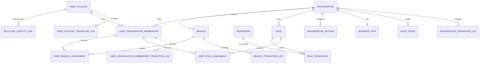

# Foundation Schema

The V1/V2 Flyway baseline is a greenfield reset. It uses text states with `CHECK` constraints so
future state additions are forward-only migration changes rather than PostgreSQL enum rewrites.

`user_account` is global. `user_organisation_membership`, branch assignments, role assignments,
settings, business date, audit events, and logs carry `organisation_id`. Composite foreign keys
keep branch, role, membership, and assignment relationships inside that organisation.

Lifecycle logs are append-only per aggregate: `organisation_transition_log`,
`branch_transition_log`, `user_account_transition_log`, and
`user_organisation_membership_transition_log`. `audit_event` is the business/security audit
record; it must not contain credentials, bearer tokens, cookies, or raw sensitive PII. Selected
transition events are externalized through Spring Modulith and Namastack for RabbitMQ delivery.

## Table notes

| Table | Ownership and purpose |
| --- | --- |
| `organisation` | Top-level isolation boundary. `tenant_code` is the stable external code retained for tenancy integration compatibility. |
| `branch` | Organisation-owned operating location. The composite parent FK prevents a branch hierarchy crossing organisations. |
| `user_account` | Global platform user; it has no organisation foreign key. Its lifecycle is platform-wide. |
| `keycloak_identity_link` | Separates Keycloak identity binding from the application user. Keycloak authenticates; application memberships and permissions authorize. |
| `user_organisation_membership` | The user's organisation access boundary, including membership state and optional primary branch. |
| `user_branch_assignment` | Active operational branch scope. The partial uniqueness index permits historical revoked assignments while preventing duplicate active grants. |
| `permission`, `role`, `role_permission`, `user_role_assignment` | Permission-code authorization model. Roles are organisation-owned, while permissions are platform definitions. Role assignments can be organisation- or branch-scoped. |
| `organisation_setting` | Effective-dated organisation configuration. Values marked sensitive must be encrypted before persistence. |
| `business_date` | One optimistic-locked controlled business date per organisation. |
| `*_transition_log` | Append-only lifecycle history. Each log is owned by the relevant organisation and uses a composite FK where a branch or membership must not cross organisation boundaries. |
| `audit_event` | Append-only business/security audit evidence, indexed by organisation/time and entity. It must never contain credentials, bearer tokens, cookies, or raw sensitive PII. |

Mutable tables use UTC `created_at`, `updated_at`, `created_by`, `updated_by`, and optimistic
`row_version` where their lifecycle allows updates, with two intentional exceptions:
`business_date` tracks its own `last_advanced_at`/`advanced_by` instead, since advancing the
business date is its only mutation; and `audit_event` is append-only, so it has no `updated_*`
columns and its `event_time` already records when it occurred. Text-plus-`CHECK` state columns are
intentional: state vocabulary can evolve in forward-only Flyway migrations without PostgreSQL enum
replacement.
