# Foundation Schema

The schema's frozen base is three Flyway migrations. `V1__foundation_schema.sql` is the single
source of DDL truth — every table, constraint, index, and comment lives there. See
[ADR 0010](../adr/0010-greenfield-migration-reset-and-schema-rewrite.md) for why the original
fourteen migrations were collapsed and why that reset was safe.

| Migration | Contents |
| --- | --- |
| `V1__foundation_schema.sql` | All 23 application tables, constraints, indexes, comments |
| `V2__platform_reference_data.sql` | 54-code permission catalogue, `PLATFORM` organisation, `PLATFORM_SUPER_ADMIN` and `PLATFORM_SUPPORT` roles and grants |
| `V3__bootstrap_tenant_and_administrator.sql` | First-deployment bootstrap tenant, branches, first administrator, Keycloak identity link, membership, assignments, business date |
| `V4__grant_local_admin_invite_approve_and_seed_checker.sql` | Grants `user.invite`/`user.approve`/`user.assign_branch` to the bootstrapped `local-admin` role, missing from `V3`, and seeds a second bootstrap actor (`local.checker`) holding the same role, since `local.admin` cannot approve its own invitations |

`V1`–`V3` will never be edited again. Every future change is a forward-only `V4+` migration.

States are stored as text with `CHECK` constraints rather than PostgreSQL enums, so adding a state
is an ordinary forward-only migration instead of an enum rewrite.

## Entity relationships

```mermaid
erDiagram
    ORGANISATION ||--o{ BRANCH : owns
    USER_ACCOUNT ||--o{ KEYCLOAK_IDENTITY_LINK : authenticates
    USER_ACCOUNT ||--o{ USER_ORGANISATION_MEMBERSHIP : joins
    ORGANISATION ||--o{ USER_ORGANISATION_MEMBERSHIP : scopes
    USER_ORGANISATION_MEMBERSHIP ||--o{ USER_BRANCH_ASSIGNMENT : receives
    BRANCH ||--o{ USER_BRANCH_ASSIGNMENT : targets
    USER_ORGANISATION_MEMBERSHIP ||--o{ MEMBERSHIP_PERMISSION : overrides
    PERMISSION ||--o{ MEMBERSHIP_PERMISSION : is_overridden
    ORGANISATION ||--o{ ROLE : owns
    ROLE ||--o{ ROLE_PERMISSION : grants
    PERMISSION ||--o{ ROLE_PERMISSION : is_granted
    USER_ORGANISATION_MEMBERSHIP ||--o{ USER_ROLE_ASSIGNMENT : receives
    ROLE ||--o{ USER_ROLE_ASSIGNMENT : assigns
    ORGANISATION ||--o{ ORGANISATION_SETTING : configures
    ORGANISATION ||--|| BUSINESS_DATE : has
    ORGANISATION ||--o{ BUSINESS_DATE_HISTORY : records
    ORGANISATION ||--o{ REFERENCE_SEQUENCE : counts
    ORGANISATION ||--o{ AUDIT_EVENT : audits
    ORGANISATION ||--o{ ORGANISATION_TRANSITION_LOG : changes
    BRANCH ||--o{ BRANCH_TRANSITION_LOG : changes
    USER_ACCOUNT ||--o{ USER_ACCOUNT_TRANSITION_LOG : changes
    USER_ORGANISATION_MEMBERSHIP ||--o{ USER_ORGANISATION_MEMBERSHIP_TRANSITION_LOG : changes
    ORGANISATION ||--o| ORGANISATION_INITIAL_ADMINISTRATOR_BOOTSTRAP : bootstraps
    USER_ACCOUNT ||--o{ IDENTITY_DISPATCH_LOG : dispatches
```



## Identifier conventions

Every table carries two UUIDs, and the distinction matters —
[ADR 0015](../adr/0015-client-suppliable-guid-alternate-key.md) has the full reasoning.

| Column | Who generates it | Purpose |
| --- | --- | --- |
| `id` | **The application, never a client.** `id UUID PRIMARY KEY DEFAULT uuidv7()` — the database generates it and the application reads it back with `RETURNING`. | Primary key |
| `guid` | **The client may supply it**; the database fills it with `uuidv7()` when omitted. `guid UUID NOT NULL DEFAULT uuidv7()` with a unique constraint. | Stable external alternate key for cross-service writes and updates |

`uuidv7()` is a PostgreSQL 18 built-in (spelled `uuidv7`, not `uuid7`). Time-ordered keys append to
the right edge of the index instead of scattering. `UUID.randomUUID()` is banned in production code
and guarded by `IdentifierGenerationRuleTests`.

No API currently accepts a client-supplied `guid` — the column exists so the migration is behind us.

Two tables have no `id` and did not gain one: `api_idempotency_record` (composite primary key
`(scope_organisation_id, idempotency_key)`) and `organisation_initial_administrator_bootstrap`
(primary key `organisation_id`). Both still carry `guid`.

## Tenant isolation

`user_account` is global and has no organisation foreign key. Everything else that is
tenant-scoped carries `organisation_id`, and the boundary is enforced by **composite foreign keys**
rather than by application filtering, so a cross-tenant write is impossible even with an
application bug:

| Constraint | Prevents |
| --- | --- |
| `fk_branch_parent_same_organisation (organisation_id, parent_branch_id)` | A branch hierarchy spanning organisations |
| `fk_user_branch_assignment_branch (organisation_id, branch_id)` | Assigning a user to another organisation's branch |
| `fk_user_branch_assignment_membership (organisation_id, user_id)` | A branch assignment without a membership |
| `fk_user_role_assignment_role (organisation_id, role_id)` | Assigning another organisation's role |
| `fk_membership_permission_membership (organisation_id, membership_id)` | An override crossing organisations |

These require an extra unique index on each parent (`uq_branch_organisation_id`,
`uq_membership_organisation_id`, `uq_role_organisation_id`) purely as a target for the composite
key. That write cost is deliberate. See
[ADR 0011](../adr/0011-global-user-with-tenant-membership.md).

## Table notes

| Table | Ownership and purpose |
| --- | --- |
| `organisation` | Top-level isolation boundary. `tenant_code` is the stable external code. `00000000-…-000000000000` is the reserved `PLATFORM` organisation. |
| `branch` | Organisation-owned operating location. The composite parent FK prevents hierarchies crossing organisations. |
| `user_account` | Global platform user, no organisation FK. Unique on `LOWER(email)` and `LOWER(username)` platform-wide. |
| `keycloak_identity_link` | Binds a user to a Keycloak subject. Stores no secret. Keycloak authenticates; the application authorizes. |
| `user_organisation_membership` | The user's access boundary for one organisation, plus invite-pending flags and optional primary branch. No membership means no access. |
| `user_branch_assignment` | Active operational branch scope. A partial unique index permits historical revoked rows while blocking duplicate active grants. |
| `permission` | Global, platform-defined permission catalogue with `risk_level` (`LOW`…`CRITICAL`). Codes, not role names, drive runtime authorization. |
| `role` | Organisation-owned. The same `role_code` may exist independently per organisation. |
| `role_permission` | Grants a catalogue permission to an organisation's role. |
| `membership_permission` | Direct `ALLOW`/`DENY` override on one membership, layered over role-derived grants. `DENY` wins. |
| `user_role_assignment` | Organisation- or branch-scoped role assignment. Two partial unique indexes prevent duplicate active grants at each scope. |
| `organisation_setting` | Effective-dated configuration. Values flagged sensitive must be encrypted before persistence. |
| `business_date` | One optimistic-locked controlled business date per organisation. |
| `business_date_history` | Append-only log of business-date and COB status changes. |
| `reference_sequence` | Organisation-scoped reference counters; survives metadata-only deprovisioning. |
| `identity_dispatch_log` | Idempotency ledger for Keycloak provisioning and application invites, keyed by a deterministic `dispatch_key`. |
| `organisation_initial_administrator_bootstrap` | Maker-checker detail and asynchronous status for the first administrator of a new tenant. |
| `api_idempotency_record` | Durable `Idempotency-Key` store, scoped per organisation, with a `CHECK` that a `COMPLETED` row has a coherent stored response. |
| `*_transition_log` (4 tables) | Append-only lifecycle history, one per aggregate, each tenant-scoped with composite FKs. |
| `audit_event` | Append-only business/security audit evidence. Must never contain credentials, bearer tokens, cookies, or raw sensitive PII. |

## Audit columns and optimistic locking

Mutable tables carry UTC `created_at`, `updated_at`, `created_by`, `updated_by`, and `row_version`.
Two intentional exceptions: `business_date` tracks `last_advanced_at`/`advanced_by` because
advancing is its only mutation, and `audit_event` is append-only so it has no `updated_*` columns —
its `event_time` records when it occurred.

`created_by`/`updated_by` are populated either by Spring Data JDBC auditing or explicitly by the
jOOQ adapters, both resolving the same actor and falling back to `SystemActor.ID`
(`00000000-…-000000000001`). See
[ADR 0014](../adr/0014-spring-data-jdbc-auditing.md).

## Indexing

Beyond primary keys and the unique constraints above, `V1` indexes three things and nothing else:

1. **Every foreign key.** PostgreSQL does not index FKs automatically, and an unindexed FK turns
   parent deletes and cascade checks into sequential scans.
2. **Tenant-scoped listing paths**, as `(organisation_id, status)` and
   `(organisation_id, created_at DESC, id DESC)` for keyset-friendly pagination.
3. **Append-only log reads**, as `(organisation_id, entity_id, created_at DESC)`.

No speculative indexes were added. Every index costs write throughput, and this schema has no
production query telemetry yet — indexes should be added in response to measured plans, not
guesses.

## Tables deliberately outside Flyway

`outbox_record` (Namastack), `event_publication` (Spring Modulith), and the JobRunr tables are
created by their own starters at runtime. They are not in these migrations, do **not** carry
`guid`, and their schema is owned by the library version. `OutboxSchemaAndRetryIntegrationTests`
asserts the columns the application depends on, acting as a canary for a starter upgrade that
changes the contract. See
[transactional-outbox-amqp.md](../architecture/transactional-outbox-amqp.md).

## Resetting a local database

Flyway will refuse to start against a database holding the pre-reset history. Wipe and recreate:

```bash
docker compose down -v && docker compose up -d postgres redis rabbitmq keycloak
```
