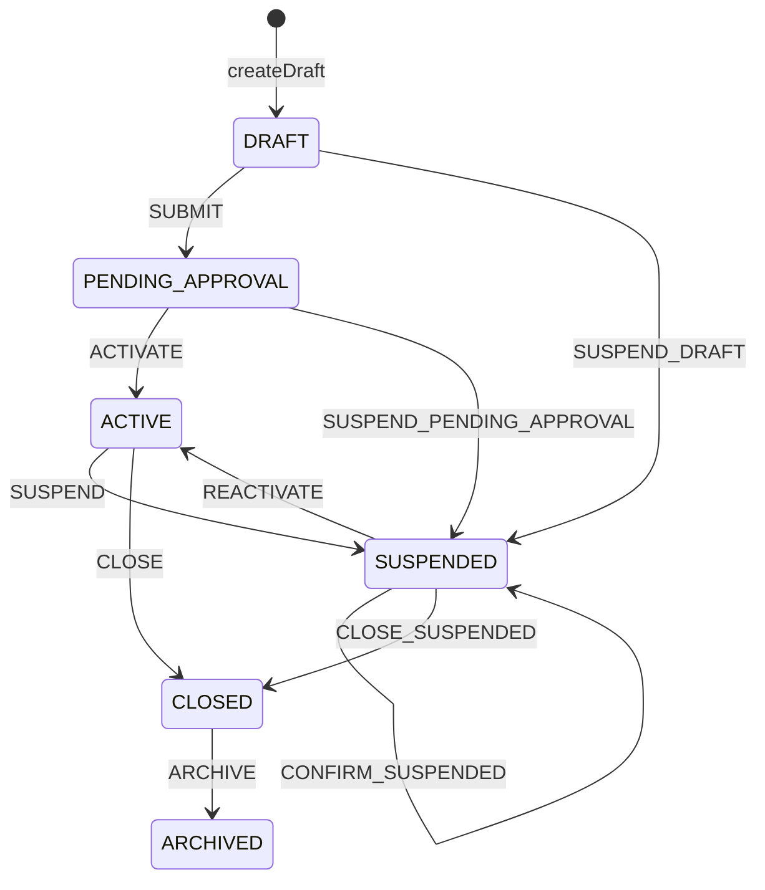
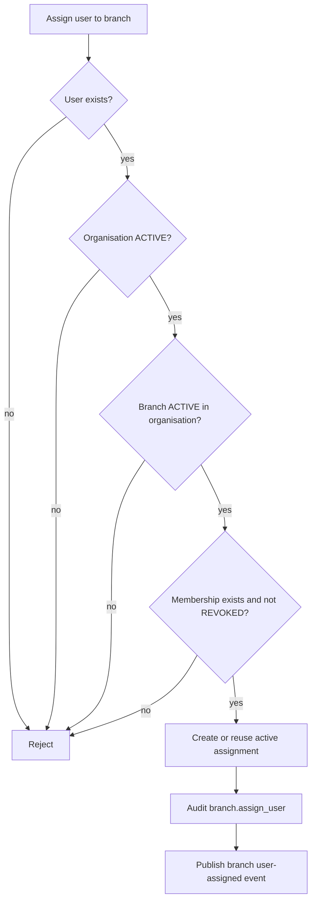

# Branch provisioning and assignment

Branches are organisation-scoped operating locations. The schema enforces same-organisation
parent branches and same-organisation branch assignments. A branch can be closed or archived, but
the implementation does not physically delete it.

Read this with [organisation provisioning](tenant-provisioning.md),
[FSM transitions](../architecture/fsm-transitions.md), and
[ADR 0005](../adr/0005-organisation-lifecycle-no-hard-delete.md).

## Lifecycle

Implemented transitions and effects:

- New to `DRAFT`: `createDraft` requires an `ACTIVE` or `PROVISIONING` organisation, branch code,
  branch name, unique code per organisation, and same-organisation parent branch.
- `DRAFT` to `PENDING_APPROVAL`: `SUBMIT` rechecks code uniqueness and parent boundary, then emits
  `finaxis.lifecycle.branch.approval-requested`.
- `PENDING_APPROVAL` to `ACTIVE`: `ACTIVATE` requires an `ACTIVE` or `PROVISIONING` organisation
  in the FSM guard and emits `finaxis.lifecycle.branch.activated`.
- `ACTIVE` to `SUSPENDED`: `SUSPEND` blocks operational use and emits
  `finaxis.lifecycle.branch.suspended`.
- `SUSPENDED` to `ACTIVE`: `REACTIVATE` requires an `ACTIVE` or `PROVISIONING` organisation in
  the FSM guard and emits `finaxis.lifecycle.branch.reactivated`.
- `ACTIVE` or `SUSPENDED` to `CLOSED`: close rejects active assignments unless the caller marks
  assignments handled, rejects active child branches, and emits `finaxis.lifecycle.branch.closed`.
- `CLOSED` to `ARCHIVED`: `ARCHIVE` is declared in the FSM graph and has no configured external
  event.

During organisation deprovisioning, draft and pending branches can also be moved to
`SUSPENDED` through internal FSM transitions so cleanup remains logged instead of becoming an
unattributed bulk update.

Draft creation writes `branch.create_draft` audit. Every branch FSM transition persists a
transition log, publishes its configured transition event, and records an audit event through
`FoundationLifecycleService`.

## Assignment model

User-to-branch assignments use `user_branch_assignment` and these assignment types:

- `HOME`;
- `OPERATE`;
- `APPROVE`;
- `VIEW`.

Assignment is organisation-boundary checked by both application code and foreign keys. The
implemented `assignUser` guard requires:

- the user account exists;
- the organisation is `ACTIVE`;
- the branch is `ACTIVE` in that organisation;
- the user has a membership in that organisation;
- the membership is not `REVOKED`.

Duplicate active assignments are idempotent. New assignments write `branch.assign_user` audit and
publish `finaxis.lifecycle.branch.user-assigned`.

Revocation is also idempotent for absent assignments. For normal memberships, revocation cannot
leave the user with zero active branch assignments. `SYSTEM` and `AUDITOR` memberships are exempt
from that retain-at-least-one guard. Successful revocation writes `branch.revoke_user` audit and
publishes `finaxis.lifecycle.branch.user-revoked`.

## Assignment flow

Before closing a branch, move or revoke active assignments under the membership guard and close or
re-parent active child branches. Closing retains the branch row and historical assignment records.
