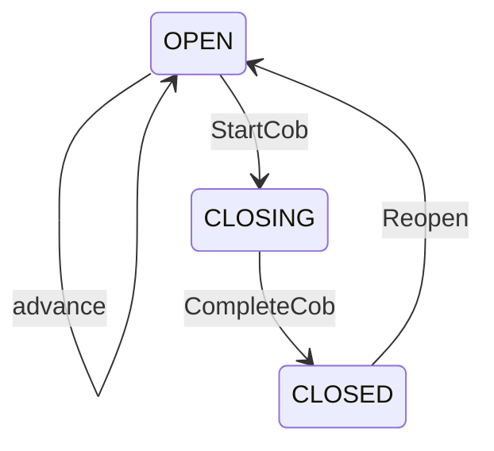

# Business date and COB status

The business date feature manages one controlled business-date row per organisation and a
close-of-business (COB) status foundation. It is deliberately status-only: it does not perform
financial end-of-day processing, day-close posting, accounting, interest accrual, or settlement.

This document describes the application service surface implemented by `BusinessDateService`.
`BusinessDateController` exposes it over REST at `/api/v1/tenant/business-date` — see the
[foundation API contract](../api/foundation-api.md#business-date) for the route table, request
shapes, and per-route permissions.

Read this with [organisation provisioning](tenant-provisioning.md),
[branch provisioning](branch-provisioning.md), and
[transactional outbox](../architecture/transactional-outbox-amqp.md).

## Singleton row

`business_date` is unique per organisation. The current row stores the current business date,
current COB date, status, advance metadata, and an optimistic-lock `row_version`.

Organisation provisioning initializes this row automatically:

- `createDraft` saves the initial business date, using the provided value or the organisation
  timezone's current local date.
- `approveProvisioning` ensures a business date again before activation.

Application code rarely needs to call `InitializeBusinessDate` directly. The operation exists for
completeness and rejects a second initialization when the singleton row already exists.

## Status model

`ADVANCING` is a reserved database status value. The current service does not drive it.

`advance` is allowed only while status is `OPEN` and the new business date is after the current
business date. COB transitions do not change the business date; `StartCob` captures the current
business date as the COB date and moves status to `CLOSING`.

## Commands and permissions

Only active organisations can be mutated.

| Operation | Permission | Precondition | Result |
|---|---|---|---|
| `InitializeBusinessDate` | `business_date.advance` | no row exists | `OPEN` |
| `AdvanceBusinessDate` | `business_date.advance` | `OPEN`, new date later | `OPEN` |
| `StartCob` | `cob.start` | `OPEN` | `CLOSING` |
| `CompleteCob` | `cob.complete` | `CLOSING` | `CLOSED` |
| `ReopenBusinessDate` | `business_date.reopen` | `CLOSED` | `OPEN` |
| `GetBusinessDate` | `business_date.view` | row exists | current view |
| `ListBusinessDateHistory` | `business_date.view` | row may have history | page |

`business_date.reopen` is the only permission that authorizes reopen. There is no fallback to
`business_date.advance`, tenant administration, or COB permissions.

Each mutation uses optimistic locking. A stale `row_version` causes the command to fail and the
caller must retry with the latest current row.

## History

Every mutation appends a row to `business_date_history`. The table is append-only and records:

- `event_type`
- from/to status
- from/to business date
- actor
- reason
- occurrence time

`ListBusinessDateHistory` returns a paginated, newest-first page from this table. Do not add an
unbounded history read.

## Audit and outbox

Every mutation records one audit event and publishes one `ExternalizedTransitionEvent` through
the existing Modulith and Namastack outbox path.

| Operation | Audit action | Target | eventType |
|---|---|---|---|
| initialize | `business_date.initialize` | see below | `BusinessDateInitialized` |
| advance | `business_date.advance` | see below | `BusinessDateAdvanced` |
| start COB | `cob.start` | see below | `CobStarted` |
| complete COB | `cob.complete` | see below | `CobCompleted` |
| reopen | `business_date.reopen` | see below | `BusinessDateReopened` |

Event targets:

- `BusinessDateInitialized`: `finaxis.lifecycle.organisation.business-date-initialized`
- `BusinessDateAdvanced`: `finaxis.lifecycle.organisation.business-date-advanced`
- `CobStarted`: `finaxis.lifecycle.organisation.cob-started`
- `CobCompleted`: `finaxis.lifecycle.organisation.cob-completed`
- `BusinessDateReopened`: `finaxis.lifecycle.organisation.business-date-reopened`

History `event_type` values are `INITIALIZED`, `ADVANCED`, `COB_STARTED`, `COB_COMPLETED`, and
`REOPENED`.

For `AdvanceBusinessDate`, the externalized event state is the date change itself:
`fromState=<previous business date>` and `toState=<new business date>`. Other operations use
status-oriented event state.

## Query surface

`BusinessDateService` exposes application-service operations:

- `InitializeBusinessDate`
- `AdvanceBusinessDate`
- `StartCob`
- `CompleteCob`
- `ReopenBusinessDate`
- `GetBusinessDate`
- `ListBusinessDateHistory`

These are exposed by `BusinessDateController` under `/api/v1/tenant/business-date`:

| Method | Path | Permission |
| --- | --- | --- |
| GET | `/` | `business_date.view` |
| GET | `/history` | `business_date.view` |
| POST | `/advance` | `business_date.advance` |
| POST | `/cob/start` | `cob.start` |
| POST | `/cob/complete` | `cob.complete` |
| POST | `/reopen` | `business_date.reopen` |

The controller is a thin inbound adapter: it validates transport concerns and delegates to
`BusinessDateService`, which performs the authorization. History listing stays paginated and
tenant-filtered.

## Out of scope

This feature does not implement financial EOD, day-close, accounting posting, or downstream
ledger behavior.

There is no RabbitMQ consumer for these events yet. Outbox emission is sufficient at this stage.

COB status remains a plain `business_date.status` column. It is not promoted into the reusable FSM
transition engine.

## Accounting reads the business date

Since the accounting module landed, the business date is read cross-module through
`AccountingBusinessDateLookup`, implemented by this module's
`LifecycleAccountingBusinessDateAdapter`. Accounting sees a single `postingAllowed` boolean rather
than the status string, so a new business-date status cannot silently change posting behaviour.

Two consequences worth knowing when operating close-of-business:

- While the business date is not `OPEN`, a **current-dated** posting is rejected, but a
  **backdated** posting into a still-open prior period is still allowed. Close-of-business
  deliberately does not deadlock corrections.
- The business date is read **without a lock** and captured once per posting, so it is never the
  ledger's serialisation point. A posting that began before an advance still commits with the date
  it captured, which is correct: the prior period stays open until it is closed.

See [accounting dates and periods](../architecture/accounting-dates-and-periods.md).
