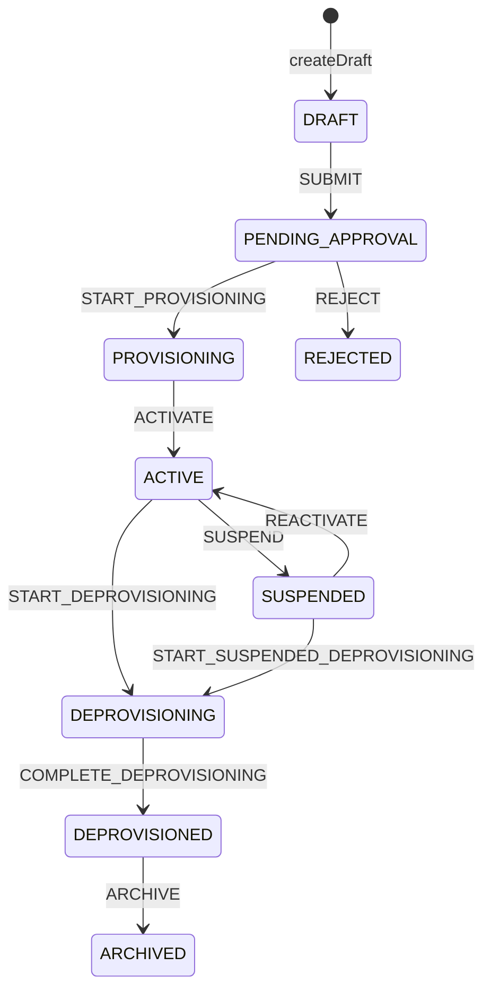

# Organisation provisioning and deprovisioning

Finaxis uses **organisation** as the tenant and data-isolation boundary. `tenant_code`
is retained as the stable external identifier, and the legacy `tenant.*` permission
codes remain stable permission codes for organisation administration. The application
does not physically delete organisation data.

This document describes the implemented lifecycle code in
`OrganisationProvisioningService`, `FoundationLifecycleDefinitions`, and the Flyway
schema/seeds. It should be read with
[FSM transitions](../architecture/fsm-transitions.md),
[audit logging](../architecture/audit-logging.md),
[ADR 0002](../adr/0002-fsm-transition-infrastructure.md), and
[ADR 0005](../adr/0005-organisation-lifecycle-no-hard-delete.md).

## Lifecycle

Implemented transitions and effects:

- New to `DRAFT`: `createDraft` requires non-blank `tenantCode`, display name, ISO country and
  currency codes, and a valid timezone. It saves initial settings and a business date.
- `DRAFT` to `PENDING_APPROVAL`: `SUBMIT` requires mandatory metadata and emits
  `finaxis.lifecycle.organisation.approval-requested`.
- `PENDING_APPROVAL` to `PROVISIONING`: `START_PROVISIONING` starts approval setup in the same
  local transaction. It publishes only an internal transition event.
- `PROVISIONING` to `ACTIVE`: `ACTIVATE` requires complete local setup and emits
  `finaxis.lifecycle.organisation.activated`.
- `PENDING_APPROVAL` to `REJECTED`: `REJECT` preserves the draft and emits
  `finaxis.lifecycle.organisation.rejected`.
- `ACTIVE` to `SUSPENDED`: `SUSPEND` blocks operations and emits
  `finaxis.lifecycle.organisation.suspended`.
- `SUSPENDED` to `ACTIVE`: `REACTIVATE` requires complete local setup and emits
  `finaxis.lifecycle.organisation.reactivated`.
- `ACTIVE` or `SUSPENDED` to `DEPROVISIONING`: deprovision start accepts only those two source
  states and publishes only an internal transition event.
- `DEPROVISIONING` to `DEPROVISIONED`: `COMPLETE_DEPROVISIONING` completes cleanup and emits
  `finaxis.lifecycle.organisation.deprovisioned`.
- `DEPROVISIONED` to `ARCHIVED`: `ARCHIVE` is declared in the FSM graph and has no configured
  external event.

Draft creation is not an FSM transition, so it writes audit but no transition-log row. Every FSM
transition goes through `FoundationLifecycleService`; the transition executor persists the status
and transition log, publishes configured internal or externalized events, and the lifecycle service
records an immutable audit event with old state, new state, reason, and request id.

## Approval setup

Approval is organisation-first. `approveProvisioning` moves the organisation into
`PROVISIONING`, creates the mandatory durable setup, verifies it, and then activates the
organisation. A failure rolls back the local transaction; the organisation is not activated.

The implemented setup is:

- default setting `settings.operational=true`;
- one business date using the organisation timezone;
- a `HEAD_OFFICE` branch that is submitted and activated if it is not already active;
- default reference sequences `MEMBER`, `TRANSACTION`, and `JOURNAL`;
- organisation-local system roles from the global permission catalogue:
  `TENANT_ADMIN`, `TENANT_AUDITOR`, `IAM_ADMIN`, `BRANCH_MANAGER`,
  and `BRANCH_OPERATOR`.

The global permission catalogue is seeded by Flyway with `permission_code`, `module_code`,
`risk_level`, and status. It includes the retained `tenant.*` codes:
`tenant.create`, `tenant.submit_for_approval`, `tenant.approve`, `tenant.activate`,
`tenant.suspend`, and `tenant.deprovision`.

## Metadata-only deprovisioning

Deprovisioning intentionally blocks access without hard-deleting records. It starts from
`ACTIVE` or `SUSPENDED`, transitions the organisation to `DEPROVISIONING`, then:

- transitions every non-terminal branch to `SUSPENDED`;
- revokes every non-revoked membership through the membership FSM;
- revokes active branch and role assignments one record at a time;
- records explicit audit for assignment revocations;
- completes the organisation transition to `DEPROVISIONED`.

The implementation retains organisation, branch, user, membership, role, permission, assignment,
transition-log, audit, identity-link, dispatch-log, settings, business-date, and reference-sequence
rows. Runtime access is blocked because the organisation is no longer `ACTIVE`, memberships are
revoked, and active local assignments are removed.

Follow-up work must define regulated retention periods, customer export, legal hold,
anonymisation, encryption-key destruction, and any separately approved physical deletion policy.

## Query API

`PlatformTenantController` exposes tenant administration over REST under
`/api/v1/platform/tenants` — see the
[foundation API contract](../api/foundation-api.md) for the route table and permissions.
It delegates to `OrganisationProvisioningService`, which exposes:

- `getByCode(tenantCode)` for lookup by the stable external code;
- `statusByCode(tenantCode)` for lifecycle status only;
- `list(filter)` for bounded administration listing.

`OrganisationListFilter` supports `status`, `countryCode`, `createdFrom`, `createdTo`, `page`,
and `size`. Pages are zero-based and `size` must be between 1 and 100. The persistence adapter
sorts by creation time descending and returns `items` plus `totalItems`.

Do not add an unbounded organisation query. New inbound APIs must follow
[API governance](../architecture/api-governance.md) and
[API versioning](../architecture/api-versioning.md).
