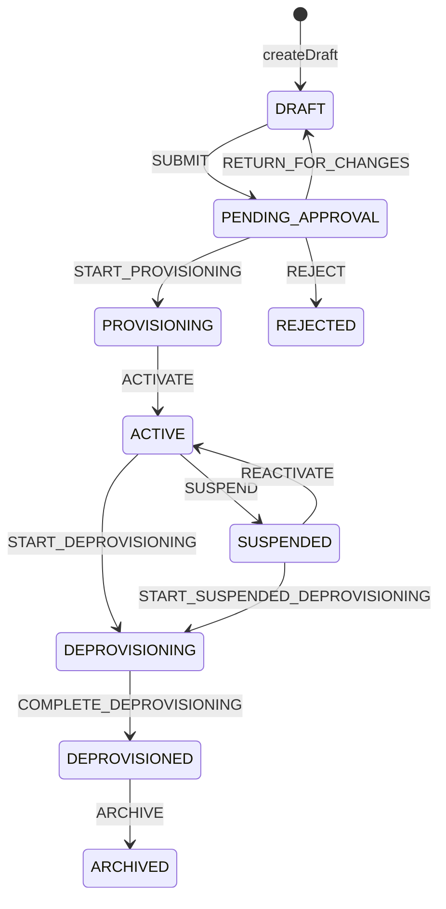

# Organisation provisioning and deprovisioning

Finaxis uses **organisation** as the tenant and data-isolation boundary. `tenant_code`
is retained as the stable external identifier, and the legacy `tenant.*` permission
codes remain stable permission codes for organisation administration. The application
does not physically delete organisation data.

This document describes the implemented lifecycle code in
`OrganisationProvisioningService`, `FoundationLifecycleDefinitions`, and the Flyway
schema/seeds. It should be read with
[FSM transitions](../architecture/fsm-transitions.md),
[audit logging](../architecture/audit-logging.md),
[ADR 0002](../adr/0002-fsm-transition-infrastructure.md), and
[ADR 0005](../adr/0005-organisation-lifecycle-no-hard-delete.md).

## Lifecycle

```mermaid
stateDiagram-v2
    [*] --> DRAFT: createDraft
    DRAFT --> PENDING_APPROVAL: SUBMIT
    PENDING_APPROVAL --> PROVISIONING: START_PROVISIONING
    PROVISIONING --> ACTIVE: ACTIVATE
    PENDING_APPROVAL --> REJECTED: REJECT
    PENDING_APPROVAL --> DRAFT: RETURN_FOR_CHANGES
    ACTIVE --> SUSPENDED: SUSPEND
    SUSPENDED --> ACTIVE: REACTIVATE
    ACTIVE --> DEPROVISIONING: START_DEPROVISIONING
    SUSPENDED --> DEPROVISIONING: START_SUSPENDED_DEPROVISIONING
    DEPROVISIONING --> DEPROVISIONED: COMPLETE_DEPROVISIONING
    DEPROVISIONED --> ARCHIVED: ARCHIVE
```

Implemented transitions and effects:

- New to `DRAFT`: `createDraft` requires non-blank `tenantCode`, display name, ISO country and
  currency codes, and a valid timezone. It saves initial settings and a business date.
- `DRAFT` to `PENDING_APPROVAL`: `SUBMIT` requires mandatory metadata and emits
  `finaxis.lifecycle.organisation.approval-requested`.
- `PENDING_APPROVAL` to `PROVISIONING`: `START_PROVISIONING` starts approval setup in the same
  local transaction. It publishes only an internal transition event.
- `PROVISIONING` to `ACTIVE`: `ACTIVATE` requires complete local setup and emits
  `finaxis.lifecycle.organisation.activated`.
- `PENDING_APPROVAL` to `REJECTED`: `REJECT` preserves the draft and emits
  `finaxis.lifecycle.organisation.rejected`.
- `PENDING_APPROVAL` to `DRAFT`: `RETURN_FOR_CHANGES` is the checker's recoverable decision
  (`POST /api/v1/platform/tenants/{tenant_id}/return`, `tenant.reject`, reason required, caller
  neither the requester nor the submitter). It publishes only an internal transition event. The
  initial-administrator record goes back to a draft as `REJECT` leaves it, the maker amends the
  draft (`PATCH`) and resubmits it (`SUBMIT`), and the reason is readable as `status_reason` on the
  platform tenant detail and on `GET /tenant`. `REJECT` stays terminal. See
  [lifecycle FSMs](../architecture/lifecycle-fsm.md#return-a-pending-tenant-to-draft-adr-0029-181).
- `ACTIVE` to `SUSPENDED`: `SUSPEND` blocks operations and emits
  `finaxis.lifecycle.organisation.suspended`.
- `SUSPENDED` to `ACTIVE`: `REACTIVATE` requires complete local setup and emits
  `finaxis.lifecycle.organisation.reactivated`.
- `ACTIVE` or `SUSPENDED` to `DEPROVISIONING`: deprovision start accepts only those two source
  states and publishes only an internal transition event.
- `DEPROVISIONING` to `DEPROVISIONED`: `COMPLETE_DEPROVISIONING` completes cleanup and emits
  `finaxis.lifecycle.organisation.deprovisioned`.
- `DEPROVISIONED` to `ARCHIVED`: `ARCHIVE` is declared in the FSM graph and has no configured
  external event.

Draft creation is not an FSM transition, so it writes audit but no transition-log row. Every FSM
transition goes through `FoundationLifecycleService`; the transition executor persists the status
and transition log, publishes configured internal or externalized events, and the lifecycle service
records an immutable audit event with old state, new state, reason, and request id.

## Approval setup

Approval is organisation-first. `approveProvisioning` moves the organisation into
`PROVISIONING`, creates the mandatory durable setup, verifies it, and then activates the
organisation. A failure rolls back the local transaction; the organisation is not activated.

`approveProvisioning` locks the organisation row before it reads the initial-administrator record
and checks maker-checker, and holds the lock to the end of the transaction. A concurrent return,
amend and resubmit therefore either completes first, and the approval is judged against the new
submitter and administrator, or waits for the approval. `returnForChanges`, `rejectProvisioning`,
`submitForApproval` and `amendDraft` lock the same way. An operator may see a decision wait on
another for the length of that transaction.

The implemented setup is:

- default setting `settings.operational=true`;
- one business date using the organisation timezone;
- a `HEAD_OFFICE` branch that is submitted and activated if it is not already active;
- default reference sequences `MEMBER`, `TRANSACTION`, and `JOURNAL`;
- organisation-local system roles from the global permission catalogue:
  `TENANT_ADMIN`, `TENANT_AUDITOR`, `IAM_ADMIN`, `BRANCH_MANAGER`, `BRANCH_OPERATOR`,
  `ACCOUNTING_OPERATOR` and `ACCOUNTING_APPROVER`. `TENANT_ADMIN` holds every `ACTIVE` permission
  of tenant scope, read from the catalogue's `grant_scope` when the role is seeded (see
  [the authorization model](../security/authorization-model.md)); the other bundles are explicit
  lists.

The global permission catalogue is seeded by Flyway with `permission_code`, `module_code`,
`risk_level`, and status. It includes the retained `tenant.*` codes:
`tenant.create`, `tenant.submit_for_approval`, `tenant.approve`, `tenant.activate`,
`tenant.suspend`, and `tenant.deprovision`.

## Failed initial-administrator bootstrap

When the bootstrap fails, the record moves to `FAILED` and `bootstrap_failure_code` (on
`GET /api/v1/tenant` and the platform tenant routes) holds one code from a closed set, chosen from
the exception's type: `IDENTITY_PROVIDER_FAILED`, `CONFLICT`, `NOT_FOUND`, `INVALID_STATE`,
`DATABASE_ERROR` or `UNEXPECTED`. It never holds the exception message, because tenant members can
read it and the message can carry SQL, identity-provider output or an email address.

Where to look for the cause, in order:

1. **The application log.** The failure is logged at `ERROR` as "Initial administrator bootstrap
   failed for organisation `<id>` with code `<CODE>`" followed by `exceptionClass=`,
   `rootCauseClass=` and the stack frames (`at Class.method(File:line)`, each cause under
   `Caused by:`, bounded, with a marker when the cause chain is cut). **This recorder's line holds
   no exception message**, neither the exception's nor a cause's, because a message can carry an
   email address, SQL parameters or identity-provider output; the throwable is not passed to the
   logger. Search the log for the organisation id, then read the classes and frames. What else
   writes about the same failure:
   - **JobRunr.** The bootstrap, Keycloak-provisioning and application-invite job handlers rethrow a
     `SanitisedJobFailureException` to JobRunr (message = the closed code, or the exception class
     name for the invite; no cause, except a message-free `InterruptedException` when the original
     chain held one, because JobRunr recognises a stopped server or a deleted job by an
     `InterruptedException` in the cause chain, so that detection is unchanged) for the failures
     they catch: every `Exception` in the bootstrap and Keycloak handlers, the four listed types in
     the invite handler. JobRunr's own `processing failed` log lines and the failed state in
     `jobrunr_jobs` (exception message, cause message, stack text) then carry no message of the
     original and only the handler's frames. The bootstrap and invite handlers always, and the
     Keycloak handler for a failure it does not record, log a `WARN` "<job> failed:
     exceptionClass=... rootCauseClass=..." with the message-free frames (after the recorder's
     `ERROR` line when it wrote one), so the location is never lost. Retry counts and backoff are
     unchanged. The synchronous `bootstrap/retry` route calls the service directly and still raises
     the original exception to the API error handler, which maps it to the HTTP status.
   - **The API error handler.** `ApiExceptionHandler` logs an unexpected failure at `ERROR` (and
     a handled one at `DEBUG`) as the request path, `exceptionClass=` and the message-free
     frames, never the throwable.
   - **The dispatch table.** For a Keycloak (and an application-invite) job the raw message is
     still kept in `identity_dispatch_log.last_error`, which no API returns: an operator
     reading the database sees it, so treat that table as sensitive.
   - **Not covered.** `jobrunr_jobs` keeps the job request's input (for the Keycloak job the
     administrator's email and username). An exception type the invite handler does not catch
     reaches JobRunr as raised. The Keycloak handler's uncaught types and its already-succeeded
     branch are logged and sanitised but not recorded as a failed dispatch. On the API side,
     Sentry's MVC exception resolver (default `sentry.exception-resolver-order` 1) runs after
     Spring's own (the composite, 0), so the global handler resolves a failure first and Sentry's
     MVC integration never sees it; the Sentry logback appender (production only) receives any
     `ERROR` line, which for these failures is now message-free.
2. **The audit trail.** A retry that fails again writes a `FAILURE` audit event for
   `tenant.bootstrap_retry` whose `reason` is the exception class name and whose metadata carries
   `bootstrapFailureCode`. A failed Keycloak provisioning job also records a `FAILURE` audit event
   (`user.keycloak_provisioning`, reason is the exception class, no code) and keeps the raw
   detail in the dispatch-tracking table (`identity_dispatch_log`), which no API returns.
3. **Retry.** `POST /api/v1/platform/tenants/{tenant_id}/bootstrap/retry`
   (`tenant.bootstrap_retry`) clears the code and runs the bootstrap again; a failure records a
   fresh code.

`UNEXPECTED` is also what `V24` wrote over every free-text value stored before it. That rewrite is
one-way, so the cause of a failure from before `V24` is only in the logs of the time.

## Metadata-only deprovisioning

Deprovisioning intentionally blocks access without hard-deleting records. It starts from
`ACTIVE` or `SUSPENDED`, transitions the organisation to `DEPROVISIONING`, then:

- transitions every non-terminal branch to `SUSPENDED`;
- revokes every non-revoked membership through the membership FSM;
- revokes active branch and role assignments one record at a time;
- records explicit audit for assignment revocations;
- completes the organisation transition to `DEPROVISIONED`.

The implementation retains organisation, branch, user, membership, role, permission, assignment,
transition-log, audit, identity-link, dispatch-log, settings, business-date, and reference-sequence
rows. Runtime access is blocked because the organisation is no longer `ACTIVE`, memberships are
revoked, and active local assignments are removed.

Follow-up work must define regulated retention periods, customer export, legal hold,
anonymisation, encryption-key destruction, and any separately approved physical deletion policy.

## Query API

`PlatformTenantController` exposes tenant administration over REST under
`/api/v1/platform/tenants` — see the
[foundation API contract](../api/foundation-api.md) for the route table and permissions.
It delegates to `OrganisationProvisioningService`, which exposes:

- `getByCode(tenantCode)` for lookup by the stable external code;
- `statusByCode(tenantCode)` for lifecycle status only;
- `list(filter)` for bounded administration listing.

`OrganisationListFilter` supports `status`, `countryCode`, `createdFrom`, `createdTo`, `page`,
and `size`. Pages are zero-based and `size` must be between 1 and 100. The persistence adapter
sorts by creation time descending and returns `items` plus `totalItems`.

Do not add an unbounded organisation query. New inbound APIs must follow
[API governance](../architecture/api-governance.md) and
[API versioning](../architecture/api-versioning.md).
