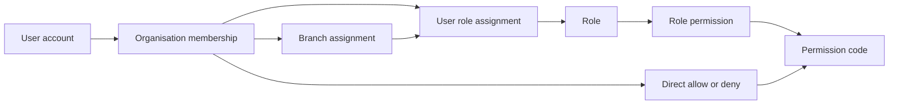

# Authorization model

Keycloak authenticates users. Finaxis authorizes them. Runtime checks evaluate permission
**codes**, never role names. Roles are administration bundles that grant permission codes to
memberships in an organisation and, optionally, a selected branch.

Read this with [active organisation context](active-organisation-context.md),
[login prechecks](login-prechecks.md),
[accounting authorization](accounting-authorization.md), and
[ADR 0005](../adr/0005-organisation-lifecycle-no-hard-delete.md).

## Permission catalogue and roles

The global catalogue in `permission` holds **80 permission codes**: 54 foundation codes seeded by
`V2__platform_reference_data.sql` and 26 accounting codes seeded by
`V5__accounting_permission_catalogue.sql`. Each has a stable `permission_code`, `module_code`,
`risk_level`, `system_permission`, and status. Module codes are `tenant`, `branch`, `iam`,
`audit`, `settings`, and `accounting`; risk levels are `LOW`, `MEDIUM`, `HIGH`, and `CRITICAL`.

The accounting codes, why they are grouped the way they are, and what the two accounting role
bundles guarantee are documented separately in
[accounting authorization](accounting-authorization.md).

The catalogue is the authorization vocabulary and is owned by the platform — organisations cannot
invent permission codes, only compose them into roles. `FoundationSeedDataTests` asserts the exact
set, so adding a code is a deliberate, reviewed change.

Two of the roles below are seeded by migration; the other seven are created by **application code**
at organisation-provisioning time (`JooqOrganisationBranchProvisioningStore`) and appear in no
migration.

Organisation approval creates these organisation-local system roles from the catalogue (in code,
not in a migration):

- `TENANT_ADMIN`: all baseline permissions, plus the accounting configuration and oversight codes
  (not manual journal preparation, approval, reversal, prior-period posting, reconciliation
  resolution or period reopening);
- `TENANT_AUDITOR`: read-only across the platform — `audit.view`, `business_date.view`,
  `tenant.view`, `branch.view`, `user.view`, `membership.view`, `branch_assignment.view`,
  `role.view`, `role_assignment.view`, `permission.view`, `settings.view`, the six accounting
  reads (`gl_account.view`, `fiscal_period.view`, `journal.view`, `posting_rule.view`,
  `reconciliation.view`, `accounting_report.view`), and the session codes
  `auth.select_organisation`, `auth.select_branch`, `iam.profile.read`;
- `IAM_ADMIN`: user, role, and audit administration permissions;
- `BRANCH_MANAGER`: branch lifecycle, branch assignment, business-date view, and
  `accounting_report.view` permissions;
- `BRANCH_OPERATOR`: `business_date.view`;
- `ACCOUNTING_OPERATOR`: the accounting maker bundle — prepares and submits, never approves;
- `ACCOUNTING_APPROVER`: the accounting checker bundle — approves and posts, never prepares.

`V2__platform_reference_data.sql` also creates the reserved platform organisation:

- id `00000000-0000-0000-0000-000000000000`;
- `tenant_code=PLATFORM`;
- system roles `PLATFORM_SUPER_ADMIN` and `PLATFORM_SUPPORT`.

`PLATFORM_SUPER_ADMIN` is granted every row in `permission` by a set-based
`INSERT … SELECT … FROM permission`, so the superset role can never drift behind the catalogue as
it did when permissions were added across several migrations. `PLATFORM_SUPPORT` receives
`audit.view` and `business_date.view`. These are still modelled as roles in the reserved
organisation, not as special runtime role-name checks.

## Role administration

`RoleManagementService` exposes application commands to:

- create, update, activate, and deactivate tenant roles;
- assign and remove catalogue permissions on roles;
- assign and revoke roles for users at `TENANT` or `BRANCH` scope.

Implemented guards include:

- role code must be unique per organisation;
- system roles cannot be modified or deactivated;
- role lookup is always by selected organisation and role id;
- permission assignment requires a known catalogue permission code;
- role assignment requires an active organisation and a non-revoked membership;
- branch-scoped role assignment requires an active branch assignment for that branch;
- tenant-scoped role assignment must not carry a branch id.

Role and role-assignment mutations write audit events. Role permission changes and user-role
assignment changes evict affected effective-permission cache entries and publish administration
events for assignment/revocation.

## Effective permissions

Effective permissions are resolved for one active membership and optional selected branch:

1. If the membership is not `ACTIVE`, the result is empty.
2. Active tenant-scoped role grants apply for the membership.
3. Active branch-scoped role grants apply only when that exact branch is selected.
4. Direct membership permission effects are applied.
5. Direct `DENY` effects remove codes from the final allowed set.

The schema supports direct membership overrides in `membership_permission` with `ALLOW` and
`DENY`. The resolver returns permission codes only.



## Caching and invalidation

`RequestPermissionCache` is request-scoped. It memoizes permission resolution only for the current
request and selected `(membershipId, branchId)`.

`EffectivePermissionResolver` also uses the application cache named `iam.effective-permissions`.
The cache key includes membership id and selected branch id, so branch switches do not reuse
another branch's permissions.

`PermissionCacheInvalidator` evicts cached selections when role grants or role assignments change.
It can also clear the entire effective-permission cache.

## Spring Security integration

After JWT authentication and active-organisation resolution, `AppPrincipalAuthenticationToken`
wraps the application principal. Its authorities are `SimpleGrantedAuthority` values built from
the principal's permission codes.

Controllers may use Spring Security authority checks such as:

```kotlin
@PreAuthorize("hasAuthority('iam.profile.read')")
```

Method security that needs organisation or branch matching uses the named authorizer:

```kotlin
@PreAuthorize("@authz.hasPermission(#organisationId, 'branch.create')")
@PreAuthorize("@authz.hasPermission(#organisationId, #branchId, 'branch.create')")
```

Application services can use `AuthorizationService` for explicit permission and resource checks.
Those checks still compare permission codes and reject cross-organisation access.
