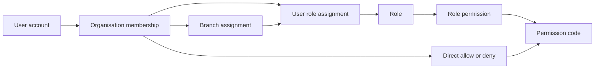

# Authorization model

Keycloak authenticates users. Finaxis authorizes them. Runtime checks evaluate permission
**codes**, never role names. Roles are administration bundles that grant permission codes to
memberships in an organisation and, optionally, a selected branch.

Read this with [active organisation context](active-organisation-context.md),
[login prechecks](login-prechecks.md),
[accounting authorization](accounting-authorization.md), and
[ADR 0005](../adr/0005-organisation-lifecycle-no-hard-delete.md).

## Permission catalogue and roles

The global catalogue in `permission` holds **80 permission codes**: 54 foundation codes seeded by
`V2__platform_reference_data.sql` and 26 accounting codes seeded by
`V5__accounting_permission_catalogue.sql`. Each has a stable `permission_code`, `module_code`,
`risk_level`, `system_permission`, and status. Module codes are `tenant`, `branch`, `iam`,
`audit`, `settings`, and `accounting`; risk levels are `LOW`, `MEDIUM`, `HIGH`, and `CRITICAL`.

The accounting codes, why they are grouped the way they are, and what the two accounting role
bundles guarantee are documented separately in
[accounting authorization](accounting-authorization.md).

The catalogue is the authorization vocabulary and is owned by the platform — organisations cannot
invent permission codes, only compose them into roles. `FoundationSeedDataTests` asserts the exact
set, so adding a code is a deliberate, reviewed change.

Two of the roles below are seeded by migration; the other seven are created by **application code**
at organisation-provisioning time (`JooqOrganisationBranchProvisioningStore`) and appear in no
migration.

Organisation approval creates these organisation-local system roles from the catalogue (in code,
not in a migration):

- `TENANT_ADMIN`: all baseline permissions, plus the accounting configuration and oversight codes
  (not manual journal preparation, approval, reversal, prior-period posting, reconciliation
  resolution or period reopening);
- `TENANT_AUDITOR`: read-only across the platform — `audit.view`, `business_date.view`,
  `tenant.view`, `branch.view`, `user.view`, `membership.view`, `branch_assignment.view`,
  `role.view`, `role_assignment.view`, `permission.view`, `settings.view`, the six accounting
  reads (`gl_account.view`, `fiscal_period.view`, `journal.view`, `posting_rule.view`,
  `reconciliation.view`, `accounting_report.view`), and the session codes
  `auth.select_organisation`, `auth.select_branch`, `iam.profile.read`;
- `IAM_ADMIN`: user, role, and audit administration permissions;
- `BRANCH_MANAGER`: branch lifecycle, branch assignment, business-date view, and
  `accounting_report.view` permissions;
- `BRANCH_OPERATOR`: `business_date.view`;
- `ACCOUNTING_OPERATOR`: the accounting maker bundle — prepares and submits, never approves;
- `ACCOUNTING_APPROVER`: the accounting checker bundle — approves and posts, never prepares.

`V2__platform_reference_data.sql` also creates the reserved platform organisation:

- id `00000000-0000-0000-0000-000000000000`;
- `tenant_code=PLATFORM`;
- system roles `PLATFORM_SUPER_ADMIN` and `PLATFORM_SUPPORT`.

`PLATFORM_SUPER_ADMIN` is granted every row in `permission` by a set-based
`INSERT … SELECT … FROM permission`, so the superset role can never drift behind the catalogue as
it did when permissions were added across several migrations. `PLATFORM_SUPPORT` receives
`audit.view` and `business_date.view`. These are still modelled as roles in the reserved
organisation, not as special runtime role-name checks.

`audit.view` held in the PLATFORM organisation is also the permission for the platform audit
endpoints (the platform log and any tenant's log); see
[audit logging](audit-logging.md#rest-read-endpoints-and-the-platform-permission-model).

## Role administration

`RoleManagementService` exposes application commands to:

- create, update, activate, and deactivate tenant roles;
- assign and remove catalogue permissions on roles;
- assign and revoke roles for users at `TENANT` or `BRANCH` scope.

Implemented guards include:

- role code must be unique per organisation;
- system roles cannot be modified or deactivated;
- role lookup is always by selected organisation and role id;
- permission assignment requires a known catalogue permission code;
- role assignment requires an active organisation and a non-revoked membership;
- branch-scoped role assignment requires an active branch assignment for that branch;
- tenant-scoped role assignment must not carry a branch id.

Role and role-assignment mutations write audit events. Role permission changes and user-role
assignment changes evict affected effective-permission cache entries and publish administration
events for assignment/revocation.

## Effective permissions

Effective permissions are resolved for one active membership and optional selected branch:

1. If the membership is not `ACTIVE`, the result is empty.
2. Active tenant-scoped role grants apply for the membership.
3. Active branch-scoped role grants apply only when that exact branch is selected.
4. Direct membership permission effects are applied.
5. Direct `DENY` effects remove codes from the final allowed set.

The schema supports direct membership overrides in `membership_permission` with `ALLOW` and
`DENY`. The resolver returns permission codes only.


```mermaid
flowchart LR
    U[User account] --> M[Organisation membership]
    M --> B[Branch assignment]
    M --> RA[User role assignment]
    B --> RA
    RA --> R[Role]
    R --> RP[Role permission]
    RP --> P[Permission code]
    M --> MP[Direct allow or deny]
    MP --> P
```

## Branch update

`PATCH /branches/{branch_id}` requires `branch.create`; there is no `branch.update` code. A branch's
descriptive fields are the maker's to edit, the same maker who holds `branch.create` for create and
submit (ADR 0029), and a new code would need a `V18` grant migration and a role review for no
separation the maker-checker rule does not already give: the checker's `branch.activate` is
unchanged and still cannot be exercised by the creator. As with the lifecycle routes it is
evaluated at the **target branch**, not the selected one (#154), by
`BranchProvisioningService.update` rather than only at the controller, and a missing or foreign
branch is `404` only after that check passes.

## Branch return and withdrawal

`POST /branches/{branch_id}/return` (and the platform route) is one transition, `PENDING_APPROVAL`
to `DRAFT`, that asks for a different permission depending on who the caller is relative to the
branch, with no new permission code (ADR 0029, 3b):

| Caller | Intent | Permission | Scope |
| --- | --- | --- | --- |
| The branch's creator, or the actor of its latest `SUBMIT` | withdraw | `branch.create` | tenant: the target branch; platform: the platform organisation |
| Anyone else | return as a checker | `branch.activate` | tenant: the target branch; platform: the platform organisation |

The caller is classified first, from `created_by` and the latest submitter **read inside the path
organisation**, so a branch of another tenant or an unknown id classifies as a return and reads the
same. Classifying only chooses which permission is asked; the permission is then checked in the
application service (`BranchProvisioningService.returnForChanges`), before any existence signal. A
creator who also holds `branch.activate` is still a maker and needs `branch.create`; a maker who
has lost `branch.create` cannot withdraw, but a non-maker holding `branch.activate` can still
return. The controller's coarse gate is `branch.create` **or** `branch.activate` because it cannot
know the class. A platform actor who returns as a checker is held to the ADR 0028 window and is
audited with `checkerScope = PLATFORM`; a platform withdrawal is not windowed and carries no
marker.

## Maker-checker and the platform checker

Approvals are maker-checker: the actor that created a thing cannot approve it, whatever its
permissions. `UserProvisioningService.approveUser` refuses the actor that invited the membership
**and the invited user themselves** (the checker is neither the maker nor the beneficiary), and
`BranchProvisioningService.activate` refuses the actor that created the branch. Both compare
user ids, so switching organisation context does not get round them.

A freshly approved tenant has one user, the bootstrap `TENANT_ADMIN`, who is the maker of
everything it creates and so cannot finish onboarding a second person or a first branch. The
resolution is [ADR 0028](../adr/0028-platform-checker-for-first-tenant-approvals.md): a
**platform-context** actor may be the audited checker of a tenant's pending membership or branch.
The checker is neither the maker nor the beneficiary: the platform actor cannot approve what it
created, a membership of its own account, or a branch it submitted itself. The tenant's own rule is
unchanged, and the permission is checked in the **platform organisation**, never in the tenant, so
no tenant membership is needed. Two separate bounds apply (409 `lifecycle.platform_checker_closed`
otherwise): a pending membership can be checked by the platform only while the tenant has no
`ACTIVE` membership beyond its bootstrap administrator, and a pending branch only while it has no
`ACTIVE` branch beyond the bootstrap head office (the ones the system actor created). Only `ACTIVE`
rows count, so suspending or revoking them reopens the route. A tenant draft that names the
approving platform user's own account as its initial administrator cannot be approved by that user
(403 `lifecycle.approver_is_initial_administrator`).

| Route | Permission | Scope |
| --- | --- | --- |
| `POST /platform/tenants/{tenant_id}/memberships/{membership_id}/activate` | `user.approve` | PLATFORM |
| `POST /platform/tenants/{tenant_id}/branches/{branch_id}/activate` | `branch.activate` | PLATFORM |
| `POST /platform/tenants/{tenant_id}/branches/{branch_id}/submit` | `branch.create` | PLATFORM |
| `POST /platform/tenants/{tenant_id}/branches/{branch_id}/return` | `branch.activate` (checker) or `branch.create` (maker) | PLATFORM |
| `POST /platform/tenants/{tenant_id}/branches` | `branch.create` | PLATFORM |

Order of checks on every one of them: platform context, then the platform permission, then the
path tenant's ownership of the id (404 otherwise; the platform organisation is never a valid
`{tenant_id}`), then the tenant state and the maker/beneficiary rules. The tenant must be `ACTIVE`
to approve or activate, and `ACTIVE` or `PROVISIONING` to create or submit a branch.
`PLATFORM_SUPPORT` holds none of the permissions.

Every use is attributed to the platform actor in the tenant's audit log: the transition row, the
`user.approve` row with metadata `checkerScope = PLATFORM`, and for a branch an extra
`branch.submit_as_platform_checker` (submission), `branch.activate_as_platform_checker` (activation)
or `branch.return_for_changes_as_platform_checker` (a branch it returned) row, each with the same
metadata. Filter on any of them to review them.

## Caching and invalidation

`RequestPermissionCache` is request-scoped. It memoizes permission resolution only for the current
request and selected `(membershipId, branchId)`.

`EffectivePermissionResolver` also uses the application cache named `iam.effective-permissions`.
The cache key includes membership id and selected branch id, so branch switches do not reuse
another branch's permissions.

`PermissionCacheInvalidator` evicts cached selections when role grants or role assignments change.
It can also clear the entire effective-permission cache.

**Break-glass checks read neither cache.** `AuthorizationService.requireBreakGlassPermission`
answers from `PermissionResolutionQueries.lockedBreakGlassGrant`, a locking read of the rows that
grant the one code being checked, and never from `RequestPermissionCache` or the
`iam.effective-permissions` cache. A cached answer is by construction a pre-revocation answer, and
that is not adequate for a control whose whole purpose is that a tenant administrator can take it
back: a revocation must either wait for the in-flight transaction or abort it, which only a lock
delivers. The eviction above is still performed and still correct — it is what keeps the *ordinary*
checks from serving a revoked grant for the rest of the cache entry's life — but nothing about
break-glass depends on it any more. See
[ADR 0026](../adr/0026-real-time-gates-on-the-serializable-posting-path.md), which also explains why
the ordinary checks deliberately keep the cache.

## Spring Security integration

After JWT authentication and active-organisation resolution, `AppPrincipalAuthenticationToken`
wraps the application principal. Its authorities are `SimpleGrantedAuthority` values built from
the principal's permission codes.

Controllers may use Spring Security authority checks such as:

```kotlin
@PreAuthorize("hasAuthority('iam.profile.read')")
```

Method security that needs organisation or branch matching uses the named authorizer:

```kotlin
@PreAuthorize("@authz.hasPermission(#organisationId, 'branch.create')")
@PreAuthorize("@authz.hasPermission(#organisationId, #branchId, 'branch.create')")
```

Application services can use `AuthorizationService` for explicit permission and resource checks.
Those checks still compare permission codes and reject cross-organisation access.
