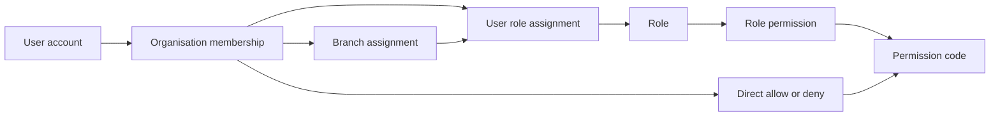

# Authorization model

Keycloak authenticates users. Finaxis authorizes them. Runtime checks evaluate permission
**codes**, never role names. Roles are administration bundles that grant permission codes to
memberships in an organisation and, optionally, a selected branch.

Read this with [active organisation context](active-organisation-context.md),
[login prechecks](login-prechecks.md),
[accounting authorization](accounting-authorization.md), and
[ADR 0005](../adr/0005-organisation-lifecycle-no-hard-delete.md).

## Permission catalogue and roles

The global catalogue in `permission` holds **81 permission codes**: 54 foundation codes seeded by
`V2__platform_reference_data.sql`, 26 accounting codes seeded by
`V5__accounting_permission_catalogue.sql`, and `branch.update`, added to the `branch` module by
`V19__branch_update_permission.sql` (#203). One of the 81, `branch.activate`, is **DEPRECATED**
(see "Branch approval"), so 80 are `ACTIVE`. Each has a stable `permission_code`, `module_code`,
`risk_level`, `system_permission`, status, and a `kind` and `grant_scope` (see "Catalogue
metadata"). Module codes are `tenant`, `branch`, `iam`,
`audit`, `settings`, and `accounting`; risk levels are `LOW`, `MEDIUM`, `HIGH`, and `CRITICAL`.

The accounting codes, why they are grouped the way they are, and what the two accounting role
bundles guarantee are documented separately in
[accounting authorization](accounting-authorization.md).

The catalogue is the authorization vocabulary and is owned by the platform — organisations cannot
invent permission codes, only compose them into roles. `FoundationSeedDataTests` asserts the exact
set, so adding a code is a deliberate, reviewed change.

Two of the roles below are seeded by migration; the other seven are created by **application code**
at organisation-provisioning time (`JooqOrganisationBranchProvisioningStore`) and appear in no
migration.

Organisation approval creates these organisation-local system roles from the catalogue (in code,
not in a migration):

- `TENANT_ADMIN`: **every `ACTIVE` permission whose `grant_scope` is `TENANT`** (66 today): the
  foundation, audit, settings and business-date codes and every accounting code, maker and checker
  alike, including the two break-glass codes `fiscal_period.reopen` and
  `journal.post_prior_period`. It is **derived from the catalogue, not listed**: approval reads the
  `TENANT` codes from `permission` when it seeds the role, and the readiness check behind tenant
  reactivation reads them the same way, so a new `ACTIVE` tenant-scope code reaches the next
  tenant's administrator with no code edit. It holds none of the `PLATFORM`-scope codes (the
  `tenant.*` lifecycle codes, `user.activate`, `user.suspend`, `user.deactivate`,
  `tenant_setting.manage_platform`), which are evaluated only in the PLATFORM organisation and
  would be inert in a tenant, and not the `DEPRECATED` `branch.activate`. The per-resource actor
  guards (no self-approval of a user, branch, GL account, posting rule or journal) apply to an
  administrator like anyone else, and use of a break-glass code stays audited and lock-checked;
- `TENANT_AUDITOR`: read-only across the platform — `audit.view`, `business_date.view`,
  `tenant.view`, `branch.view`, `user.view`, `membership.view`, `branch_assignment.view`,
  `role.view`, `role_assignment.view`, `permission.view`, `settings.view`, the six accounting
  reads (`gl_account.view`, `fiscal_period.view`, `journal.view`, `posting_rule.view`,
  `reconciliation.view`, `accounting_report.view`), and the session codes
  `auth.select_organisation`, `auth.select_branch`, `iam.profile.read`;
- `IAM_ADMIN`: user, role, and audit administration permissions, plus `branch.view` (it assigns
  users to branches and must be able to list them);
- `BRANCH_MANAGER`: branch lifecycle, branch assignment (assign **and** `user.revoke_branch`),
  `user.view`, business-date view, and `accounting_report.view` permissions;
- `BRANCH_OPERATOR`: `business_date.view` and `branch.view`;
- `ACCOUNTING_OPERATOR`: the accounting maker bundle — prepares and submits, never approves;
- `ACCOUNTING_APPROVER`: the accounting checker bundle — approves and posts, never prepares.

`V2__platform_reference_data.sql` also creates the reserved platform organisation:

- id `00000000-0000-0000-0000-000000000000`;
- `tenant_code=PLATFORM`;
- system roles `PLATFORM_SUPER_ADMIN` and `PLATFORM_SUPPORT`.

`PLATFORM_SUPER_ADMIN` holds every `ACTIVE` code in `permission`: V2 granted every row by a
set-based `INSERT … SELECT … FROM permission`, each later catalogue migration repeated the grant for
its own codes, and `V23` re-asserts the whole set (the drift test `SeededRolesDriftTests` fails the
build when a catalogue code is not held). `PLATFORM_SUPPORT` is the read-only support role: since
`V23` it holds `audit.view`, `business_date.view`, **`auth.select_organisation` and
`iam.profile.read`** (without which it could never select the PLATFORM organisation and the two
reads were unusable) and the platform reads `tenant.view`, `branch.view`, `user.view`,
`membership.view`, `branch_assignment.view`, `role.view`, `role_assignment.view` and
`permission.view`. It holds no accounting code. These are still modelled as roles in the reserved
organisation, not as special runtime role-name checks.

`audit.view` held in the PLATFORM organisation is also the permission for the platform audit
endpoints (the platform log and any tenant's log); see
[audit logging](audit-logging.md#rest-read-endpoints-and-the-platform-permission-model).

## Seeded administrator roles (V23)

The owner's rule is that an administrator role has access to **everything in its scope**. Scope is
`permission.grant_scope` (below): the seeded tenant administrator holds every `ACTIVE` `TENANT`
code, the platform administrator every `ACTIVE` code.

- **New tenants.** `OrganisationBootstrapDefaults` lists only the non-administrator bundles;
  `TENANT_ADMIN` is the catalogue's `ACTIVE` `TENANT` codes, read when the role is seeded.
  `hasDefaultRolesAndPermissions` (the readiness check behind approval and `reactivate`) derives the
  same bundle, so the grant and the check cannot disagree.
- **Existing tenants.** `V23__seeded_admin_roles_hold_every_permission_of_their_scope.sql` brings
  every existing seeded `TENANT_ADMIN`, and the bootstrap tenant's `local-admin`, to the same set,
  and removes the ten inert `tenant.*` rows from `TENANT_ADMIN`. Without it a suspended tenant
  approved before the release could not be reactivated (the readiness check would find the derived
  bundle missing on its role). A seeded role is a `system_role` row with a seeded code; a
  tenant-customised role (`system_role = FALSE`) is never touched, and the API cannot edit a seeded
  role (`RoleManagementService.requireMutable`), so there is no tenant edit to preserve. Direct
  `membership_permission` `DENY` overrides survive.
- **The cache.** Effective permissions are cached and the migration writes the tables directly; the
  application clears the cache on every start (`EffectivePermissionCacheStartupClearer`), so the
  change takes effect on the first request of a new instance.
- **Going forward.** A migration that adds an `ACTIVE` permission must grant it to the
  administrators it belongs to. `SeededRolesDriftTests` checks the migrated database, but it
  sees only `PLATFORM_SUPER_ADMIN` and the bootstrap `local-admin`, so the migration must copy
  `V23`'s step 1a and step 2 statements for every tenant's `TENANT_ADMIN`; a tenant that misses a
  code fails closed (reactivation answers 409).
- **Authority increase.** Every tenant administrator gains the manual-journal maker and checker
  codes, `journal.reverse`, `reconciliation.resolve` and the two break-glass codes. The invariant
  is now "no **non-admin** default bundle holds a break-glass code"
  ([accounting authorization](accounting-authorization.md#break-glass-permissions)). The bootstrap
  `local.admin` and `local.checker` become full administrators of `FINAXIS-LOCAL`; see
  [production hardening](production-hardening.md).
- **Other bundles.** `IAM_ADMIN` + `branch.view`; `BRANCH_MANAGER` + `user.revoke_branch` and
  `user.view`; `BRANCH_OPERATOR` + `branch.view`; `PLATFORM_SUPPORT` as above;
  `TENANT_AUDITOR` unchanged (`accounting_report.export` stays withheld until an export route
  exists). Every seeded bundle holds a mutation only with the views `permission_view_requirement`
  pairs with it (ADR 0030).

## Catalogue metadata

`V22__permission_catalogue_metadata.sql` ([ADR
0030](../adr/0030-mutation-permission-implies-view-permission.md), decisions 7 and 8) gives every
catalogue code three pieces of metadata. They are reference data, changed only by a forward
migration, and are published by `GET /api/v1/tenant/permissions` (and `/{permission_id}`) as `kind`,
`grant_scope` and `required_view_permissions`.

**`kind`** says what a code is:

- `VIEW` (18): a read, which requires nothing. The twelve foundation reads (`tenant.view`,
  `branch.view`, `user.view`, `membership.view`, `branch_assignment.view`, `role.view`,
  `role_assignment.view`, `permission.view`, `settings.view`, `business_date.view`, `audit.view`
  and `iam.profile.read`) and the six accounting views.
- `CONTEXT` (3): `auth.select_organisation`, `auth.select_branch` and
  `tenant_setting.manage_platform`. They gate the caller's own session context, or a platform-only
  setting that is read and written with the same code in the PLATFORM organisation (so no role
  could also hold the tenant `settings.view`). They require nothing and are not views.
- `MUTATION` (60): everything else. Each requires the view of the resource it writes and returns.

**`grant_scope`** says where a code is evaluated:

- `PLATFORM` (14): only ever evaluated in the PLATFORM organisation, so a tenant role holding it
  gains nothing. They are the ten `tenant.*` lifecycle codes other than `tenant.view` (`create`,
  `update_draft`, `submit_for_approval`, `approve`, `reject`, `activate`, `suspend`, `reactivate`,
  `deprovision`, `bootstrap_retry`), `user.activate`, `user.suspend`, `user.deactivate` and
  `tenant_setting.manage_platform`.
- `TENANT` (67): evaluated in a tenant organisation. Some of them are **also** evaluated in the
  PLATFORM organisation (at least `tenant.view`, `branch.view`, `user.view`, `membership.view`,
  `branch_assignment.view`, `role.view`, `role_assignment.view`, `permission.view`, `audit.view`,
  `business_date.view`, `branch.create`, `branch.approve`, `branch.activate` and `user.approve`),
  so `TENANT` means "may be granted in a tenant", not "only there".

Two values cannot say which `TENANT` codes are also evaluated in PLATFORM. A future non-super
platform administrator therefore cannot be derived as "the `PLATFORM` codes" alone: it would hold
the `tenant.*` and `user.*` mutations without `tenant.view` and `user.view`, which ADR 0030
forbids. Deriving it needs its own decision, and probably its own metadata.

The platform administrator holds every code. The seeded tenant administrator is derived from this
column ("an admin holds every code of its scope", see "Seeded administrator roles"); `V22` itself
touched no role, and `V23` applied the rule.

**`permission_view_requirement`** pairs a `MUTATION` with each view it requires: 61 rows for the 60
mutations, because `user.invite` needs two. A role or a caller that holds the mutation must also
hold these views (ADR 0030). The runtime enforces it for every mutation ("Mutation-time check"
below); role composition enforces it for custom roles (see "Role composition"); the catalogue test
enforces it for the seeded roles.

| Mutation | Required views |
| --- | --- |
| `tenant.create`, `update_draft`, `submit_for_approval`, `approve`, `reject`, `activate`, `suspend`, `reactivate`, `deprovision`, `bootstrap_retry` | `tenant.view` |
| `branch.create`, `update`, `approve`, `activate` (deprecated), `suspend`, `reactivate`, `close` | `branch.view` |
| `user.invite` | `membership.view` **and** `user.view` |
| `user.approve`, `membership.suspend`, `membership.reactivate`, `membership.revoke` | `membership.view` |
| `user.activate`, `user.suspend`, `user.deactivate` | `user.view` |
| `user.assign_branch`, `user.revoke_branch` | `branch_assignment.view` |
| `user.assign_role`, `user.revoke_role` | `role_assignment.view` |
| `role.create`, `update`, `activate`, `deactivate`, `assign_permission`, `remove_permission` | `role.view` |
| `settings.update` | `settings.view` |
| `business_date.advance`, `reopen`, `cob.start`, `cob.complete` | `business_date.view` |
| `gl_account.create`, `update`, `submit`, `approve`, `deactivate` | `gl_account.view` |
| `fiscal_period.open`, `close`, `reopen` | `fiscal_period.view` |
| `journal.create_manual`, `submit`, `approve`, `reverse`, `post_prior_period` | `journal.view` |
| `posting_rule.create`, `update`, `submit`, `approve` | `posting_rule.view` |
| `reconciliation.run`, `resolve` | `reconciliation.view` |
| `accounting_report.export` | `accounting_report.view` |

Two choices keep the seeded bundles compliant: `user.assign_branch`, `user.revoke_branch` and the
role-composition codes need only their own resource's view (not also `branch.view`,
`membership.view` or `permission.view`), and `journal.create_manual`, `posting_rule.create` and
`posting_rule.update` need only their own view (not also `gl_account.view`).

**Rules a new permission migration must follow.** `kind` and `grant_scope` are `NOT NULL`, so a
migration that inserts a permission without them fails to apply. It must also insert the
`permission_view_requirement` rows of a `MUTATION` in the same file. A kind cannot be a `CHECK`
across two tables and no trigger is allowed (ADR 0024), so `PermissionCatalogueMetadataTests` is the
enforcement: it fails for a `MUTATION` with no requirement, a `VIEW` or `CONTEXT` code with one, a
required code that is not a `VIEW`, and an `ACTIVE` mutation that requires a view that is not
`ACTIVE` (runtime honours only `ACTIVE` codes). A `DEPRECATED` mutation such as `branch.activate`
may still name an `ACTIVE` view. The same test is also **strict** about seeded roles: it fails if
the platform roles, the bootstrap `local-admin` role or any default bundle built in code hold a
mutation without its views (today none does). Role composition (below) refuses to build such a
role, and a custom role that already holds one is not repaired by a migration: its holder is
refused at mutation time with a named 403 until the role gains the view ("Mutation-time check").

## Role composition

A role is composed only by `POST /tenant/roles/{role_id}/permissions` (`assign-permission`) and
`DELETE /tenant/roles/{role_id}/permissions/{role_permission_id}` (`remove-permission`); the role
create and update routes carry no permission codes and seeded roles are immutable. Those two
operations enforce [ADR 0030](../adr/0030-mutation-permission-implies-view-permission.md) point 2,
reading the pairings from `permission_view_requirement` and counting only `ACTIVE` codes, as
runtime resolution does:

- **Assign** a mutation whose required views the role does not hold answers **400
  `validation_failed`** before anything is written. The `detail` lists **every** missing view and
  the code that needs it, for example `Missing view permissions: membership.view (required by
  user.invite); user.view (required by user.invite).` A view held but not `ACTIVE` counts as
  missing. Assigning a view, or a code that needs no view, never fails. Re-assigning a mutation
  the role already holds is an idempotent no-op; assigning one that is not `ACTIVE` (it grants
  nothing) is written without the check. Neither is refused. Making such a mutation `ACTIVE`
  later (a migration or hand SQL) can leave a role holding it without its views, so run both
  gap reports after any change that makes a mutation `ACTIVE`.
- **Remove** a view that another **held** `ACTIVE` mutation needs answers
  **400 `validation_failed`** naming the dependants (`Permission branch.view is required by
  held permissions: branch.close, branch.suspend.`). Removing a mutation or a context code never
  fails.
- Only the code being assigned is checked, never the rest of the role, so a legacy violating role
  is repaired one code at a time (add the missing view, then the next).
- **Both operations lock the role row first** (`SELECT ... FOR NO KEY UPDATE` through
  `IamAdministrationPersistence.lockRole`) and read the held set afterwards. Two concurrent
  compositions of one role therefore run one after the other and the second validates against what
  the first committed; without the lock one request removing `branch.view` and one adding
  `branch.suspend` could each pass against its own snapshot and commit a violating role. The lock
  does not block the foreign-key inserts of role assignments.

**Reporting, not backfilling.** There is no migration that repairs existing roles. Role list
(`GET /tenant/roles`) and role detail (`GET /tenant/roles/{role_id}`) carry
**`missing_view_permissions`**: the sorted flat list of view codes the role's held `ACTIVE`
mutations need and the role lacks (`[]` when it complies). It is computed for the roles on the page
only, by one query per page, so pagination and totals are unaffected. Activating a legacy violating
role stays allowed; the report is the signal.

**Memberships and platform roles: the operator query.** A membership's effective set is its
`ACTIVE` role grants plus its direct `ALLOW` overrides minus its direct `DENY` overrides, so a
direct `ALLOW` of a mutation without its view, or a `DENY` of a view a held mutation needs, violates
the rule though every role the membership holds complies, and no API field reports it. Platform
roles have no listing API at all. Both are covered by the documented, tested operator SQL in
[the permission view-gap report](../operations/permission-view-gap-report.md)
(`docs/operations/sql/permission-view-gap-roles.sql` and `permission-view-gap-memberships.sql`).

## Mutation-time check: a mutation implies its view

[ADR 0030](../adr/0030-mutation-permission-implies-view-permission.md), decision 4. A route that
mutates names its mutation code; the catalogue (`permission_view_requirement`, see "Catalogue
metadata") says which view codes that mutation implies. **Every check the application makes
through the `PermissionGuard` adapters requires the mutation code and every view code paired with
it, at the same scope**: the tenant, the target branch, or the PLATFORM organisation.

- **Central.** `LifecyclePermissionGuardAdapter` and `AccountingPermissionGuardAdapter` call
  `AuthorizationService.requirePermissionWithViews` (and the target-branch and break-glass
  variants), which reads the pairing through the `PermissionViewRequirementQueries` port. No call
  site types a view, and none can forget it. Accounting has no inbound web adapter yet, but it
  adopts the check now, so the first accounting route inherits it. A view or context code has no
  pairing and is checked alone, exactly as before. The system actor stays exempt, except at the
  break-glass check, which never exempts it.
- **Same scope, same memo.** At a target branch the mutation code and each view are asked of the
  branch's effective set (a tenant-wide grant or a grant on that branch) through the same
  per-request `RequestPermissionCache` entry the gated branch read-back decides from, so the
  pre-check and the read-back are one procedure over one piece of data and the read-back cannot
  disagree with the pre-check or be refused for want of a grant. The pairing is read once per
  request. It can fail only if the organisation stops being `ACTIVE` between the two (a concurrent
  committed suspension): the request rolls back with a named 403 and a retry fails cleanly at the
  pre-check.
- **A named 403.** The refusal is `MissingPermissionException`, a `ForbiddenOperationException`:
  `403 application/problem+json`, `code` still `forbidden`, and a `detail` that names the first
  missing code, the mutation code first and then each view in code order: `Missing permission:
  branch.view.` Every refusal the guard adapters make now names the code it needs, reads included.
  Codes are public vocabulary (the catalogue, OpenAPI and `GET /auth/me` already list them) and the
  check precedes any existence lookup on the routes listed under "Order", so naming adds no
  oracle. A resource-level
  `AccessDeniedException` that carries a resource reference, and `@PreAuthorize` denials, stay
  generic. The view is **not** added to a route's `@PreAuthorize`: that would be an unnamed
  duplicate of the application check and the wrong scope for a branch-scoped caller.
- **Order.** Body validation (400), `@PreAuthorize` (403), then in the service the mutation and
  view check (403, named), the platform-organisation 404 or 409, resource existence (404), the
  ADR 0028 window (409), state (409), the mutation, the gated read-back. The platform tenant
  routes (`PlatformTenantController`) follow it in `OrganisationProvisioningService`: the
  controller checks nothing, each command carries the acting `actorId`, and the response is the
  gated tenant detail (platform `tenant.view`), which carries the initial-administrator bootstrap
  status, so no web adapter reads the bootstrap store. A refused request writes
  nothing: no state change, transition log, audit success row, outbox row or idempotency row (the
  refusal precedes every write and the idempotent transaction rolls back). Replay is unchanged: an
  idempotent replay returns the stored response of the caller's own completed write after
  `@PreAuthorize` only. Role-permission remove, branch-assignment revoke and role-assignment
  revoke follow the same order since ADR 0030 rollout step 6c: role-permission remove names the
  role it works on, so its mutation and view check is the first thing the service does, before the
  role or the grant is read (a caller without `role.view` is refused with `Missing permission:
  role.view.`, not by an unnamed read and not with a 404). The two revoke routes name only an
  assignment id, so see "Assignment revoke: the authorised combined lookup" below. Tenant settings
  resolve the setting key (400) and the organisation state (409) before the permission check. The
  refusal of a target-aware read stays unnamed everywhere.
- **Memberships and invitations authorise in the service.** `UserProvisioningService` makes
  the check itself, inside the mutation transaction and first: `user.invite` (with
  `membership.view` and `user.view`) for `inviteUser`, `user.approve` with `membership.view` for
  `approveUser` (in the tenant, or in the platform organisation for the platform checker, which
  then refuses the platform organisation as a tenant with a 404), and `membership.suspend`,
  `membership.reactivate` and `membership.revoke`, each with `membership.view`. The web adapters
  carry only the coarse `@PreAuthorize` gate (its 403 stays generic and unnamed, like every
  `@PreAuthorize` denial: its message holds the request's resource ids, not a permission code to
  name) and read the result back through the
  gated membership query at the scope the mutation was checked at: `membership.view` in the tenant
  for the tenant routes, `membership.view` in the platform organisation for the platform checker
  route, bound to the path tenant (another tenant's id is a 404). Two system entry points,
  `inviteAsSystem` and `approveAsSystem`, serve only the initial-administrator bootstrap, whose
  actors hold no tenant permission yet; they keep the maker-checker exclusions.
- **Assignment revoke: the authorised combined lookup.** Branch-assignment revoke and
  role-assignment revoke take only `assignment_id`, and the target-scoped check needs the target
  branch (or the scope type) that only the assignment row holds. The service therefore resolves it
  through an internal lookup that is never returned to the caller. First it asks
  `PermissionGuard.mutationBranchVisibility` for the branches where the caller holds the mutation
  and every view paired with it (a tenant-wide grant means all of them), read from grants alone and
  memoised per request; a code held nowhere is a named 403. Then it reads the row. A tenant-wide
  caller gets 404 for an unknown id. Any other caller gets the **same 403** (`Missing permission:
  <mutation code>.`: same status and body, apart from the per-request `request_id` and the
  `instance` path the caller itself requested) for an unknown id, for an assignment on a branch it
  may not act on and, for a role assignment, for a tenant-scope row, so the lookup is not an
  existence oracle and no unrestricted existence read is restored. A caller with no grant at all
  gets the named 403 of the first code it lacks, whatever id it asks for. The refusal names the
  **mutation** code whenever the row's branch lies outside the intersection of the mutation's and
  the views' branches, even to a caller who holds the mutation (for example `user.revoke_branch` at
  A and `branch_assignment.view` only at B: its own row at A is refused with `Missing permission:
  user.revoke_branch.`, as an unknown id is, and reveals nothing). A view is named only when it is
  held nowhere at all. Because the lookup resolves the same visibility the gated read-back asks for,
  the read-back cannot be refused by a grant revoked in between (the branch assignment assign route
  primes the same memo for the same reason).
- **Platform user lifecycle authorises in the service.** `UserProvisioningService.suspendUser`,
  `reactivateUser` and `deactivateUser` check `user.suspend`, `user.activate` or `user.deactivate`
  with `user.view` in the platform organisation, inside the mutation transaction and before the
  user is looked up, so an unknown id answers a caller without them with the named 403, never a
  404. The controller keeps only the coarse `@PreAuthorize` gate and reads the result back through
  the gated `IamQueryService.getGlobalUser` (`user.view` in the platform organisation; it needs no
  platform membership, as these routes act on any user account), so the response status is the
  stored one.
- **Tenant branch routes authorise in the service.** `BranchProvisioningService` checks
  `branch.create` for create draft (tenant-wide: no branch exists yet) and, at the target branch,
  `branch.create` for submit, `branch.approve`, `branch.suspend`, `branch.reactivate` and
  `branch.close`, before anything else, so `BranchController` carries only the coarse
  `@PreAuthorize` gate and the gated read-back: it no longer repeats the same check (same code,
  same scope) before delegating.
- **The build enforces it** (ADR 0030, decision 6). `PermissionFreeReadRuleTests` (rules in
  `ReadGateRules`) fails the build when: a method named `get...AfterAuthorizedMutation` exists; a
  web adapter calls or references a query-service method (a `..application.query..` or
  `..application.reporting..` `*Service`, or a `*QueryService`) that is not marked `@GatedRead`
  (the marker, in `common.application`, sits on `FoundationQueryService`, `IamQueryService`,
  `LifecycleIamReadService` and its adapter, `AuditQueryService`, the accounting
  `LedgerReportingService` and `FinancialStatementService` reads, and the business-date reads); a
  GET handler (`@GetMapping`, or a GET `@RequestMapping`) calls any application-package service or
  bean through an unmarked method that is not on the commented allowlist
  (`UserProfileService.profile` and `AuthSelectionService.available*`; the per-key
  `TenantSettingsService` reads are marked, and authorise per key before reading the stored row);
  a marked lifecycle or IAM query method does not take the caller; a marked method does not ask a
  `*PermissionGuard` (or a marked delegate) before its first store call, in line order; an
  implementation of a marked method drops the marker (erased parameter types are compared; Kotlin
  `by` delegation fails closed, since it forces explicit overrides); a web adapter depends on a
  platform type outside the web layer that is neither a `*Service` that depends on a
  `*PermissionGuard` or declares a marked method, nor a plain value, nor on the commented
  allowlist of six (a store, a reader class, a `@Component`, a `@Bean`-built engine, a resolver or
  a port of any name, in a domain package too, is refused), names `SystemActor`, builds or copies
  a `TenantCaller`/`PlatformCaller` itself, or depends on the bootstrap service; or any class but
  the initial-administrator bootstrap calls or references `inviteAsSystem`/`approveAsSystem`
  (`inviteAsSystem` also requires `SystemActor.ID` as the inviter; `approveAsSystem` cannot, its
  approver is the platform user who approved the tenant). Each rule is proved against a violating
  fixture class. What it does not cover: the marker check is structural (a guard comes first, not
  that it runs on every path, which the named-403 integration tests cover), a bean registered
  without a stereotype or a `@Bean` method is not seen, and a non-GET handler's reads outside a
  query service rely on the mutation service's own check. A new read must carry the marker and
  authorise its caller, or no controller can call it. Finding: `UserProfileService.profile` makes
  no application-layer check; `GET /api/v1/auth/me` is gated only by `@PreAuthorize` and serves
  the authenticated principal's own profile.
- **A direct `DENY` of a view** removes it from the resolved set, so the operator who holds a
  mutation and a `DENY` of its view cannot mutate either, by design.
- **Hand SQL on the catalogue fails open.** The pairing is reference data changed only by forward
  migration. An `ACTIVE` mutation with no `permission_view_requirement` row, because someone
  deleted or reclassified it by hand, is checked alone: the rule is silently off for that code.
  `PermissionCatalogueMetadataTests` guards the migrated database (every mutation paired with an
  `ACTIVE` view), so run it, and the operator view-gap queries, after any hand SQL on the
  catalogue. The accepted cost of keeping the rule in data (ADR 0030).

**Lock-out implications.** A custom role (or a direct override, or a platform checker role) that
holds a mutation code without its view cannot mutate: the check refuses it. What the
caller gets is a clean `403` naming the missing view and no change, never a mutation that rolls
back after the fact. Repair the role by adding the view (`assign-permission`), after listing the
violators with the operator report shipped with the role-composition change. The seeded roles
already comply (`V22`, `V23` and the drift tests), `PLATFORM_SUPER_ADMIN` holds every code, and
the bootstrap `local-admin` holds every tenant code.

## Role administration

`RoleManagementService` exposes application commands to:

- create, update, activate, and deactivate tenant roles;
- assign and remove catalogue permissions on roles;
- assign and revoke roles for users at `TENANT` or `BRANCH` scope.

Implemented guards include:

- role code must be unique per organisation;
- system roles cannot be modified or deactivated;
- role lookup is always by selected organisation and role id;
- permission assignment requires a known catalogue permission code;
- role assignment requires an active organisation and a non-revoked membership;
- branch-scoped role assignment requires an active branch assignment for that branch;
- tenant-scoped role assignment must not carry a branch id.

Role and role-assignment mutations write audit events. Role permission changes and user-role
assignment changes evict affected effective-permission cache entries and publish administration
events for assignment/revocation.

## Effective permissions

Effective permissions are resolved for one active membership and optional selected branch:

1. If the membership is not `ACTIVE`, the result is empty.
2. Active tenant-scoped role grants apply for the membership.
3. Active branch-scoped role grants apply only when that exact branch is selected.
4. Direct membership permission effects are applied.
5. Direct `DENY` effects remove codes from the final allowed set.

The schema supports direct membership overrides in `membership_permission` with `ALLOW` and
`DENY`. The resolver returns permission codes only.

### Target-aware reads of branch resources

The set above is resolved for the *selected* branch, which is the right scope for what a caller
does. Reads of branch resources are instead authorised **at the branch they concern** (ADR 0030,
decision 5): `branch.view` for `GET /branches` and `GET /branches/{id}`, `branch_assignment.view`
for the assignment reads, and `role_assignment.view` for role-assignment rows with
`scope_type = BRANCH` (`TENANT`-scope rows need the tenant-wide view). The rule is **a tenant-wide
grant OR a grant on that branch**.

`PermissionGuard.branchVisibility(actor, organisation, viewCode)` answers it as a
`BranchVisibility`:

- `AllBranches` when the code is in the tenant-wide effective set (a tenant-scope role or a direct
  `ALLOW`);
- otherwise `Branches(ids)`, the branches carrying an ACTIVE branch-scope role assignment to an
  ACTIVE role granting an ACTIVE catalogue code (`PermissionResolutionQueries.branchIdsGranting`),
  empty when there is none;
- empty as well for an inactive organisation or membership and for a direct `DENY` of the code,
  exactly as the effective set is.

A by-id read is `404` for an unknown id to an `AllBranches` holder, and `403` to a branch-scoped
holder for an unknown id and for another branch alike, so there is no existence oracle. A list
restricts the store query to the visible ids (`restrictToBranchIds`), so pages and totals stay
exact; an explicit `branch_id` outside the set is `403`, and no grant is `403`. With no explicit
`branch_id`, the branch-assignment list defaults to the selected branch when the caller may view
it (the same rule for a tenant-wide and a branch-scoped holder), else to every viewable branch.
`visibility` is memoised per request in `RequestPermissionCache`, so the pre-check and the
read-back of one request cannot disagree. `PermissionGuard.mutationBranchVisibility` is the same
projection for a mutation code and every view paired with it, intersected: the branches where a
target-branch mutation check passes (used by the assignment revoke lookup below). These read
endpoints carry **no** `@PreAuthorize` coarse gate, since it would evaluate the selected branch's
authority set and refuse a caller pinned to A whose only grant is scoped to B; the application
layer is their only authorisation and a route is never open (authentication is still required,
and a caller with no grant gets `403`). Mutation routes keep their coarse gates. See
[Active Organisation Context](active-organisation-context.md).


```mermaid
flowchart LR
    U[User account] --> M[Organisation membership]
    M --> B[Branch assignment]
    M --> RA[User role assignment]
    B --> RA
    RA --> R[Role]
    R --> RP[Role permission]
    RP --> P[Permission code]
    M --> MP[Direct allow or deny]
    MP --> P
```

## Branch update

`PATCH /branches/{branch_id}` requires **`branch.update`** (risk `HIGH`, module `branch`), not
`branch.create`. An edit to a `DRAFT` branch is the maker's own correction, but the same route also
edits an `ACTIVE` branch, which has already been approved, and with `branch.create` a custom
maker-only role could change a live branch with no checker anywhere in the path. A separate code
lets an owner withhold live edits from makers and grant them on purpose. The one person who may
create or submit a draft and the one who approves it are still different people (`branch.approve`
still cannot be exercised by the creator); `branch.update` adds no approval, it
only separates who may amend. As with the lifecycle routes it is evaluated at the **target
branch**, not the selected one (#154), by `BranchProvisioningService.update` rather than only at
the controller, and a missing or foreign branch is `404` only after that check passes, so a caller
without `branch.update` gets `403` for a real branch and an unknown id alike.

`V19__branch_update_permission.sql` seeds the code and **copies the grant**: every role (and every
direct membership override, `ALLOW` or `DENY` alike) that held `branch.create` on the day it ran
also holds `branch.update`, so nobody who could `PATCH` before loses the ability, and a role
without `branch.create` receives nothing. After that the two codes are independent. To take `PATCH`
away from a role, revoke `branch.update`; revoking `branch.create` no longer does. For organisations
approved from then on, `TENANT_ADMIN` and `BRANCH_MANAGER` (the roles that already carry
`branch.create`) are seeded with `branch.update`; `TENANT_AUDITOR`, `IAM_ADMIN` and
`BRANCH_OPERATOR` are not. The platform-operator routes never offered `PATCH`.

## Branch approval

Approving a `PENDING_APPROVAL` branch requires **`branch.approve`** (risk `HIGH`, module
`branch`): `POST /branches/{branch_id}/activate`, the platform checker route
`POST /platform/tenants/{tenant_id}/branches/{branch_id}/activate`, and the checker's half of
`/return`. It is checked at the controller (coarse gate) and again in
`BranchProvisioningService` against the target branch, or against the platform organisation on
the platform route. Reactivating a `SUSPENDED` branch keeps `branch.reactivate`, suspending
`branch.suspend`, closing `branch.close`, and a maker's withdrawal `branch.create`. The ADR 0028
platform-checker window and the creator/submitter rules are unchanged, and so are the audit
actions (`branch.activate`, `branch.activate_as_platform_checker`), which name what happened,
not a permission.

Until #208 the code seeded for this, `branch.approve`, was checked nowhere and `branch.activate`
did the work. The rule is that approval needs an explicit permission and a replaced permission
is deprecated, so `V21__branch_approve_permission.sql` marks **`branch.activate` `DEPRECATED`**.
Runtime resolution honours only `ACTIVE` permissions, so a deprecated code that is still held
confers nothing, and no route checks it (`BranchApprovePermissionMigrationTests` scans the
source to keep it so). The migration **rebuilds approval authority from `branch.activate`**.
Because nothing ever checked `branch.approve`, every `branch.approve` role grant and membership
override that already existed (`ALLOW` or `DENY`) conferred nothing; while `branch.activate` is
`ACTIVE`, those with no `branch.activate` counterpart are **discarded**, and then every role
(system roles of existing tenants included) and every direct membership override, `ALLOW` or
`DENY` alike, that held `branch.activate` is given the same on `branch.approve`. Afterwards a
role holds `branch.approve` if and only if it held `branch.activate`, and a membership override
on one matches the other, so every principal's effective approval ability is the same before and
after: nobody who could approve loses it, and nobody who could not gains it (a custom role that
an admin built around the dead `branch.approve`, or a lone `branch.approve` `DENY`, no longer
matters; such an admin must re-grant approval knowingly with `role.assign_permission`). A
`DISABLED` source disables `branch.approve` and discards nothing. A `DEPRECATED` source with
`branch.approve` `ACTIVE` **raises whatever the rows say**: the previous runtime authorized
nobody through a deprecated code, matching rows cannot prove V21 completed earlier, and accepting
them would open approval to every `branch.approve` holder at once. The message tells the operator
to disable `branch.approve` by hand if approval must stay shut, or to re-activate `branch.activate`
and run again, and never to re-run V21 by hand where it already completed. While it rebuilds, V21
takes `LOCK TABLE role_permission, membership_permission IN SHARE ROW EXCLUSIVE MODE`: other
transactions' grant writes wait until it commits (reads continue), so a revoke or an override
change made by an old instance cannot slip between the snapshot and the copy. To take approval
away from a role, revoke `branch.approve`; revoking `branch.activate` no longer does anything. The
`branch.activate` rows are not deleted. The V21 header carries an informational query listing the
rows that are discarded. The effective-permission cache is namespaced by schema version and cleared
at start by the mechanism introduced with V19. During a **rolling deploy** the instances of the
previous release still check `branch.activate`, which V21 deprecates, so they refuse approvals
(403) until they are replaced: it fails safe, and nothing is needed beyond completing the rollout.

New organisations are seeded with `branch.approve` and **not** `branch.activate`
(`TENANT_ADMIN` and `BRANCH_MANAGER`, `OrganisationBootstrapDefaults`). The readiness check
that gates tenant reactivation counts the role's `ACTIVE` codes that are in the current
bundle and ignores any other, so an existing tenant whose roles still hold the deprecated
`branch.activate` beside `branch.approve` stays ready (`TenantRoleReadinessTests`).

## Branch return and withdrawal

`POST /branches/{branch_id}/return` (and the platform route) is one transition, `PENDING_APPROVAL`
to `DRAFT`, that asks for a different permission depending on who the caller is relative to the
branch, with no new permission code (ADR 0029, 3b):

| Caller | Intent | Permission | Scope |
| --- | --- | --- | --- |
| The branch's creator, or the actor of its latest `SUBMIT` | withdraw | `branch.create` | tenant: the target branch; platform: the platform organisation |
| Anyone else | return as a checker | `branch.approve` | tenant: the target branch; platform: the platform organisation |

The caller is classified first, from `created_by` and the latest submitter **read inside the path
organisation**, so a branch of another tenant or an unknown id classifies as a return and reads the
same. Classifying only chooses which permission is asked; the permission is then checked in the
application service (`BranchProvisioningService.returnForChanges`), before any existence signal. A
creator who also holds `branch.approve` is still a maker and needs `branch.create`; a maker who
has lost `branch.create` cannot withdraw, but a non-maker holding `branch.approve` can still
return. The controller's coarse gate is `branch.create` **or** `branch.approve` because it cannot
know the class. A platform actor who returns as a checker is held to the ADR 0028 window and is
audited with `checkerScope = PLATFORM`; a platform withdrawal is not windowed and carries no
marker.

## Tenant return for changes

`POST /platform/tenants/{tenant_id}/return` sends a `PENDING_APPROVAL` tenant back to `DRAFT`
(ADR 0029, 3c). It asks for the existing **`tenant.reject`**, the permission for the checker's
non-approving decision, in the platform organisation, and no new code or migration. The permission
is checked in the application service (`OrganisationProvisioningService.returnForChanges`) before
any existence signal, so a caller without it gets `403` for a real tenant, the platform
organisation and an unknown id alike; the controller's coarse gate is `tenant.reject`.

It is **checker only**: the actor may be neither the requester nor the actor of the current
submission (`requested_by` and `submitted_by` on the initial-administrator record, the rule
`approveProvisioning` applies) and may not be the system actor, so there is no maker-side withdraw
of a tenant. Rejecting is wider: `rejectProvisioning` has no maker check, so a maker holding
`tenant.reject` can terminally reject their own submission but cannot return it. The rule is read
from the record at approval, so it holds across the return, amend, resubmit loop, and so does the
`lifecycle.approver_is_initial_administrator` refusal. The returner and amenders are not makers
and may approve a later resubmission, as may the earlier submitter, who is not the submitter of
the current request (an accepted consequence of reading the rule from the record at approval).

`tenant.reject` is checked together with `tenant.view` in the platform organisation (the mutation
check, "Mutation-time check"), so a checker role holding `tenant.reject` alone is refused with
`Missing permission: tenant.view.` before anything changes. The `status_reason` it sets is
exposed on the platform tenant routes (`tenant.view`) and on the tenant's own `GET /tenant`, as an
always-present nullable field.

## Maker-checker and the platform checker

Approvals are maker-checker: the actor that created a thing cannot approve it, whatever its
permissions. `UserProvisioningService.approveUser` refuses the actor that invited the membership
**and the invited user themselves** (the checker is neither the maker nor the beneficiary), and
`BranchProvisioningService.activate` refuses the actor that created the branch and the actor who
**amended** it (anyone with a successful `branch.update` audit event on it, 403
`lifecycle.approver_is_branch_modifier`), because a returned draft is amendable by anyone holding
`branch.update` and one person must not amend, resubmit and approve another's draft. The checker who
merely returned a draft is not an amender and may approve its resubmission. An amender whose edit
was later overwritten is still refused, so a tiny tenant may need a third person or the platform
checker. Both compare user ids, so switching organisation context does not get round them.

A freshly approved tenant has one user, the bootstrap `TENANT_ADMIN`, who is the maker of everything
it creates and so cannot finish onboarding a second person or a first branch. The resolution is
[ADR 0028](../adr/0028-platform-checker-for-first-tenant-approvals.md): a **platform-context** actor
may be the audited checker of a tenant's pending membership or branch. The checker is neither the
maker nor the beneficiary: the platform actor cannot approve what it created, a membership of its
own account, a branch it submitted itself, or a branch it amended. The tenant's own rule is
unchanged, and the permission is checked in the **platform organisation**, never in the tenant, so
no tenant membership is needed. Two separate bounds apply (409 `lifecycle.platform_checker_closed`
otherwise): a pending membership can be checked by the platform only while the tenant has no
`ACTIVE` membership beyond its bootstrap administrator, and a pending branch only while it has no
`ACTIVE` branch beyond the bootstrap head office (the ones the system actor created). Only `ACTIVE`
rows count, so suspending or revoking them reopens the route. A tenant draft that names the
approving platform user's own account as its initial administrator cannot be approved by that user
(403 `lifecycle.approver_is_initial_administrator`).

| Route | Permission and its view | Scope |
| --- | --- | --- |
| `POST /platform/tenants/{tenant_id}/memberships/{membership_id}/activate` | `user.approve` + `membership.view` | PLATFORM |
| `POST /platform/tenants/{tenant_id}/branches/{branch_id}/activate` | `branch.approve` + `branch.view` | PLATFORM |
| `POST /platform/tenants/{tenant_id}/branches/{branch_id}/submit` | `branch.create` + `branch.view` | PLATFORM |
| `POST /platform/tenants/{tenant_id}/branches/{branch_id}/return` | `branch.approve` (checker) or `branch.create` (maker), + `branch.view` | PLATFORM |
| `POST /platform/tenants/{tenant_id}/branches` | `branch.create` + `branch.view` | PLATFORM |

Order of checks on every one of them: platform context, then the platform permission with its
view (a custom platform checker role must hold both; `PLATFORM_SUPER_ADMIN` holds every code),
then the path tenant's ownership of the id (404 otherwise; the platform organisation is never a
valid `{tenant_id}`, see [below](#the-platform-organisation-is-never-a-tenant)), then the tenant
state and the maker/beneficiary rules. The tenant must be `ACTIVE` to approve or activate, and
`ACTIVE` or `PROVISIONING` to create or submit a branch.
`PLATFORM_SUPPORT` holds none of the permissions.

Every use is attributed to the platform actor in the tenant's audit log: the transition row, the
`user.approve` row with metadata `checkerScope = PLATFORM`, and for a branch an extra
`branch.submit_as_platform_checker` (submission), `branch.activate_as_platform_checker` (activation)
or `branch.return_for_changes_as_platform_checker` (a branch it returned) row, each with the same
metadata. Filter on any of them to review them.

## The platform organisation is never a tenant

The reserved `PLATFORM` organisation (`00000000-0000-0000-0000-000000000000`, seeded by `V2`) is the
identity every platform principal authenticates against. It is never a tenant to be acted on, and
the rule has two answers depending on what the route does with it:

| Route | Answer for the platform organisation |
| --- | --- |
| A route **under** a tenant, with the platform organisation as `{tenant_id}`: platform branch and user routes (`/platform/tenants/{tenant_id}/branches/**`, `/memberships/**`) | `404`, after the permission check: it is not a valid parent for these |
| A **lifecycle action on the tenant itself**: `PATCH`, `submit`, `approve`, `reject`, `return`, `suspend`, `reactivate`, `deprovision` and `bootstrap/retry` on `/platform/tenants/{tenant_id}` | `409` `lifecycle.platform_organisation_protected`: "The platform organisation cannot be suspended, deprovisioned or otherwise changed through the tenant lifecycle." |

The second is a refusal rather than a `404` because the organisation exists and a caller holding the
permission is entitled to know why the action is unavailable. Suspending it makes the application
refuse every platform principal, and deprovisioning it also revokes every platform membership;
recovery would be only by direct SQL. The check order is the platform permission (`403`), then this
refusal, then any lock or read, so an unauthorised caller learns nothing about the organisation.

Three layers hold the line, each correct without the others (#205):

1. `OrganisationProvisioningService` refuses it on every method that takes a tenant id and mutates
   or transitions it, through one shared guard. Each refusal is first recorded as a `DENIED` audit
   row (actor, attempted action such as `organisation.suspend`, entity = the platform organisation,
   severity `HIGH`, reason `lifecycle.platform_organisation_protected`) through
   `AuditService.recordIndependently`, a new transaction, so the row survives the rollback the
   `409` causes. A caller refused earlier, on the permission check, leaves none.
2. The organisation transition graph (`FoundationLifecycleDefinitions.organisationGraph`) carries a
   guard on every edge, so a future caller of `FoundationLifecycleService` is refused too (the same
   `409`, with the generic `conflict` code and the same message). Platform branches and memberships
   are not covered and keep their own lifecycles.
3. `V20`'s `chk_organisation_platform_always_active` CHECK refuses any `UPDATE` that would leave the
   row in a status but `ACTIVE`, for a statement that bypasses the application altogether. A raw
   violation would surface as `DataIntegrityViolationException`, which the web layer renders as a
   generic `500`: the `409` above comes from layers 1 and 2, which fire first.

None of the three prevents a `DELETE` of the row. No code deletes an organisation, and the foreign
keys refuse it while any dependant exists, which the platform roles seeded by `V2` always are. A
delete-guard trigger on `organisation` is therefore not added: it fails condition one of
[ADR 0024](../adr/0024-journal-line-append-guard-and-trigger-policy.md), because the property is a
single-row one that the non-cascading foreign keys already refuse.

## Caching and invalidation

`RequestPermissionCache` is request-scoped. It memoizes permission resolution only for the current
request and selected `(membershipId, branchId)`.

`EffectivePermissionResolver` also uses the application cache named `iam.effective-permissions`.
The cache key includes membership id and selected branch id, so branch switches do not reuse
another branch's permissions.

`PermissionCacheInvalidator` evicts cached selections when role grants or role assignments change.
It can also clear the entire effective-permission cache (with `invalidate()`, because the Redis
cache's `clear()` may run on its asynchronous writer and return before the keys are gone). On
Redis both act on the running instance's own schema-version namespace (below) through the Spring
cache API.

**The Redis keys are namespaced by the applied schema version.** The cache lives in Redis with no
time-to-live, so it outlives a deployment, and a Flyway migration that changes who holds a
permission writes the tables directly and cannot evict anything. A key is therefore
`iam.effective-permissions:v<N>::<membership_id>:<branch_id|none>`, where `N` is the highest Flyway
version applied when the instance started (read after migrations ran, by
`EffectivePermissionCacheConfiguration`; `none` if Flyway reports nothing). An instance on a newer
schema never reads what an older release wrote, and an older instance never reads what a newer one
wrote. A cache manager that is not Redis (Caffeine, a concurrent map, no-op in tests) is not
configured by this and is unaffected.

**The cache is also cleared on every application start.**
`EffectivePermissionCacheStartupClearer` clears this instance's namespace and then deletes the keys
of every schema version (`iam.effective-permissions:*`, the pre-versioning
`iam.effective-permissions::` included), once all singletons exist, which is after Flyway has run
and before the web server accepts traffic. It logs one info line. If Redis is unreachable at that
moment the clear is logged as a warning and the boot continues, because an unreachable cache cannot serve stale entries
either; entries of the same schema version written before an out-of-band change could then
survive a Redis that returns later until the next start or a role or assignment change, so an
operator seeing that warning should restart once Redis is back.

What this protects, and what it does not:

- **A permission migration (`V19` is the first; every later one inherits it) is effective on the
  first request of a new instance with no operator action.** The namespace is what makes a
  **rolling deploy** safe: an instance of the previous release can miss the cache, resolve a
  permission set before the migration commits and write it after the new instance's start-up
  clear, but it writes into its own (older) namespace, which the new instance never reads. During
  the rollout old instances keep serving their own namespace, so they still answer the
  pre-migration way (for `V19`, a `branch.create` holder still passes their old gate) until they
  are replaced; their entries are removed by the next start-up sweep.
- **A role or assignment change handled by a new instance evicts its own namespace only.** An old
  instance still running during a rolling deploy can serve a revoked grant from its namespace
  until it is replaced; this adds nothing to the per-instance eviction limit that already exists
  (the set of cached branch selections per membership is held in each instance's memory).
- **SQL run outside Flyway while instances stay up is not covered.** The schema version does not
  change and nothing evicts, so a manual `INSERT`/`UPDATE` of `role_permission`,
  `membership_permission` or `permission` needs the cache flushed: restart the instances (the
  start-up clear), or delete the keys, for example
  `redis-cli --scan --pattern 'iam.effective-permissions:*' | xargs -r redis-cli unlink`. Prefer a
  Flyway migration, which the namespace and the start-up clear cover.

**Break-glass checks read neither cache.** `AuthorizationService.requireBreakGlassPermission`
answers from `PermissionResolutionQueries.lockedBreakGlassGrant`, a locking read of the rows that
grant the one code being checked, and never from `RequestPermissionCache` or the
`iam.effective-permissions` cache. A cached answer is by construction a pre-revocation answer, and
that is not adequate for a control whose whole purpose is that a tenant administrator can take it
back: a revocation must either wait for the in-flight transaction or abort it, which only a lock
delivers. The eviction above is still performed and still correct — it is what keeps the *ordinary*
checks from serving a revoked grant for the rest of the cache entry's life — but nothing about
break-glass depends on it any more. See
[ADR 0026](../adr/0026-real-time-gates-on-the-serializable-posting-path.md), which also explains why
the ordinary checks deliberately keep the cache.

## Spring Security integration

After JWT authentication and active-organisation resolution, `AppPrincipalAuthenticationToken`
wraps the application principal. Its authorities are `SimpleGrantedAuthority` values built from
the principal's permission codes.

Controllers may use Spring Security authority checks such as:

```kotlin
@PreAuthorize("hasAuthority('iam.profile.read')")
```

Method security that needs organisation or branch matching uses the named authorizer:

```kotlin
@PreAuthorize("@authz.hasPermission(#organisationId, 'branch.create')")
@PreAuthorize("@authz.hasPermission(#organisationId, #branchId, 'branch.create')")
```

Application services can use `AuthorizationService` for explicit permission and resource checks.
Those checks still compare permission codes and reject cross-organisation access.
