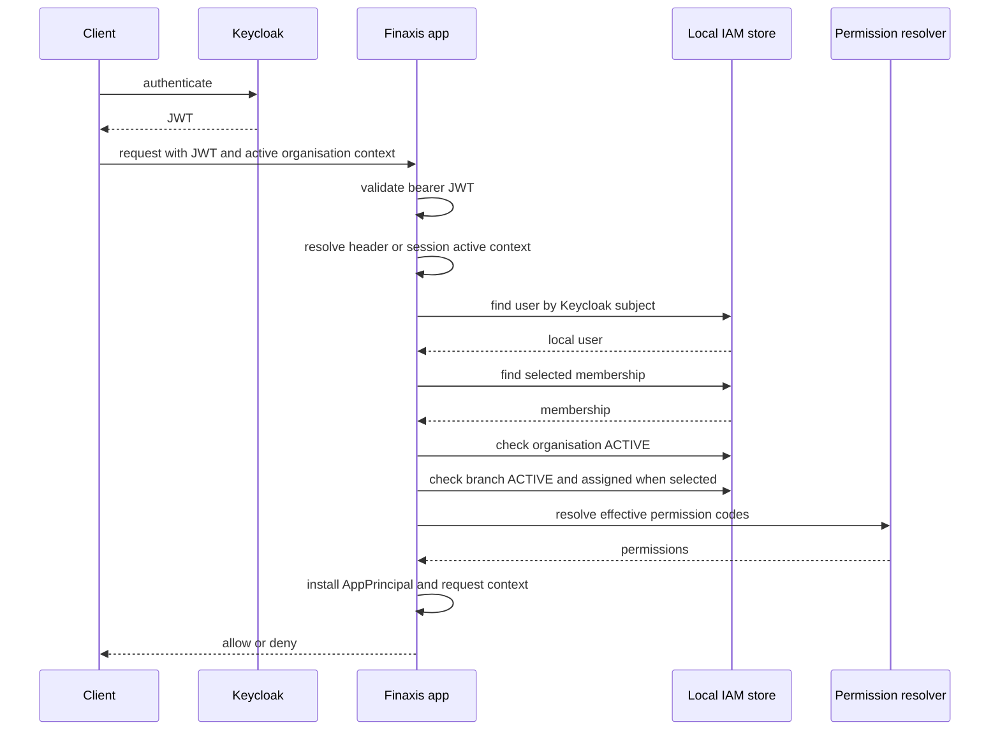

# Login prechecks

Keycloak authenticates the bearer JWT. Finaxis then resolves a local application principal before
controllers and method security can make organisation-scoped decisions. These checks prevent a
valid JWT from bypassing local lifecycle, membership, branch, or permission state.

Read this with [active organisation context](active-organisation-context.md),
[authorization model](authorization-model.md), and
[user provisioning](user-provisioning-keycloak.md).

## Active context transport

The active organisation context is not authentication. It selects the local organisation,
membership, and optional branch for a request that has already authenticated with Keycloak.

The resolver checks, in order:

1. `X-Active-Organisation-Context`, a signed headless-client token;
2. the Redis-backed browser session attribute `iam.activeOrganisationContext`.

An invalid header fails closed with `403`. If neither transport is present, the request remains
JWT-authenticated but is not upgraded to an application principal.

## Principal prechecks

`AppPrincipalLoader` only creates an `AppPrincipal` when all implemented checks pass:

- the Keycloak subject maps to an active `keycloak_identity_link`;
- the context user id matches the local user resolved from the subject;
- the membership id exists and belongs to that user and organisation;
- the local user status is `ACTIVE` or `INVITED`;
- the membership status is `ACTIVE`;
- the organisation status is `ACTIVE`;
- if a branch is selected, the branch is `ACTIVE` and assigned to that membership's user;
- effective permissions resolve for the selected membership and branch.

For an `INVITED` user, `UserFirstLoginActivationService` performs the first-login activation
after these checks identify a valid active membership and organisation. The service transitions
the user to `ACTIVE` through the lifecycle FSM and updates `last_login_at`.

## Authorization checks after login

The resulting `AppPrincipalAuthenticationToken` exposes permission codes as Spring authorities.
Runtime checks use concrete permission codes:

- `hasAuthority('code')` for coarse controller gates;
- `@authz.hasPermission(organisationId, code)` for organisation checks;
- `@authz.hasPermission(organisationId, branchId, code)` for branch checks;
- `AuthorizationService` for service-level resource checks.

Cross-organisation access is rejected because principal organisation id must match the resource or
method-security organisation id. Branch-scoped method security also requires the selected branch id
to match.

## Failure shape and context propagation

JWT failures are handled by Spring Security's resource-server path and return `401`. Local
precheck failures return `403` from the active-organisation filter with generic messages such as
`Invalid active organisation context`; the code does not expose tenant lookup detail to callers.

When a principal is installed, `RequestContexts` carries tenant, optional branch, actor, and
correlation data for downstream code. `X-Request-Id` and `X-Correlation-Id` are propagated into
the request context and MDC-aware logging path; cleanup happens at the end of the request.
