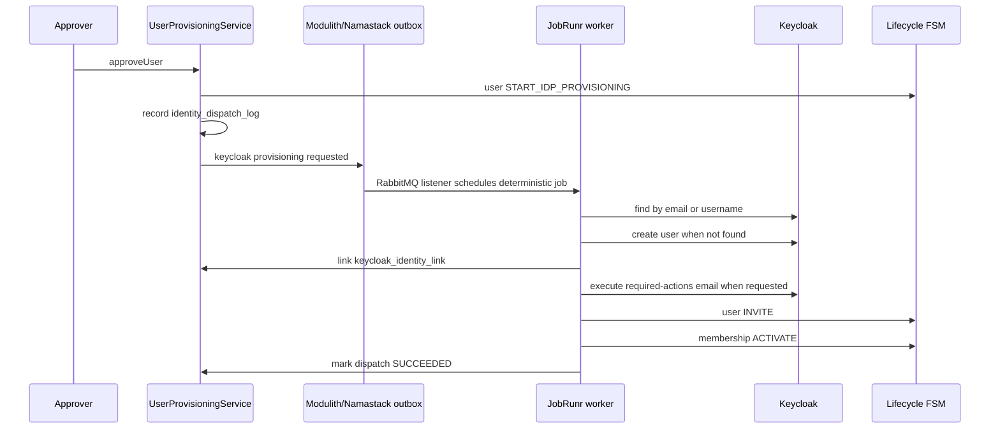

# User provisioning and Keycloak coordination

User provisioning is local-first. The application owns users, memberships, branch assignments,
role assignments, lifecycle state, and authorization. Keycloak remains the external identity
provider used for authentication only.

Read this with [authorization model](authorization-model.md),
[login prechecks](login-prechecks.md), and
[ADR 0006](../adr/0006-keycloak-outbox-coordination.md).

## Local invitation lifecycle

The implemented flow is:

1. `inviteUser` validates an active organisation, email, username, display name, active branch
   prerequisites, role prerequisites, and assignment requirements.
2. The service creates or reuses a local `user_account`.
3. It creates a `user_organisation_membership` in `PENDING_APPROVAL`.
4. It saves invite preferences on the membership:
   `pending_keycloak_invite` and `pending_application_invite`.
5. It creates staged branch assignments and role assignments locally.
6. It records `user.invite` audit.
7. `approveUser` verifies the pending membership and active access prerequisites.
8. If the user has no Keycloak identity link, it transitions the local user through
   `DRAFT -> PENDING_APPROVAL -> PROVISIONING_IDP` as needed and records a Keycloak dispatch.
9. If the user already has an identity link, it activates the membership immediately when the
   user is `ACTIVE` or `INVITED`.
10. Optional application-invite dispatch is also recorded and externalized.

The Keycloak path then continues asynchronously:

After provisioning, the user is `INVITED` and the membership is `ACTIVE`. On the first successful
login, `UserFirstLoginActivationService` transitions the user from `INVITED` to `ACTIVE`, records
`user.first_login_activation` audit, and updates `last_login_at`. Already-active users only get
their last-login marker refreshed.

## Durable outbox and idempotent worker

There is no distributed transaction with Keycloak. The local approval transaction records local
state, `identity_dispatch_log`, and externalized transition events. Spring Modulith and Namastack
Outbox own reliable externalization to RabbitMQ. The listener remains thin: it validates the event
metadata and schedules a JobRunr job.

Idempotency is implemented at several layers:

- `identity_dispatch_log.dispatch_key` is unique;
- Keycloak dispatch key is `${userId}:KEYCLOAK_PROVISIONING`;
- application-invite dispatch key is `${userId}:${organisationId}:APPLICATION_INVITE`;
- JobRunr job id is deterministic from the dispatch key;
- the worker returns immediately when the dispatch status is already `SUCCEEDED`;
- `KeycloakAdminGateway` searches by email and username before creating a user;
- local identity linking stores the Keycloak subject in `keycloak_identity_link`.

Failures mark the dispatch `FAILED`, increment attempts in persistence, and rethrow so JobRunr or
the broker can retry according to their runtime configuration.

## Keycloak admin gateway

The Keycloak admin adapter is enabled only when
`finaxis.keycloak.admin.enabled=true`; the default is disabled. Configuration keys are under
`finaxis.keycloak.admin.*`:

- `server-url`;
- `realm`;
- `client-id`;
- `client-secret`;
- `enabled`;
- `connect-timeout-millis`;
- `read-timeout-millis`.

The gateway uses the pinned `org.keycloak:keycloak-admin-client:26.0.10` dependency. It wraps
admin calls in the Resilience4j circuit breaker named `keycloakAdmin`, configured in
`application.yaml`.

The gateway creates enabled Keycloak users with unverified email, links the returned subject
locally, and optionally calls `executeActionsEmail([VERIFY_EMAIL])`.

Known minor edge: if the required-actions email is sent and a later local FSM step fails, a retry
may send another required-actions email. Keycloak required-actions email is re-issuable, and the
worker keeps local state idempotent around the dispatch key and identity link.
